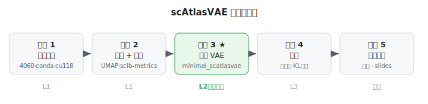

# 复现总纲与学习地图

> 这是整套复现报告的入口文件。如果你只先读一份，就读它。
> 建议阅读顺序：**本文（总纲）→ [知识框架](01_concepts_and_toolbox.md) → [阶段 1](phase1_environment_setup.md) → [2](phase2_integration_and_benchmark.md) → [3 ★](phase3_reimplement_vae.md) → [4](phase4_ablation_studies.md) → [5](phase5_final_report.md)**。
> **导航**：[知识框架 →](01_concepts_and_toolbox.md)　·　[索引](README.md)

---

## 1. 这套报告是怎么组织的

你面对的是一次完整的"论文复现"训练。为了让你既能**一步步照着做**、又能**同时把知识框架搭起来**，报告分成三层：

| 层 | 文件 | 作用 |
|---|---|---|
| 总纲 | `00_overview_and_learning_map.md`（本文） | 讲清"复现是什么、你最终要达到什么、要学会什么"，给出五阶段全景地图 |
| 知识框架 | `01_concepts_and_toolbox.md` | 从生物问题到 VAE 原理，一站式建立心智模型；附"工具箱总表"讲清每个包干啥 |
| 分阶段实操 | `phase1_...` ~ `phase5_...` | 每个阶段一份，统一模板：概览 → 学习目标 → 原理 → 操作步骤 → 检查点 → 自测 |

每份阶段报告都遵循同一套**教学模板**（详见 [`README.md`](README.md)）：每一步都会讲**"为什么这么做"**、并在末尾给**自测题**——能不看资料答上，才算真学到。文中会穿插几类提示框：

> **包速览 — 名称**：某个工具是什么、在本项目里干什么、官方文档在哪。

> **为什么这么做**：解释一步操作背后的动机，而不只是"敲这条命令"。

> **常见坑**：新手最容易在这里翻车，提前标注。

> **试一试**：几行可直接运行的小代码，把"知道"变成"会用"。

---

## 2. 先破题：到底什么叫"复现"一篇论文

"复现"不是一个非黑即白的词。学术界（ACM、以及 Pineau 等人在 NeurIPS 推动的复现计划）把它分成一条由浅入深的谱系。搞清楚自己停在哪一层、为什么，是这次训练的第一课。

| 层级 | 英文 | 含义 | 学习价值 | 本次 |
|---|---|---|---|---|
| L0 | Repeatability | 原作者、原代码、原数据，再跑一遍得到一样的数 | 近乎零 | 热身 |
| L1 | Reproducibility | 用**作者的代码/数据**，重新生成论文结果 | 中 | 做 |
| L2 | **Replicability** | **自己重写核心方法**，用（可不同的）数据得到相似结论 | **高——真正的训练在这里** | **重点做** |
| L3 | 扰动 / 消融 | 改动作者的设计选择，看结论稳不稳 | 很高，已接近研究 | 做 1–2 个 |
| L4 | 迁移 / 挑战 | 迁移到新数据、挑战某个结论 | 最高 | 象征性接触 |

> **为什么这么做**：一个常见误区是把"复现"理解成 L0/L1——把作者代码跑通就完事。但把 115 万细胞跑通、却说不清模型为什么这么设计，学习价值很低。真正长本事的是 **L2：亲手把核心 VAE 从零重写一遍**。所以本项目**以 L2 为必达底线**，配 1–2 个 L3 消融。

### 判定"复现成功"的正确标准

**看结论和趋势，不看像素级/数字级重合。**

- 成功长这样：批次（batch）被校正、细胞类型分得开、耗竭 T 细胞（Tex）分出三个亚型、整合指标的量级和论文接近、方法间的相对排序符合论文。
- 你的 UMAP 图**几乎一定**和论文的不完全一样——软件版本、随机种子、GPU 浮点运算顺序都会让图有差异。这在真实科学复现里本就正常（这正是 Pineau/NeurIPS 复现计划反复强调的：报告清楚"做了什么、没做什么、为什么"，比追求数字对齐重要得多）。

> **心态**：Daniel Bourke 在《PyTorch Paper Replicating》里有句话值得记住——研究者往往花了数月甚至数年打磨一篇论文，**你一开始读不懂、复现不出来，是完全正常的**。复现是一项需要耐心的工程技能，靠的是"分解 → 逐块实现 → 逐块验证"，不是一口气看懂全部。

---

## 3. 你最终要交付什么（北极星）

**交付物**：一份"理解透彻 + 有独立发现 + 有消融"的**复现报告 / 组会汇报**。导师最看重的是**你懂不懂**，不是数字齐不齐。

比"交出报告"更实在的目标，是做完之后你能**不看资料**回答下面这些问题。它们就是你整个复现过程的"北极星"——每一阶段都在为回答它们攒素材：

1. scAtlasVAE 的编码器为什么**不接收批次信息**？这带来什么能力（相比 scVI）？
2. 批次信息具体在代码的哪个函数、以什么方式注入模型？
3. ZINB 的三个输出各是什么？文库大小（library size）在哪一步乘进去？
4. KL 预热（warmup）关掉会发生什么？为什么？
5. "多个细胞类型预测器"解决的是什么问题？单个 atlas 为何用不到？
6. 你的复现 UMAP 和论文的不一样——这能说明复现失败吗？判断成功的正确标准是什么？
7. 论文正文没写、你却在代码里发现的两个东西是什么？

> 读到这里如果这些问题你一个都答不上，完全没关系——这正是接下来五个阶段要带你逐个攻克的。

---

## 4. 五阶段学习地图

这是整趟旅程的全景。每个阶段都标了"你会学到什么""会遇到哪些新工具""产出什么"，方便你随时知道自己在哪、为什么在这。

| 阶段 | 做什么 | 你会学到 | 首次遇到的包 | 产出物 | 对应论文 |
|---|---|---|---|---|---|
| **1 环境搭建** | 在 4060/Windows 上搭训练环境，过冒烟测试 | GPU/CUDA 与深度学习环境的关系；conda/pip 依赖管理；为什么算力架构决定装哪个版本 | `conda` `pip` `pytorch` | 可跑通的环境 + 冒烟测试记录 | — |
| **2 端到端跑通** | 下载 TCellLandscape，跑官方流程出 latent + UMAP，再自己手动走一遍数据流；用 scib-metrics 对比 | 单细胞数据结构（AnnData）；预处理（QC/HVG/归一化）；整合/降维/聚类；如何量化"整合好不好" | `scanpy` `anndata` `scvi-tools` `scib-metrics` `umap-learn` `leidenalg` | 整合前后 UMAP + 指标对比表 | Ext. Data Fig 1–2 |
| **3 核心 VAE 从零重写** ★ | 对着论文公式和源码，用纯 PyTorch 手写最小可用 VAE，与官方对比，逐行找差异 | VAE 的编码器/解码器/潜空间/重参数化；ZINB 重构损失；KL 预热；把"论文公式"翻译成"代码" | `torch.nn` `torch.distributions` | 你的手写模型 + "我的实现 vs 原实现"差异清单 | Fig 1b, Methods |
| **4 消融实验** | 改一个设计选择（潜维度 / KL 预热 / batch 注入位置），看结论怎么变 | 控制变量做实验；从"我复现了"升级到"我验证了作者的设计是否必要" | （复用上面） | 消融结果图/表 + 结论 | Ext. Data Fig 4 |
| **5 汇总报告** | 把前四阶段整理成组会报告/slides | 科学写作：如何诚实地讲清做了什么、没做什么、为什么 | — | 最终报告 / slides | — |

> 你现在在**阶段 1**。地图会一直放在这份总纲里，随时回来看。

---

## 5. 谁做什么：你和"军师"的分工

这次复现是"人机结对"：

- **军师（Claude Code，跑在一台无 GPU 的小服务器上）**：读代码讲给你听、帮你写手写 VAE、写脚本和报告、分析你贴回的结果、排错。
- **你（本地 RTX 4060 / Windows）**：装环境、下数据、跑训练和评测、把日志与图贴回来。
- **一起**：看结果、决定下一步。

> **为什么这么分工**：军师所在的机器只有 1 核 CPU、1GB 内存、无 GPU，跑不动 11 万细胞的训练；但它非常适合读代码、写代码、写报告。你的 4060 则专门负责"真刀真枪地算"。这也正好落实了本项目的一条原则——**核心模型第一版一定你自己写，军师只做 review**，否则 L2 的学习价值就没了。

---

## 6. 精选权威阅读清单

不需要现在全读。遇到具体主题时回来查即可。这些都是该领域公认的权威来源。

**复现方法学（为什么这么做复现）**
- Pineau et al., *Improving Reproducibility in ML Research*（NeurIPS 2019 复现计划报告，JMLR）：https://www.jmlr.org/papers/v22/20-303.html
- REFORMS: *Consensus-based Recommendations for ML-based Science*（Science Advances）：https://www.science.org/doi/10.1126/sciadv.adk3452

**如何复现/实现一篇深度学习论文（教学法）**
- Daniel Bourke, *PyTorch Paper Replicating*：https://www.learnpytorch.io/08_pytorch_paper_replicating/
- Olga Chernytska, *Learn To Reproduce Papers: Beginner's Guide*：https://medium.com/data-science/learn-to-reproduce-papers-beginners-guide-2b4bff8fcca0

**单细胞分析（领域权威教材）**
- *Single-cell best practices*（scverse / Theis 实验室）：https://www.sc-best-practices.org/
  - 数据结构（AnnData/scanpy）：https://www.sc-best-practices.org/introduction/fundamental_data_structures_and_frameworks.html
  - 数据整合：https://www.sc-best-practices.org/cellular_structure/integration.html

**本项目直接相关**
- 论文：https://doi.org/10.1038/s41592-024-02530-0
- 代码：https://github.com/WanluLiuLab/scAtlasVAE ｜ 文档：https://scatlasvae.readthedocs.io/en/latest/
- 主力数据 TCellLandscape（GEO GSE156728）：https://www.ncbi.nlm.nih.gov/geo/query/acc.cgi?acc=GSE156728

**工具官方文档**（阶段 2、3 会频繁用）
- PyTorch：https://pytorch.org/docs/stable/ ｜ scanpy：https://scanpy.readthedocs.io/ ｜ anndata：https://anndata.readthedocs.io/
- scvi-tools：https://docs.scvi-tools.org/ ｜ scib-metrics：https://scib-metrics.readthedocs.io/
