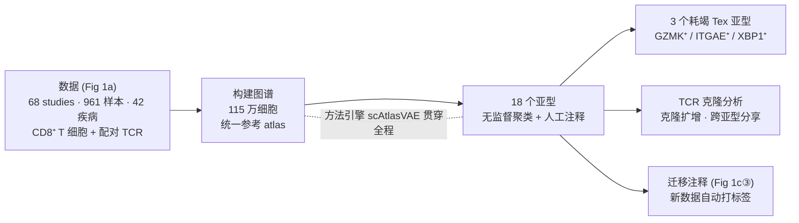
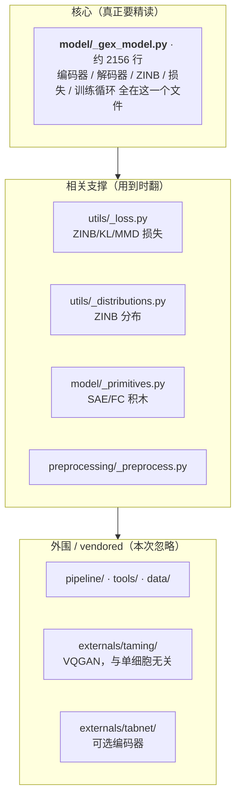
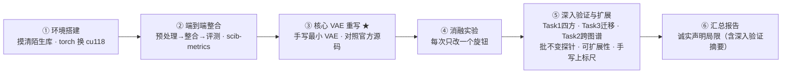
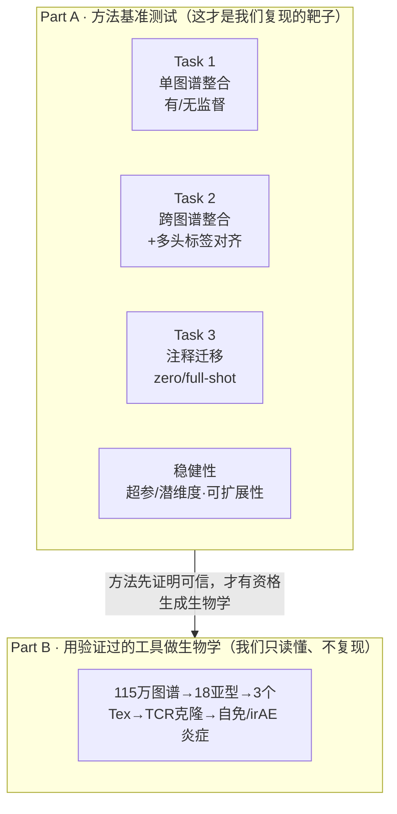

# 项目总纲：先探索，再上路

> 这是整套复现报告的入口。若你只先读一份，就读它。
> **本文的目标**：不急着让你"照着做"，而是先带你**亲手探索两样东西——论文和代码仓库**，从中**自己得出**"这个项目在做什么、核心在哪、为什么复现路线是这条"。搞清楚这些，你后面每一步才不是盲跟。
> **阅读顺序**：本文（总纲）→ [知识框架](01_concepts_and_toolbox.md) → [阶段 1](phase1_environment_setup.md) → [2](phase2_integration_and_benchmark.md) → [3 ★](phase3_reimplement_vae.md) → [4](phase4_ablation_studies.md) → [5 深入验证与扩展](phase5_deeper_validation.md) → [6 汇总](phase6_final_report.md)
> **导航**：[知识框架 →](01_concepts_and_toolbox.md)　·　[索引](README.md)

---

## 0. 这套报告的"读法"——一条贯穿始终的规矩

先说清楚这套文档和普通教程最大的不同，因为它决定了你该怎么用它。

普通教程告诉你**结论**："scAtlasVAE 的编码器不看批次。"你记住了，但换一个库你还是不会自己查。

这套报告只做一件事：**每一条结论，都先带你走一遍"我是怎么找到它的"**，你完全可以打开论文、打开仓库跟着查一遍，最后我们才把结论收下来。格式固定是这样一条链：

> **为什么要知道这个 → 去哪找 → 怎么动手查（命令/看论文哪张图）→ 你会看到什么 → 门道（关键在哪、直觉是什么）→ 结论**

> **为什么这么设计**：复现一篇论文，真正稀缺的能力不是"记住 scAtlasVAE 怎么样"，而是**下次拿到任何一篇论文 + 任何一个仓库，你都知道去哪看、看什么、怎么判断**。所以我们宁可慢一点，也要把"怎么找"露给你看。你会看到大量真实命令、真实代码行号、真实论文原句——它们不是装饰，是让你能自己复核、自己迁移的凭据。

文中会反复出现几类提示框：

> **包速览 — 名称**：某个工具是什么、在本项目里干什么、官方文档在哪。

> **为什么这么做**：一步操作背后的动机，而不只是"敲这条命令"。

> **常见坑**：新手最容易在这里翻车，提前标注。

> **试一试**：几行可直接运行的小代码，把"知道"变成"会用"。

---

## 1. 第一次探索：读论文的 Fig 1，把"科学故事"串起来

我们要复现的是 **Xue et al. (2024) *Nature Methods*** 这篇论文。34 页很厚，但**新手不需要通读**——我们带着一个具体问题去"定点侦查"就够了。

**为什么先读它**：动手复现前，你得先知道"这篇论文到底在讲一个什么故事、scAtlasVAE 这个方法在故事里处在什么位置"。否则你会花大力气复现某个环节，却不知道它为什么重要。

**去哪找**：一篇实验性论文的"故事梗概"永远在两个地方——**摘要（Abstract）**和**第一张主图（Figure 1）**。打开 `bio/s41592-024-02530-0.pdf`，看第 1 页摘要、第 3 页的 Fig 1。

**怎么动手**：你可以直接翻 PDF。Fig 1 分三块看——`Fig 1a`（数据从哪来）、`Fig 1b`（scAtlasVAE 长什么样）、`Fig 1c`（它能干哪些活）。

**你会看到什么**：把摘要和 Fig 1 连起来，一条科学故事就出来了：



*图 0-1 — 读 Fig 1 得到的科学故事全景：数据→图谱→18 亚型，再派生出 Tex 分型、TCR 克隆与迁移注释三类下游分析；scAtlasVAE 是让这一切成立的方法引擎。*

- **数据（Fig 1a）**：作者从 **68 项研究、961 个样本、42 种疾病**里，收集人 **CD8⁺ T 细胞**的单细胞 RNA 测序数据，还带**配对的 TCR（T 细胞受体）**信息。
- **构建图谱（Abstract）**：把它们整合成一张 **115 万细胞**的统一参考"地图"（atlas）。
- **18 个亚型**：在这张图上做无监督聚类 + 人工注释，得到 18 种 CD8⁺ T 细胞状态。
- **3 个耗竭（Tex）亚型**：论文的一个亮点——把"耗竭 T 细胞"进一步分成 `GZMK⁺ / ITGAE⁺ / XBP1⁺` 三种，各有不同的转录与克隆特征。
- **TCR 克隆分析**：借配对的 TCR 信息，看哪些亚型之间"共享克隆"（同源、可能相互转化）。
- **迁移注释（Fig 1c 第③块）**：训练好后，来一个**新的**数据集，能**自动**给它的细胞打上亚型标签。

**门道**：注意 Fig 1b 单独画了 **scAtlasVAE 这个模型**，Fig 1c 又专门画它的三种用法。这说明——**scAtlasVAE 不是论文的一个小配件，而是让上面整条故事成立的"方法引擎"**：没有它，115 万异质细胞拼不成一张可信的图，也没法自动迁移注释。

**结论**：这篇论文 = **一个方法（scAtlasVAE）+ 用它得到的一套生物学发现**。作为"复现方法论文"，**价值的大头在方法本身**；生物学发现我们读懂、定性讨论即可。这条判断直接决定了下面的复现路线。

> **常见坑**：新手容易一头扎进论文的生物学细节（18 个亚型每个的 marker 基因是什么……）。第一遍**别**这样。先抓"方法 + 它解决的核心计算问题"，生物学留到读懂方法之后再回看。

---

## 2. 第二次探索：走一遍代码仓库，找出"真正的核心"

知道了论文靠 scAtlasVAE 这台引擎，下一步自然要问：**这台引擎的代码在哪、有多大、我要读多少？**

**为什么先摸仓库**：新手看到一个陌生仓库几十个文件常会发怵，以为要全读。事实几乎总是相反——**核心逻辑往往集中在极少数文件**，其余是外围和第三方代码。先把"地形"摸清，才知道劲往哪使。

**去哪找 / 怎么动手**：仓库在 `scAtlasVAE/` 下。别急着点开文件，先用两条命令给它"拍个 X 光"——数一数有多少 Python 文件、各自多少行：

```bash
# 有多少 .py 文件
find scAtlasVAE/scatlasvae -name '*.py' | wc -l
# 每个文件多少行，从多到少排
find scAtlasVAE/scatlasvae -name '*.py' | xargs wc -l | sort -n | tail -20
```

**你会看到什么**：文件不少，但行数排下来，一个文件断崖式领先——`model/_gex_model.py`**约 2156 行**，是第二名的两倍多；紧跟着是 `model/_primitives.py`(845)、`preprocessing/_preprocess.py`(742)、`utils/_distributions.py`(311)、`utils/_loss.py`(212)。而 `externals/` 下有一大堆文件（`taming/`、`tabnet/`），名字看着与单细胞毫无关系。

把这些按"和核心方法的距离"分三层，就是这张仓库地图：



*图 0-2 — 仓库按重要性分三层：核心其实只有 `_gex_model.py` 一个文件，若干支撑文件，大量可忽略的外围/vendored 代码。*

**门道**（三个都值得你自己复核）：

1. **核心其实只有一个文件**。`grep` 一下入口就知道：`scatlasvae/__init__.py` 里 `from . import model`，`model/__init__.py` 里 `from ._gex_model import scAtlasVAE`——所有路都通向 `_gex_model.py`。编码器、解码器、ZINB、损失、训练循环全在这一个文件里。**读懂它 ≈ 读懂 scAtlasVAE。**
2. **`externals/taming` 是"李鬼"**。打开看一眼就懂——它是 **VQGAN（做图像生成的 taming-transformers）**，被原样 vendored 进来，和 CD8⁺ T 细胞八竿子打不着。`tabnet` 是一个**可选**的编码器实现。这些**本次复现一律忽略**。
3. **支撑文件"用到时再翻"**：`utils/_loss.py`（ZINB/KL/MMD 损失）、`utils/_distributions.py`（ZINB 分布怎么算）、`model/_primitives.py`（编码器/全连接层这些"积木"）——它们是 `_gex_model.py` 用到的零件，读核心时顺藤摸过去即可。

**结论**：这个仓库看着庞大，**真正要精读的就 `_gex_model.py` 一个文件**，外加两三个损失/分布的支撑文件。这一步直接把"复现工作量"从"读一个大项目"缩成"吃透一个文件"——这也是[阶段 3](phase3_reimplement_vae.md)带你逐行走读它的原因。

> **试一试**：现在就在你的机器上把上面两条 `find`/`wc` 命令跑一遍，亲眼确认"2156 行那个文件"。你会对"核心只有一个文件"这个结论更有底气。这套"先数行数、再分层"的摸库手法，[阶段 1](phase1_environment_setup.md) 会讲成一套可复用的通用方法。

---

## 3. 由这两次探索，推出我们的复现路线

现在把两次探索的结论并起来看，**复现路线就不是别人硬塞给你的，而是自然推出来的**：

- 探索 1 告诉我们：**论文的价值大头在 scAtlasVAE 这个方法**（生物学发现是它的产物）。
- 探索 2 告诉我们：**这个方法的核心代码就一个文件**，可控、可精读、可手写复刻。

于是路线定为——**不追求把 115 万细胞的全图谱重跑一遍**（那是算力秀，学习价值低），而是**聚焦"整合 + 迁移"这台方法引擎，亲手把它的核心 VAE 从零重写一遍**，再用一份公开、与论文同量级的真实数据（GSE156728 全量 CD8 10X，**约 10.5 万细胞**）验证它、并做消融与跨图谱/迁移/可扩展性等扩展。整条路线六个阶段：



*图 0-3 — 复现路线。第 3 阶段（手写核心 VAE）是全程重点；第 5 阶段是深入验证与扩展、第 6 阶段汇总全部工作。*

| 阶段 | 做什么 | 你会学到 | 首次遇到的包 | 产出物 | 对应论文 |
|---|---|---|---|---|---|
| **1 环境搭建** | 在 4060 上搭训练环境，顺带学"怎么摸清一个陌生库" | GPU 算力↔CUDA↔PyTorch 版本的关系；依赖管理；侦查陌生库的通用手法 | `conda` `pip` `pytorch` | 可跑通的环境 + 冒烟测试 | — |
| **2 端到端跑通** | 用真实数据 TCellLandscape 走完"预处理→整合→评测" | AnnData 数据结构；QC/HVG/归一化；如何**量化**整合好坏 | `scanpy` `anndata` `scvi-tools`(baseline) `scib-metrics` | 整合前后 UMAP + 指标对比表 | Ext. Data Fig 1–2 |
| **3 核心 VAE 从零重写** ★ | 带你逐行读 `_gex_model.py`，再对着它手写最小版 | VAE 全套；ZINB；KL 预热；**把论文公式/源码翻译成代码** | `torch.nn` `torch.distributions` | 手写模型 + "我的实现 vs 原实现"差异清单 | Fig 1b, Methods |
| **4 消融实验** | 改一个设计旋钮，看结论怎么变 | 控制变量法；从"我复现了"到"我验证了作者为什么这么设计" | （复用上面） | 消融结果图/表 + 结论 | Ext. Data Fig 4 |
| **5 深入验证与扩展** | 注释迁移、监督vs无监督、批不变探针、手写VAE上标尺、指标对照 | 复现论文招牌能力、把观察升级为可测证据、诚实定位复现边界 | `sklearn`(迁移评测) | 迁移 AUROC/混淆矩阵 + 四方对比 + 探针 | Ext. Data Fig 2 |
| **6 汇总报告** | 整理成组会汇报稿（含深入验证摘要） | 科学写作：诚实讲清做了/没做什么、为什么 | — | 最终报告 / slides | — |

> 你现在在**总纲**。这张地图会一直放在这里，随时回来看自己在哪、为什么在这。

---

## 3.5 一张对照图：论文的实验思路 ↔ 我们的复现（先看这张，思路就不散了）

上面六个阶段是按**"学习/复现动作"**排的（搭环境→整合→手写→消融→深入→汇总）。但论文本身是按**另一条轴**展开的——**实验任务**。很多人（包括第一次读的你）会觉得"思路散"，正是因为这两条轴没对齐。把它们并到一张图上，就一眼清楚了。

**论文分两大部分**（读正文 Benchmarking 段与 Ext. Data Fig. 1 图注即可确认）：



*图 0-4 — 论文骨架：Part A 用"三任务 + 稳健性"把方法钉死，Part B 才用它做生物学。**我们复现 Part A（方法侧），Part B 只读懂、定性讨论**（它需要全量受控数据、且是描述性生物学，非方法验证）。*

**Part A 每个实验 ↔ 我们在哪做**（这张表是全篇的"定位器"，随时回来对）：

| 论文实验 | 论文图 | 我们在哪做 | 状态 |
|---|---|---|---|
| 方法内部机制（编码器/解码器/ZINB/KL/分类头） | Fig 1b + Methods | 阶段 1 摸库 + **阶段 3 手写重写** | ✅ 超出论文（L2 从零手写）|
| **Task 1** 单图谱整合（有/无监督） | Ext.Fig 1e, 2a–f | 阶段 2（PCA/scVI/无监督/监督 四方对比） | ✅ |
| **Task 2** 跨图谱整合 + 标签对齐 | Ext.Fig 1f, 3 | 阶段 5（Zheng + Yost 双图谱、多分类头） | ✅ 补上 |
| **Task 3** 注释迁移（zero/full-shot） | Ext.Fig 1g, 2g,h | 阶段 5（设计 A/B + kNN 对照） | ✅ |
| 超参 / 潜维度稳健性 | Ext.Fig 4d | 阶段 4 消融 | ✅ |
| 可扩展性（时间/内存近线性） | Ext.Fig 4e,f | 阶段 5（4060 计时曲线） | ✅ 补上 |
| 批不变编码器（机制实证） | Methods（F(X)） | 阶段 5 打乱-batch 探针 | ✅ 原创扩展 |
| Part B 生物学（18 亚型 / Tex 三分 / TCR） | Fig 1–5 | — | 只读懂、定性讨论（正当超范围）|

> **一个必须先知道的差异**：论文 Task 1 的 batch 键用 **study_name**（跨 28 个研究，批次效应大）；我们用 **patient**（一个研究 GSE156728 内的 45 个病人，批次效应小、更同质）。这直接导致我们各方法的**绝对分差距被压扁**、且**不能与论文绝对值逐点对齐**——判据自始至终是**同一套指标下方法间的相对排序**，不是绝对数字。数据规模上，我们用的是 GSE156728 全量 CD8 10X（**约 10.5 万细胞**，与论文 TCellLandscape 的 11 万同量级），而非早期误传的"下采样到 4 万"。

---

## 4. 破题：到底什么叫"复现"一篇论文

路线里反复出现 L1/L2/L3，这里讲清。"复现"不是非黑即白，学术界（ACM、Pineau 等在 NeurIPS 推动的复现计划）把它分成一条由浅入深的谱系。**搞清楚自己停在哪层、为什么**，是这次训练的第一课。

| 层级 | 英文 | 含义 | 学习价值 | 本次 |
|---|---|---|---|---|
| L0 | Repeatability | 原作者、原代码、原数据，再跑一遍得到一样的数 | 近乎零 | 热身 |
| L1 | Reproducibility | 用**作者的代码/数据**，重新生成论文结果 | 中 | 做 |
| L2 | **Replicability** | **自己重写核心方法**，用（可不同的）数据得到相似结论 | **高——真正的训练在这里** | **重点做** |
| L3 | 扰动 / 消融 | 改动作者的设计选择，看结论稳不稳 | 很高，已接近研究 | 做 1–2 个 |
| L4 | 迁移 / 挑战 | 迁移到新数据、挑战某个结论 | 最高 | 象征性接触 |

> **为什么以 L2 为底线**：把 115 万细胞跑通、却说不清模型为什么这么设计，学习价值很低（那只是 L0/L1）。真正长本事的是 **L2——亲手把核心 VAE 从零重写一遍**。所以本项目**以 L2 为必达底线**，配 1–2 个 L3 消融。

**判定"复现成功"的正确标准——看结论和趋势，不看像素级/数字级重合。**

- 成功长这样：批次被校正、细胞类型分得开、Tex 分出三个亚型、整合指标量级接近论文、方法间相对排序符合论文。
- 你的 UMAP **几乎一定**和论文不完全一样——软件版本、随机种子、GPU 浮点运算顺序都会让图有差异。这在真实科学复现里**本就正常**。报告里诚实写清"做了什么、没做什么、为什么"，远比追求数字对齐重要（这正是 Pineau/NeurIPS 复现计划反复强调的）。

> **心态**：研究者往往打磨一篇论文数月甚至数年，**你一开始读不懂、复现不出来，完全正常**。复现是一项耐心的工程技能，靠"分解 → 逐块实现 → 逐块验证"，不是一口气看懂全部。

---

## 5. 你的"北极星"：做完能不看资料答上这 7 问

比"交出报告"更实在的目标，是做完之后你能**不看资料**回答下面这些。它们是整个复现的"北极星"——每一阶段都在为回答它们攒素材。现在一个都答不上完全没关系，这正是接下来五个阶段要逐个攻克的。

1. scAtlasVAE 的编码器为什么**不接收批次信息**？这带来什么能力（相比 scVI）？
2. 批次信息具体在代码的哪个函数、以什么方式注入模型？
3. ZINB 的三个输出各是什么？文库大小（library size）在哪一步乘进去？
4. KL 预热（warmup）关掉会发生什么？为什么？（读代码你还会发现：默认设置下它其实**从没升到过 1**——为什么？）
5. "多个细胞类型预测器"解决的是什么问题？单个 atlas 为何用不到？
6. 你的复现 UMAP 和论文的不一样——这能说明复现失败吗？判断成功的正确标准是什么？
7. 论文正文没写、你却在代码里发现的东西有哪些？

---

## 6. 谁做什么：你和"军师"的分工

这次复现是"人机结对"：

- **军师（Claude Code，跑在一台无 GPU 的小服务器上）**：读代码讲给你听、带你走读源码、帮你写手写 VAE、写脚本和报告、生成配图、分析你贴回的结果、排错。
- **你（本地 RTX 4060 / Windows）**：装环境、下数据、跑训练和评测、把日志与图贴回来。
- **一起**：看结果、决定下一步。

> **为什么这么分工**：军师所在的机器只有 1 核 CPU、约 1GB 内存、无 GPU，跑不动 11 万细胞的训练；但它非常适合读代码、写代码、写报告、画图。你的 4060 专门负责"真刀真枪地算"。这也落实了一条原则——**核心模型第一版最好你自己写，军师做 review**，否则 L2 的学习价值就没了。
>
> **关于配图**：报告里的**示意/流程/概念图**一律用 [Mermaid](https://mermaid.js.org/)（代码块内嵌，GitHub 原生渲染、零文件、可 diff）；**实验结果图**（UMAP、条形、曲线、混淆矩阵、探针）才落成 PNG，集中放 [`reports/figures/`](figures/)，由 [`figgen/build_real.py`](../scripts/figgen/build_real.py) 从真实实跑产物生成。这样既保住该有的实验图，又不让一堆 SVG 散落仓库。

---

## 7. 精选权威阅读清单

不需要现在全读。遇到具体主题时回来查。这些都是该领域公认的权威来源。

**复现方法学**
- Pineau et al., *Improving Reproducibility in ML Research*（NeurIPS 2019 复现计划报告，JMLR）：https://www.jmlr.org/papers/v22/20-303.html
- REFORMS: *Consensus-based Recommendations for ML-based Science*（Science Advances）：https://www.science.org/doi/10.1126/sciadv.adk3452

**如何复现/实现一篇深度学习论文（教学法）**
- Daniel Bourke, *PyTorch Paper Replicating*：https://www.learnpytorch.io/08_pytorch_paper_replicating/

**单细胞分析（领域权威教材）**
- *Single-cell best practices*（scverse / Theis 实验室）：https://www.sc-best-practices.org/
  - 数据结构：https://www.sc-best-practices.org/introduction/fundamental_data_structures_and_frameworks.html
  - 数据整合：https://www.sc-best-practices.org/cellular_structure/integration.html

**本项目直接相关**
- 论文：https://doi.org/10.1038/s41592-024-02530-0
- 代码：https://github.com/WanluLiuLab/scAtlasVAE ｜ 文档：https://scatlasvae.readthedocs.io/en/latest/
- 主力数据 TCellLandscape（GEO GSE156728）：https://www.ncbi.nlm.nih.gov/geo/query/acc.cgi?acc=GSE156728

**工具官方文档**
- PyTorch：https://pytorch.org/docs/stable/ ｜ scanpy：https://scanpy.readthedocs.io/ ｜ anndata：https://anndata.readthedocs.io/
- scvi-tools：https://docs.scvi-tools.org/ ｜ scib-metrics：https://scib-metrics.readthedocs.io/

---

> **下一步**：进入 [知识框架](01_concepts_and_toolbox.md)，在动手前把"神经网络怎么学、VAE 在做什么、scAtlasVAE 独特在哪"的直觉搭起来。
> **导航**：[知识框架 →](01_concepts_and_toolbox.md)　·　[索引](README.md)
