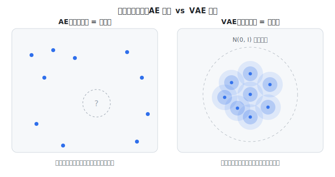

# 知识框架与工具箱

> 本文目标：在你动手之前，用**直觉**把整个项目的知识框架搭起来——你在处理什么生物问题、它如何变成一个计算问题、深度学习到底怎么"学"、scAtlasVAE 这个模型在做什么、以及你会用到的每个工具是干什么的。
> 阅读方式：**直觉优先，不需要你会高等数学**。所有数学符号第一次出现都会用大白话解释；真正可选的推导放在"深入（可选）"框里，第一遍可以跳过。
> 如果你完全没接触过深度学习，请**重点读 1.3（深度学习地基）**——后面的 VAE 全靠它。

---

## 1. 心智模型：从生物问题到 scAtlasVAE

整个项目是一条链：**生物问题 → 计算问题（数据整合）→ 深度学习怎么学 → 用 VAE 解决 → scAtlasVAE 的独特设计**。下面逐段建立直觉。

### 1.1 生物问题：给 CD8⁺ T 细胞画一张"全景地图"

- **CD8⁺ T 细胞**是免疫系统的"杀手细胞"，通过 T 细胞受体（TCR）识别并清除被感染或癌变的细胞。它们有很多**状态（亚型）**：初始（naive, Tn）、效应（effector）、记忆（memory）、以及在肿瘤/慢性炎症中因长期抗原刺激而进入的**耗竭（exhausted, Tex）**状态。
- **单细胞 RNA 测序（scRNA-seq）**能测出**每一个细胞**里每个基因的表达量，得到一张巨大的表格：**行是细胞、列是基因、值是计数（count）**（这个基因的 mRNA 被捕获到多少条）。这张表**非常稀疏**（大部分格子是 0）且噪声大。
- **图谱（atlas）**：把很多研究、很多样本的细胞**合并成一张统一的参考地图**，覆盖 CD8⁺ T 细胞的所有状态。本论文构建的图谱有 115 万细胞、来自 68 个研究。

### 1.2 计算问题：数据整合（integration）

把很多来源的数据拼在一起，会遇到一个核心障碍：**批次效应（batch effect）**。

> **什么是批次效应**：每个研究/样本是在不同时间、不同实验室、不同实验方案、不同测序仪上做出来的，这些**技术差异**会系统性地改变数据。结果是：**来自两个研究的同一种细胞，可能仅仅因为"批次不同"就看起来不一样**——这不是生物学差异，是技术噪声。

**数据整合的目标**：把所有细胞放进一个统一的空间，让它们**按生物学（细胞类型/状态）聚在一起，而不是按批次（来自哪个研究）聚在一起**。一句话——**去掉技术批次、保留生物学信号**。

几个反复出现的概念：**潜空间/嵌入 (latent space/embedding)**——用一个短向量（比如 10 个数）代替 4000 个基因来描述一个细胞；**聚类 (clustering)**——把相似细胞分组（Leiden 算法）；**UMAP**——把嵌入压到 2D 画图给人看（可视化手段，不是分析本身）；**注释 (annotation)**——给聚类贴上细胞类型标签。

---

### 1.3 深度学习地基（从零补齐，后面全靠它）

在讲 VAE 之前，先把"神经网络怎么学"这件事彻底讲清楚。只要这一节懂了，后面就顺了。

#### 1.3.1 神经网络 = 一台"带很多旋钮的函数机器"

把**神经网络 (neural network)** 想成一台机器：**喂进去一串数字（输入），吐出来一串数字（输出）**。机器内部有**成千上万个可调的数字**，叫**参数 / 权重 (parameters / weights)**——把它们想成一排排**旋钮**。旋钮拧到不同位置，同样的输入就会得到不同的输出。

- 最小的零件叫**神经元 (neuron)**：它把几个输入各自乘上一个权重、加起来、再加一个偏置，最后过一个**激活函数 (activation function)**（比如 ReLU：把负数变成 0）。激活函数的作用是引入"非线性"，让网络能表达复杂关系。
- 很多神经元排成一**层 (layer)**，一层的输出喂给下一层。层数多就叫"深度 (deep)"。
- 把输入从头喂到尾、得到输出的过程，叫**前向传播 (forward pass)**。

> 一句话记住：**神经网络就是一个内部有海量旋钮的函数**。"学习"就是找到一组好的旋钮位置。

#### 1.3.2 训练 = 调旋钮，让"损失"变小（下山直觉）

怎么知道旋钮调得好不好？我们定义一个**损失 (loss)**：一个**衡量"输出有多错"的数字，越小越好**。比如"预测值和真实值差多少"。

**训练 (training)** 就是不断调整旋钮，让损失变小。用的方法叫**梯度下降 (gradient descent)**，直觉是"下山"：

- 想象损失是一片**丘陵地形**：你**站的位置** = 当前所有旋钮的取值；**你所在的海拔高度** = 当前的损失。
- 你想走到**最低的山谷**（损失最小）。办法是：感受脚下的**坡度**，朝**下坡方向**迈一小步；到新位置再感受坡度、再迈一步……如此反复，慢慢走到谷底。
- 每步迈多大，由**学习率 (learning rate)** 控制。太大容易越过谷底来回震荡，太小则走得很慢。（这就是为什么模型里有个 `lr=5e-5`——它是这个"步长"。）

> 一句话记住：**训练 = 沿着损失的下坡方向，一小步一小步地拧旋钮。**

#### 1.3.3 梯度与反向传播：每个旋钮该往哪拧

"脚下的坡度"到底是什么？就是**梯度 (gradient)**。对**每一个旋钮**，梯度回答一个问题：

> "如果我把**这个**旋钮**轻轻拧一点点**，损失会变大还是变小、变多少？"

把所有旋钮的这个信息合起来，就是梯度。有了它，就知道每个旋钮该往哪个方向拧、拧多少。

**反向传播 (backpropagation, 简称 backprop)** 就是**高效地一次性算出所有旋钮梯度的算法**。它的本质其实很朴素：

- 网络是"函数套函数套函数"（一层套一层）。一个靠前的旋钮，要影响最终损失，得**层层传递**。微积分里的**链式法则 (chain rule)** 说：这种"层层传递的影响" = 沿途每一步影响的**乘积**。
- backprop 就是**从损失出发、沿网络倒着走一遍**，用链式法则把"影响"逐层乘回去，算出每个旋钮的梯度。
- 打个比方：损失说"这次你错了这么多"，backprop 负责把这份"责任"**按贡献大小分摊回每一个旋钮**——谁对错误负责多，谁就得多调。

**好消息**：你几乎不用手算这些。PyTorch 有**自动求导 (autograd)**——你只管写前向传播（怎么算输出、怎么算损失），它自动帮你做 backprop、算好所有梯度。你在阶段 3 手写模型时，写的就是前向部分，`loss.backward()` 一句话就触发反向传播。

> 一句话记住：**反向传播 = 用链式法则，自动算出"每个旋钮该往哪拧"。它是训练能进行的引擎。**

#### 1.3.4 "可导 / 不可导"是什么，为什么训练必须可导

这是理解重参数化技巧的钥匙，单独讲清楚。

- **可导 (differentiable)** 的直白含义：当你把输入**轻轻变化一点点**，输出也**平滑地跟着变一点点**——于是"坡度/梯度"是有定义的、能算出来的。
- 梯度下降**必须要有坡度才能走**。所以：**一个操作如果不可导（没有平滑的坡度），backprop 的梯度就传不过它**，它前面的旋钮也就学不了。

哪些操作**不可导 / 传不了梯度**？

- **"掷骰子"式的随机采样**：输出是随机蹦出来的，你把某个参数轻轻一动，输出没有一个"平滑跟着变"的确定关系——没法对它求导。**这正是 VAE 的麻烦所在**（下面 1.4d 解决它）。
- 硬性的"非此即彼"决定，比如取整、`argmax`（选最大的那个）——输出是跳变的台阶，不是平滑的斜坡。

> 一句话记住：**能反向传播梯度的前提是"可导"（输出随输入平滑变化）。随机采样天生不可导，需要特殊处理。**

#### 1.3.5 概率分布与采样：快速补给

VAE 会用到一点概率，先把最基础的补回来。

- **概率分布 (distribution)**：描述一个随机量**可能取哪些值、各自多大概率**。
- **正态分布 / 高斯分布 (normal / Gaussian)**，记作 **N(μ, σ²)**：就是那条**钟形曲线**。两个参数——**μ（均值 mean）** 是曲线的中心，**σ²（方差 variance）** 描述曲线的胖瘦（σ 叫**标准差**，是方差的平方根）。经验规律：约 68% 的取值落在 μ±σ 之内，约 95% 落在 μ±2σ 之内。
- **采样 (sampling)**：从分布里**随机抽出一个具体的值**。比如"从 N(0,1) 采一个样"= 抽一个随机数，多半靠近 0，绝大多数落在 −2 到 2 之间。
- **N(0, I)** = 标准多维正态：每一维都是独立的标准正态 N(0,1)。它就是 VAE 想把潜空间"整理"成的那个规整目标。

> 一句话记住：**分布 = 值的可能性地图；均值 μ 是中心、方差 σ² 是胖瘦；采样 = 从地图上随机点一个值。**

---

### 1.4 用 VAE 解决：从自编码器到变分自编码器

有了 1.3 的地基，现在讲 scAtlasVAE 的核心——**VAE（变分自编码器, Variational Autoencoder）**。它有**编码器**、**解码器**两半：编码器把细胞压成潜向量，解码器从潜向量重建细胞。我们先看最朴素的 AE，再看 VAE 在它上面改了什么、为什么。

#### (a) 自编码器 (AE)：先压缩、再重建

AE 是一个"哑铃形"网络：

- **编码器 (encoder)**：把高维输入 x（一个细胞约 4000 个基因）**压缩**成一个很短的向量 z（比如 10 个数），叫**潜向量 (latent vector)**。
- **解码器 (decoder)**：从 z **重建**出原输入，记作 x̂。
- **训练目标**：让 x̂ 尽量接近 x，两者的差距叫**重构损失 (reconstruction loss)**。

中间的"瓶颈"很窄，逼网络必须抓住数据的精华才能重建成功——这个精华 z 就是我们要的**低维表示 / 嵌入 (embedding)**。

> 类比：让你用 10 个数字概括一张人脸，再让别人只凭这 10 个数字把脸画回来。想画得像，这 10 个数就必须抓住脸的关键特征。

#### (b) 从 AE 到 VAE：把"一个点"换成"一团云"

AE 把每个细胞压成潜空间里**一个确定的点**。VAE 在这上面改了两个动作：

1. **点 → 云**：编码器不再输出一个点，而是输出一团**高斯"云"**——一个**中心 μ** 和一个**散布 σ**（σ 是标准差；σ² 是方差，见 1.3.5）。真正喂给解码器的 z，是**从这团云里随机采样**出来的。可以把云想成一个**中间浓、越往外越淡的"毛球"**（越靠近 μ 越容易被采到），二维时像一团模糊的圆斑；每次采样，就是从毛球里随机点一个位置。
2. **KL 收拢**：再加一个**正则项 (regularizer)** 叫 **KL 散度 (KL divergence)**，把每一团云都**往标准正态 N(0, I) 拉**——像一只温柔的手，把所有云收拢到以 0 为中心的规整区域（这只手具体怎么塑形，见 (e)）。

这样换来的潜空间是**平滑、连续、有组织**的，正是我们后面拿去聚类、可视化、迁移的那个**嵌入**。下图直观对比二者——左 AE（散点 + 空洞）、右 VAE（重叠的云填满中心区域）：



*图：同一个潜空间，左 AE（散点 + 空洞）vs 右 VAE（重叠的云填满 N(0, I) 附近的有界区域）。*

> 一句话记住：**AE 把细胞压成一个点；VAE 压成一团云、从中采样，再用 KL 把所有云拉向 N(0, I)——换来一个平滑、有组织的潜空间。**

#### (c) 说准：VAE 比 AE 到底多带来什么

为什么非要改成"云"？直接用 AE 不行吗？这里要**把话说准**，避免一个常见的过度归因——先把三件容易混在一起的设计拆开：

| 设计 | 解决什么 | 和"是不是 VAE"的关系 |
|---|---|---|
| ① AE → VAE（云 + 采样 + KL 正则） | 更平滑、规整、能泛化的潜空间 + 概率框架 | 就是 VAE 本身 |
| ② 解码器注入 batch | 批次校正 / 整合 | 与是不是 VAE 无关 |
| ③ 编码器不看 batch | zero-shot 迁移（见 1.5） | scAtlasVAE 的题眼，独立设计 |

**"能整合""能迁移"主要是 ②③ 的功劳，别都算到 VAE 头上。** 那么单看第 ① 件，VAE 相对 AE 强在哪？答案**不是"AE 做不了"，而是"几何更可信、更能泛化"**：

- **聚类**：其实两者都能聚类（聚类永远在"点"上做，VAE 也是拿云的中心 μ 当坐标）。差别在——纯 AE 只优化"把训练细胞重建好"，**没有任何一股力要求"距离＝相似度"**，于是它可能把编码摆成"能重建、但两个不相干的细胞恰好靠得近"的样子；VAE 的 KL 正则把空间修得连续、尺度统一，"挨得近＝真的像"更成立，基于近邻图的 Leiden/UMAP 更可靠。
- **来新细胞**：AE 也能把新细胞压成点、找最近的簇；但纯 AE 只在训练细胞上被"抠"过，对没见过的细胞**泛化没保证**，可能落到没被规整过的区域（就是上图 AE 里那些"空洞"）。VAE 的正则相当于给空间加了"处处平滑连续"的先验，新细胞更容易落到**和它真正相似的训练细胞附近**。

（"空洞里解码出乱码"这个画面，最直接体现在**生成 / 插值**上；对我们的聚类 / 迁移，更准确的说法就是这句——**正则 → 泛化 + 距离可信**。）

> 一句话记住：**VAE 相对 AE 的净收益 = 正则化带来的"平滑、距离可信、能泛化"的潜空间 + 概率式计数建模；"能整合""能迁移"是另外两个设计的功劳。**

#### (d) 重参数化技巧：让"采样"也能训练

(b) 里"从云中采样 z"埋了个雷：**随机采样不可导**（见 1.3.4），梯度传不回 μ 和 σ，编码器就学不了。VAE 用一个改写解决它——与其"直接从 N(μ, σ²) 采一个 z"，不如写成：

**z = μ + σ · ε**，其中 **ε 从 N(0, 1) 独立采样**。

**随机性被挪到了 ε 身上**，而 ε 与网络旋钮无关（只是外部丢进来的随机数）；剩下的 `μ + σ·ε` 对 μ、σ 是**平滑可导**的（就是乘一下、加一下）。于是梯度能穿过采样、传回编码器——采样这一步就"能训练"了。这就是"重参数化"：**把同一个随机采样，重写成一个可导的形式**。

对到代码（scAtlasVAE）：`q_var = exp(z_var_fc(x)) + eps` 保证方差为正；`Normal(q_mu, q_var.sqrt()).rsample()` 里的 **`rsample`（reparameterized sample）** 做的正是 `μ + σ·ε`。

> 一句话记住：**z = μ + σ·ε，把随机性交给与旋钮无关的 ε，梯度就能穿过采样传回编码器——这是 VAE 能端到端训练的关键。**

#### (e) KL 的两只手：把 σ 拉向 1、把 μ 拉向 0

(b) 说 KL 是"收拢的手"，这里说清它具体怎么塑形。KL 衡量每团云 N(μ, σ) 离标准正态 N(0, I) 有多远，并往**两个方向**施压：

- **把 σ 拉向 1（不是拉向 0）**：σ 是编码器为每个细胞输出的，但它输出多少是**训练"拔河"**拔出来的——**重构损失想把 σ 压到 0**（云越尖、编码越确定，越好重建；极端情况云缩成点，就退回成 AE），而 **KL 对"σ 太小"惩罚极重**（σ 趋近 0 时 KL 趋向无穷大）。所以 KL 正是那股**不许云坍缩成点、逼它保持"胖乎乎"**的力。
- **把 μ 拉向 0**：若不管 μ，编码器能把细胞甩到无穷远，距离没有统一标度、空间松散——新细胞该落哪、距离怎么比都失去参照。KL 把所有中心拉向 0，等于规定"大家共用一套**以 0 为中心、尺度约为 1** 的坐标系"。

两个方向合起来：一堆**又胖、又都挤在原点附近**的云彼此重叠，把中心那片**有界区域**（N(0, I) 的质量几乎都在离原点半径 2~3 以内，并非无限大的平面）铺满、不留空洞。而**生物学不会被压没**——重构损失在反向拔河，会把不同细胞类型在这片紧凑区域内**推开到能区分**。最终就是"紧凑规整"与"类型分得开"的平衡。

**顺带厘清三个容易混的点**（也回答几个常见疑问）：

- **μ 和 σ 不是"随机、没有定值"的**：它们是编码器这台函数对某个细胞算出的**确定输出**（每个细胞有自己的一对 μ、σ）；真正随机的只是从云里抽的那个 z。训练中 μ、σ 会随旋钮更新而变，但对**训练好的编码器 + 给定细胞**，它们是定值。
- **如果只有 KL、没有重构**，每团云都会坍缩成**恰好 N(0, 1)**（μ=0、σ=1，此时 KL=0 最小）——潜空间就彻底没信息了。正因为重构在反向拔河，云才被推开、带上生物学。
- **两股力一起作用时，σ 并不是每个都等于 1**：重构想把 σ 压小、KL 想把它拉到 1，最终落在中间，而且**每个细胞、每一维都各不相同**。

> 一句话记住：**KL 有两只手——σ 拉向 1（防止云坍缩成点）、μ 拉向 0（统一坐标系）；重构损失反向拔河把类型推开。平衡出一张既规整又能区分的地图。**

#### (f) 解码器：用 ZINB 分布重建计数

回到解码器这一半。它要重建"原始计数"，但单细胞计数很特别：**整数、极稀疏、方差大、零特别多**。所以解码器**不直接输出一个数**，而是输出一个**概率分布的参数**，我们再问"真实计数在这个分布下有多大可能"——可能性越高＝重建越好。这个分布叫 **ZINB**。别被名字吓到——它是从最简单的泊松、分三步搭起来的：

- **第一步 · 泊松分布 (Poisson)** —— "平均每次测到几个"的分布。设想某基因在某细胞里**平均**能被测到 3 条 mRNA；因为测序是随机抽样，实际测到的数会在 3 上下随机波动（也许 1、2、3、4…）。泊松就是描述"给定一个平均发生率、实际计数如何随机波动"的分布，天生适合"计数"这种非负整数。它有一条**铁律：方差 = 均值**（平均测到 3，波动的方差也正好是 3）。
  > 小提醒：**方差 (variance)** 就是"数据围绕平均值波动的幅度"，越大越参差（见 §1.3.5）。
- **问题**：真实单细胞数据比泊松**更"散"**——同一群细胞里，有的把某基因表达得畸高，方差远大于均值。泊松"方差=均值"那条铁律太死板，套不住。
- **第二步 · 负二项分布 (Negative Binomial, NB)** —— 给泊松**松绑**。它比泊松多一个**离散度 (dispersion)** 旋钮，允许**方差大于均值**（术语叫"过离散 overdispersion"）。"离散度"就是"比泊松多散多少"的调节量：旋得越狠，同样的平均表达量下、各细胞计数越参差。（代码里这个旋钮叫 `theta`，方差 ≈ 均值 + 均值²/theta。）
- **问题**：单细胞里还有**特别多的零**——很多基因其实表达了，却因技术原因没被测到（叫 **dropout**）。光靠 NB 给不出这么多零。
- **第三步 · 零膨胀负二项 (Zero-Inflated NB, ZINB)** —— 在 NB 之外再**并联一个"额外补零"的开关**，专门解释这些多出来的零。这就是解码器最终用的分布。

**解码器为每个基因输出三个数，正好把 ZINB 这三步参数化：**

1. **均值比例 (scale)** —— 回答"这个基因占该细胞总表达的多少比例"。怎么得到：解码器先吐一组原始分数，用 **softmax** 变成占比（**softmax** = 把一组任意数字压成"加起来正好等于 1 的占比"，像把各科原始分换算成百分比份额）；这个占比再乘该细胞的**文库大小**，就得到该基因的均值 μ（即 NB 的均值）。为什么要乘文库大小，见下框。
2. **离散度 (dispersion, θ)** —— 第二步那个"过离散"旋钮，控制方差比均值大多少。
3. **零膨胀门控 (dropout gate, π)** —— 第三步那个"补零开关"：额外多大概率**直接吐一个 0**（不管 NB 那部分算出多少）。名字里的"门控 (gate)"就是"零这扇门开多大"。

> **文库大小 (library size) 到底是什么**："文库 (library)"本是测序术语——制备样本时，一个细胞的所有 mRNA 会被转成一个待测的"文库"。**文库大小 = 这个细胞被测到的所有基因计数之和**（也就是它那一行的总计数），反映这个细胞"测得深不深"。不同细胞深浅差很多（有的总共 2000 条、有的 8000 条），所以解码器先给与深浅无关的"占比"，再乘各自的文库大小，才还原成该细胞真实尺度的计数。
>
> **什么是归一化 (normalization)**：把数值缩放到统一尺度、方便比较。编码器的**输入**就先做归一化——`normalize_total`（每个细胞按自己的文库大小缩放，消除测序深浅差异）＋ `log1p`（取 log(1+x)，把动辄上千的计数压到小范围、稳定方差）。§3 的"试一试 2"能亲手看它前后的变化。
>
> **常见坑**：编码器**输入**是上面这种归一化后的值（`log_variational=True`），但解码器**重建的目标是原始整数计数**——两者别混。且走 ZINB 时 `adata.X` 必须是整数、每细胞总计数 > 0，否则出 NaN。

> 一句话记住：**解码器不猜一个数，而是猜一个 ZINB 计数分布的参数；重建好＝真实计数在该分布下概率高。ZINB ＝ 负二项（能过离散）+ 补零（治 dropout）。**

#### (g) 损失函数：三块加起来（含 VAE 之外的分类器）

VAE 训练时最小化的总损失，就是 1.3.2 里那个"越小越好的数字"，由三块组成：

**总损失 = 重构损失 + λ_KL · KL 损失 ( + λ_ct · 分类损失 )**

> **先搞懂一个贯穿的词——负对数似然 (negative log-likelihood, NLL)**：
> - **似然 (likelihood)** ＝"在我的模型（分布）下，观测到真实数据的概率有多大"。模型越贴合数据，似然越高，我们希望**最大化**它。
> - 似然常是许多小概率连乘、数值极小，于是取 **对数 (log)** 把连乘变连加、数值更稳（不改变谁大谁小）。
> - 训练框架都在"最小化损失"，而我们要"最大化对数似然"——**加个负号**就统一了：最大化对数似然 = 最小化**负对数似然 (NLL)**。所以 **NLL 越小 ＝ 模型越贴合数据**。
> 下面三块里，**重构损失和分类损失本质都是 NLL**。

- **重构损失**：真实计数在解码器预测的 ZINB 分布下的 NLL——ZINB 给真实计数的概率越高，损失越低。衡量"我预测的计数分布解释真实数据有多好"。
- **KL 损失**：每团云离 N(0, I) 多远——就是 (e) 讲的那两只手。λ_KL 是它的权重。
- **分类损失（半监督，可选）**：若细胞带类型标签，在潜向量 z 上再接一个**分类器 (classifier)**，用**交叉熵 (cross-entropy)** 衡量分类准不准（交叉熵本质就是"真实标签的 NLL"：真实是 Tex，模型给 Tex 的概率越高、损失越小）。λ_ct 默认 1。这个分类器是 VAE 之外的第二个网络、在本研究里很关键，**下面 (h) 单独细讲**。

重构与 KL 是一对拉锯（重构要潜空间**多带信息**、KL 要它**规整**），平衡好才得到既有用又规整的表示；分类损失（若开启）再额外把表示朝"可分类"方向轻推。

> 一句话记住：**损失 ＝ 重建好不好 + 潜空间规不规整 +（可选）分类准不准；重构与分类本质都是"负对数似然"（NLL 越小＝越贴合）。那个分类器和 VAE 一起训练，让编码器顺带学会给细胞打标签。**

#### (h) 分类器：让模型顺带学会给细胞打标签（半监督）

前面讲的都是 VAE 本身（编码器 + 解码器）。但 scAtlasVAE 在潜空间上还挂了**第二个网络——分类器 (classifier)**，专门做"给细胞贴类型标签"。正是它，让这个模型从"只会整合"升级到"还能自动注释、跨图谱对齐"。

**它长什么样（源码里就一行）**：在 [`_gex_model.py`](../../scAtlasVAE/scatlasvae/model/_gex_model.py) 里，当有标签（`n_label > 0`）时建
`self.fc = nn.Sequential(nn.Linear(n_latent, n_label))`——就是**一个线性层**，把 10 维潜向量直接映射成"各细胞类型的打分 (logits)"，再经 softmax 变成各类型概率。旁边还有 `self.additional_fc`（一个 `ModuleList`）——**多个并列的分类头**，对应多套标签体系（见下面第 2 点）。

**它怎么和 VAE 一起训练（半监督 semi-supervised）**：

- **有标签**的细胞：把分类器的**交叉熵**损失加进总损失；反向传播时梯度既更新分类器、也**回流进编码器**——于是编码器把潜空间朝"同类型细胞聚在一起、好分类"的方向整理（既提升嵌入质量，也顺带学会打标签）。
- **没标签**的细胞（代码里用 `ignore_index` 跳过）：不算分类损失，但照常参与重构和 KL。"部分细胞有标签"正是"半监督"的含义。
- **训练细节**：代码 `pred_last_n_epoch=10`，**最后 10 轮才重点训练分类头**——先学好表示、再学分类更稳。

**在这篇论文里，它具体做到了两件事**（这才是重点）：

1. **自动注释 query 数据**：训练好后来一个新数据集，编码器把它映射进参考图谱、分类器直接预测每个细胞的亚型，**不用人工**。论文用 **AUROC**（一种分类准确度指标，越接近 1 越准）衡量这种自动注释的好坏。
2. **跨图谱标注对齐**（`additional_fc` 多头的用武之地）：不同图谱各有一套命名（类别 a、类别 b…）。多个并列分类头同时预测每个细胞在各套命名下的类型，汇成一张注释矩阵 M；再统计"类别 a 的亚型 i"和"类别 b 的亚型 j"落在同一批细胞上的**重叠比例**，超过阈值（论文用 10%）就认为两者对应——从而把两套命名体系对齐。**这是单个 atlas 用不到、只有跨图谱才需要的能力**（所以你阶段 3 手写单-atlas 版只需一个分类头，见 §1.5）。

> 一句话记住：**分类器就是潜空间上的一个线性头（可有多个），用交叉熵和 VAE 一起训练；它让 scAtlasVAE 除了整合，还能自动给 query 细胞打标签、并跨图谱对齐命名。**

#### (i) KL 预热 (warmup)：别让潜空间过早坍缩

**先纠正一个方向**：预热 (warmup) 指的是**把 λ_KL 从 0 开始、逐轮慢慢升到目标值**（像发动机预热——先温和、再上力），**不是**"一开始就给很高的权重"。

你的这个推理其实**正好说中了预热要避免的那件事**：如果一开始就给 KL 很高的权重，KL 会**压过重构**，所有云会争先恐后奔向 N(0, 1)、在学到任何有用信息之前就**坍缩**成没信息的标准正态（这叫**后验坍缩 posterior collapse**，因为那样 KL 损失最小、模型图省事）。预热就是为了防止它——**先让 KL 权重接近 0，给重构时间把潜空间用起来，再逐步收紧正则**。

> **深入（可选）**：论文里预热贯穿整个训练（λ_KL 一路缓升）。**关掉预热**（从第一轮就给满权重）是阶段 4 一个很好的消融实验——大概率能观察到潜空间坍缩、聚类变差。

---

### 1.5 scAtlasVAE 的独特设计：与 scVI 的关键区别（全项目最重要的一点）

市面上已有 scVI、scANVI、SCALEX、scPoli 等 VAE 方法。scAtlasVAE 的关键创新在于**编码器不看批次**。论文里给了这张对比表：

| 方法 | 编码器 | 解码器 | 重构 |
|---|---|---|---|
| **scAtlasVAE** | `F(X) → z`（**只吃基因表达**） | `F(z, B) → (r_mean, r_var, r_gate)` | ZINB |
| scVI / scANVI | `F(X, B, S) → (z, z_l)`（吃了批次 B 和文库 S） | `F(z, z_l, B) → ...` | ZINB |
| SCALEX | `F(X) → z` | `F(z, B) → X̃` | BCE |
| scPoli | `F(X, B) → z`（吃了批次 B） | `F(z, B) → ...` | ZINB |

- **批不变编码器 (batch-invariant encoder)**：scAtlasVAE 的编码器输入**只有基因表达 X**，不含批次。批次信息只在**解码端**注入（`decode()` 里把 batch 先过一个 embedding 层，再和 z 拼接送进解码 MLP）。
- **这带来什么能力（zero-shot 迁移）**：因为编码器从不看批次，一个**全新的查询数据集**可以**不重新训练**、直接过同一个编码器映射进参考图谱——这就是"零样本迁移 (zero-shot transfer)"。而 scVI 的编码器依赖批次，来了新批次就得做"架构手术"或重训。
- **多个细胞类型预测器**：`additional_fc` 那些**并列分类头**用于**跨图谱标注对齐**；**单个 atlas 只需一个分类头**——多头只在跨图谱时才有意义（机制详见 §1.4(h)，这是阶段 3 可以合理简化的地方）。

> 回到 `00` 总纲的"北极星"问题 1、2、5——现在你应该能开始回答它们了。

---

## 2. 工具箱总表：你会遇到的每个包干什么

下面每个工具在后续阶段都会用到。现在**不用记**，混个脸熟，用到时回来查。

| 工具 | 是什么 | 在本项目里干什么 | 官方文档 |
|---|---|---|---|
| **NumPy** | Python 数值计算基础库（多维数组） | 一切数据的底层数组表示 | numpy.org/doc |
| **pandas** | 表格数据处理库 | 存放细胞的元信息（`obs`：批次、细胞类型等） | pandas.pydata.org/docs |
| **PyTorch** | 深度学习框架（张量 + 自动求导 + GPU） | 定义、训练神经网络；阶段 3 手写 VAE 的语言 | pytorch.org/docs |
| **AnnData** | 单细胞数据的标准容器 | 把"表达矩阵 + 细胞信息 + 基因信息 + 嵌入"打包在一个对象里 | anndata.readthedocs.io |
| **Scanpy** | 单细胞分析工具箱（基于 AnnData） | 预处理（QC/HVG/归一化）、聚类（Leiden）、UMAP、画图 | scanpy.readthedocs.io |
| **scvi-tools** | VAE 类单细胞方法的官方现代实现 | 阶段 2 跑 baseline（scVI）；也是理解 scAtlasVAE 的最佳对照 | docs.scvi-tools.org |
| **scib-metrics** | 整合评测指标库（GPU 加速） | 量化"整合好不好"（batch 校正 vs 生物保留） | scib-metrics.readthedocs.io |
| **umap-learn** | UMAP 降维算法 | 把嵌入压到 2D 可视化 | umap-learn.readthedocs.io |
| **leidenalg** | Leiden 图聚类算法 | 在嵌入上把细胞分成簇 | 随 scanpy 调用 |
| **scAtlasVAE** | 本论文的方法本体 | 阶段 1–2 调它跑通；阶段 3 对照它手写 | scatlasvae.readthedocs.io |

### 几个主力工具的"包速览"

> **包速览 — PyTorch**：深度学习框架。三件事：① **张量 (tensor)**，像 NumPy 数组但能放到 GPU 上；② **自动求导 (autograd)**，你只写前向计算，它自动做反向传播算梯度（见 1.3.3）；③ **`torch.nn`**，搭网络的积木（线性层、激活函数等）。阶段 3 你会直接用 `torch.nn` 和 `torch.distributions` 手写模型。

> **包速览 — AnnData**：单细胞数据的"标准集装箱"。一个 `adata` 对象里：`adata.X` 是表达矩阵（细胞×基因）；`adata.obs` 是细胞的元信息表（批次、细胞类型…）；`adata.var` 是基因信息表；`adata.obsm` 放每个细胞的低维嵌入（如 `X_pca`、`X_scAtlasVAE`）；`adata.layers` 放同尺寸的其他矩阵（如原始计数 `counts`）。**几乎所有单细胞工具都以 AnnData 为通用货币。**

> **包速览 — Scanpy**：基于 AnnData 的分析工具箱，函数按模块分：`sc.pp.*` 预处理（`normalize_total`、`log1p`、`highly_variable_genes`）、`sc.tl.*` 工具（`leiden`、`umap`、`rank_genes_groups`）、`sc.pl.*` 画图。阶段 2 的外围流程基本都靠它。

> **包速览 — scvi-tools / scib-metrics**：前者是 scVI/scANVI 等方法的**官方现代实现**——baseline 直接调它，别自己手写；后者是整合评测指标的现代库。**注意**：论文用的是**旧版 `scib`(1.1.4)**，我们用现代 `scib-metrics`，两者**数值不可直接比**，只看方法间相对排序（这点阶段 2 会反复强调）。

---

## 3. 试一试：亲手感受 AnnData（把"知道"变成"会用"）

下面两个小练习可以在**阶段 1 建好的 `scatlasvae` 环境**里运行（它已装好 `scanpy`/`anndata`）。目的是在正式上真实数据前，先摸清数据结构长什么样。

> **试一试 1 — AnnData 的解剖**：新建一个文件 `try_anndata.py` 粘贴运行，观察打印出来的每一部分对应上面"包速览"里的哪个属性。

```python
"""练习：亲手创建并解剖一个 AnnData 对象，理解它的四大组成部分。"""
import numpy as np
import pandas as pd
import anndata as ad

rng = np.random.default_rng(0)
n_cells, n_genes = 6, 4

# X：表达矩阵（行=细胞，列=基因），这里用整数模拟原始计数
X = rng.poisson(1.0, size=(n_cells, n_genes)).astype("int32")

adata = ad.AnnData(
    X=X,
    obs=pd.DataFrame(                       # obs：每个细胞的元信息
        {"batch": ["s1", "s1", "s2", "s2", "s3", "s3"]},
        index=[f"cell_{i}" for i in range(n_cells)],
    ),
    var=pd.DataFrame(                        # var：每个基因的信息
        index=[f"gene_{j}" for j in range(n_genes)]
    ),
)

print(adata)                                # 一览：维度 + 各字段
print("形状 (细胞, 基因):", adata.shape)
print("表达矩阵 X:\n", adata.X)
print("细胞元信息 obs:\n", adata.obs)
print("每个细胞的总计数(文库大小):", np.asarray(adata.X).sum(axis=1))
```

> **试一试 2 — 归一化前后对比**：这正是 scAtlasVAE 编码器输入所做的 `normalize_total(1e4) + log1p`。运行后对比同一个细胞归一化前后的数值，理解"为什么要按文库大小归一化"。

```python
"""练习：观察 normalize_total + log1p 对表达值的影响。"""
import scanpy as sc
import numpy as np

adata = sc.datasets.pbmc3k()                # scanpy 自带的小型真实数据集
adata.layers["counts"] = adata.X.copy()     # 先把原始计数备份到 layers（好习惯）

print("归一化前，第 0 个细胞前 5 个基因:", np.asarray(adata.X[0, :5].todense()).ravel())
print("第 0 个细胞总计数:", np.asarray(adata.X[0].sum()))

sc.pp.normalize_total(adata, target_sum=1e4)  # 把每个细胞缩放到总计数=1e4，消除测序深度差异
sc.pp.log1p(adata)                            # log(1+x)，压缩动态范围、稳定方差

print("归一化后，第 0 个细胞前 5 个基因:", np.asarray(adata.X[0, :5].todense()).ravel())
```

> **延伸阅读**：神经网络/反向传播的可视化入门推荐 3Blue1Brown 的《Neural Networks》系列；AnnData 与 scanpy 的权威入门见《Single-cell best practices》"数据结构"章：https://www.sc-best-practices.org/introduction/fundamental_data_structures_and_frameworks.html ；数据整合原理见"数据整合"章：https://www.sc-best-practices.org/cellular_structure/integration.html

---

## 4. 一页速查（阶段 3 手写时回看）

- 训练三件套：前向传播算输出与损失 → 反向传播(backprop)算梯度 → 梯度下降拧旋钮（步长=学习率）。
- 编码器 `F(X) → (μ, σ²)`，**只吃 X**；重参数化 `z = μ + σ·ε` 得 z（默认 10 维）。
- 解码器 `F(z, B) → (scale, dispersion, gate)`，批次在**解码端**注入；`均值 μ = scale × 文库大小`。
- 损失 = ZINB 重构 + λ_KL·KL（KL 权重预热）+（可选）λ_ct·交叉熵分类。
- 默认超参：`n_latent=10`、`hidden=[128]`、`batch_hidden_dim=8`、`lr=5e-5`、AdamW、`batch_size=128`、`seed=12`；`max_epoch=min(round(20000/N×400), 400)`。
- 与 scVI 的唯一"题眼"：**编码器批不变 → zero-shot 迁移**。
