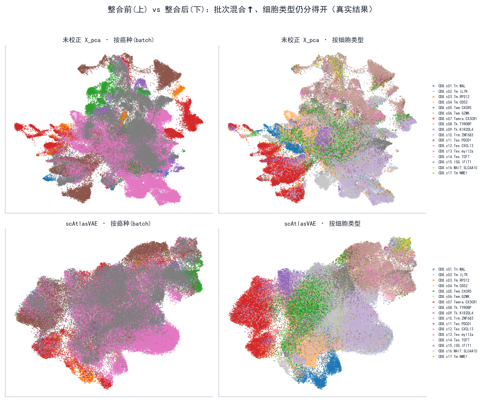
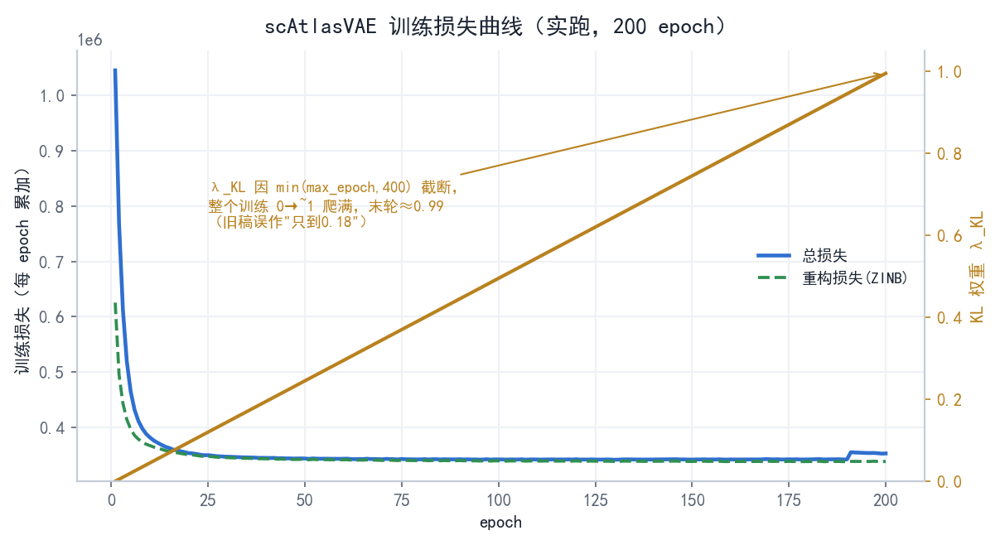
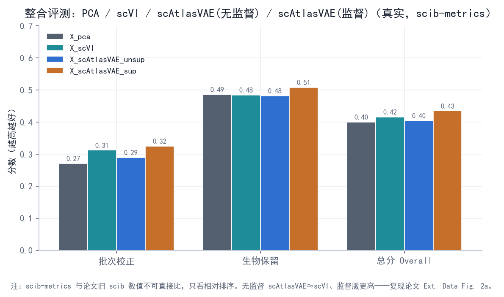

# 阶段 2 · 端到端跑通与整合评测

> **阶段** 2 / 5　·　**前置**：[阶段 1 · 环境搭建](phase1_environment_setup.md)　·　**产出**：整合前后 UMAP + 指标对比表 + 三份脚本　·　**预计** 3–4 天
> **导航**：[← 阶段 1](phase1_environment_setup.md)　·　[总纲](00_overview_and_learning_map.md)　·　[知识框架](01_concepts_and_toolbox.md)　·　[阶段 3 →](phase3_reimplement_vae.md)
>
> **本阶段结果已为本机 RTX 4060 真实实跑**：数据 = GSE156728 的 10X CD8 子集下采样至 ~4 万细胞；baseline 用 **scVI**（scvi-tools；Windows 需先开长路径才能装，本机单独建 `scvi` 环境）。指标表、UMAP、loss 曲线均为真实数据。

---

## 1. 阶段概览

阶段 1 把环境搭好了。阶段 2 要用**作者的代码 + 一份真实数据**，走完单细胞整合的完整链路，并**学会两件真正可迁移的能力**：

- **能力 A — 拿到一份陌生单细胞数据，怎么自己"验货"**：格式对不对、能不能直接喂给模型。
- **能力 B — 怎么判断"整合到底好不好"**：这需要一套**量化指标**，而不是肉眼看 UMAP 图觉得"挺好"。

这一阶段属于复现谱系里的 **L1**（用作者代码 + 真实数据，重现论文结论）。判定成功仍是**趋势对上**（批次被混开、细胞类型分得开、scAtlasVAE 与 scVI 相当或更好），不是数字与论文一致。

**全流程一图**（本阶段就是把它跑出来）：



*图 2-1 — **本机真实结果**（4 万 CD8 细胞）。上排未校正 X_pca、下排 scAtlasVAE；左列按癌种(batch)、右列按 17 个 CD8 亚型上色。可见整合后**癌种/批次更混合**、而 Tn/Tem/Temra/Tex 等**细胞类型仍分得开**——定量见 §7。*

---

## 2. 学习目标

完成本阶段后你应能：

- 自己**找到并验货**一个单细胞数据集是否满足模型要求（一套可复用的检查清单）；
- 说清标准预处理 **QC / HVG / 归一化**各是什么、为什么做；
- 理解整合评测的**两类指标**（生物保留 vs 批次校正），以及为什么不能只看一个；
- 会用 `scib-metrics` 把多种方法放一起比，并知道**看相对排序、不看绝对值**。

---

## 3. 侦查：数据去哪找、怎么"验货"

> 沿用[阶段 1](phase1_environment_setup.md) 的侦查法——**为什么找 → 去哪找 → 怎么动手 → 看到什么 → 结论**。

### 3.1 该用哪份数据——三处交叉确认

- **为什么找**：复现的是论文的 benchmark 实验，就该用论文 benchmark 用的数据，而不是随便找一份。
- **去哪找 / 怎么动手**：三处互相印证——
  1. **论文 Methods 的 "Benchmarking" 段**（PDF 里搜 `GSE156728`）明写："pan-cancer CD8⁺ T cell landscape containing **110,218 cells from 28 studies** (data available at **GSE156728**)"。
  2. **[总纲](00_overview_and_learning_map.md) 的复现路线**指向同一个 GEO 号。
  3. **官方文档** `gex_integration` 教程给了 CD8 数据的用法示例。
- **结论**：主力数据 = **TCellLandscape**（Zheng *et al.* 2021 泛癌 T 细胞图谱，GEO **GSE156728**，约 11 万 CD8⁺ 细胞）。它公开、无需申请、11 万在 4060 上很舒适，且**本就是论文真实做过的 benchmark**——你复现的是真实验，不是玩具。

> **为什么不用全 115 万 atlas**：那是受控数据 + 巨大算力，学习增益却很低（见[总纲 §3–4](00_overview_and_learning_map.md)）。11 万的 benchmark 足以复现"方法相对排序"这一核心结论。

### 3.2 拿到后必做的"验货清单"

scAtlasVAE 的 ZINB 重构对输入有**硬要求**（回顾 [知识框架 §1.4f](01_concepts_and_toolbox.md)：ZINB 建模的是**原始整数计数**）。数据一到手，先在 Python 里逐条查，别急着训练：

```python
import scanpy as sc, numpy as np
adata = sc.read_h5ad("tcell_landscape.h5ad")
print(adata)                       # 先看整体：多少细胞×基因、有哪些 obs/var/layers/obsm
print(adata.obs.columns.tolist())  # 列名五花八门，得亲眼确认 batch/label 列叫什么
print(adata.X[:3, :8].toarray() if hasattr(adata.X, "toarray") else adata.X[:3, :8])
print("每细胞总计数>0 :", bool((np.asarray(adata.X.sum(1)) > 0).all()))
```

| 要查什么 | 为什么 | 怎么判断 |
|---|---|---|
| `adata.X` 是**原始整数计数**？ | ZINB 需要 count；若已被 log 归一化就不能直接用 | 打印出的值是否为**非负整数**；或看有没有 `adata.layers['counts']` 备份 |
| **每细胞总计数 > 0** | 否则训练出 `NaN`（README "Common Issues" 第 2 条，也见[阶段 1](phase1_environment_setup.md)） | `(np.asarray(adata.X.sum(1))>0).all()` 为 `True` |
| **batch 键**叫什么 | 要传给 `batch_key`（可能是 `study_name`/`patient`/`cancerType`） | 看 `adata.obs.columns`，逐列 `adata.obs['列'].value_counts()` |
| **cell type 列**叫什么 | 半监督/评测要用（可能是 `meta.cluster`/`cell_type`） | 同上 |

- **结论（本机实测）**：本次用 GSE156728 的 10X CD8 子集，组装+下采样得 **39,997 细胞 × 24,148 基因**（组装脚本 `phase2_data_fetch_gse156728.py`）；`adata.X` 为原始整数计数、每细胞总计数均 > 0（最小 503）；**batch 列取 `patient`（45 个样本）、类型列取 `cell_type`（=meta.cluster，17 个 CD8 亚型）**。这些列名已填进各脚本顶部的 `CONFIG`。

> **为什么这么做**：不同来源的 AnnData 列名千差万别。**先打印 `adata` 与 `adata.obs.columns` 把"这份数据长什么样"搞清楚，再动手**——这是所有单细胞分析的第一步，也是最常被跳过、然后在后面莫名报错的一步。

> **常见坑**：若打印出的 `X` 是小数（如 2.71、0.69），说明它已被 `log1p` 归一化过——**不能直接喂 ZINB**。去 `adata.layers` 找 `counts`；找不到就得回到数据源重新拿原始计数。

---

## 4. 会遇到的工具与术语

> **包速览 — scvi-tools**：scVI/scANVI 等方法的官方现代实现。本阶段用它跑 **scVI baseline**（别自己手写 baseline）。文档：docs.scvi-tools.org。

> **包速览 — scib-metrics**：单细胞整合评测指标库（YosefLab，JAX 加速）。核心是 `Benchmarker`：喂它一个 `adata`、若干个嵌入（`obsm` 里的 key）、batch 键、label 键，它一次算出全套指标并排名。文档：scib-metrics.readthedocs.io。

**术语速览**（第一次出现）：**QC**（质量控制，过滤低质量细胞/基因）· **HVG**（高变基因，细胞间变化最大的一批基因，本项目取 4000）· **PCA**（主成分分析，线性降维；这里用它得到一个**未做批次校正的基线嵌入** `X_pca`）· **近邻图 kNN graph**（每个细胞连到最近的 k 个邻居，Leiden 和 UMAP 都基于它）· **Leiden**（在近邻图上做社区发现得到聚类）· **UMAP**（把嵌入压到 2D 画图，是可视化手段、不是分析本身）。

---

## 5. 原理：这条流程为什么这样走

**预处理三步的动机：**

- **QC**：去掉将死细胞（线粒体基因占比过高）、空液滴（检测到的基因数过少）等，留下可信细胞。
- **HVG**：只留最有信息的约 4000 个基因——降噪、加速，且论文正是用 4000 HVG（Methods 原文）。
- **归一化**（编码器输入）：`normalize_total` 消除测序深浅差异 + `log1p` 压缩动态范围（原理见 [知识框架 §1.4f](01_concepts_and_toolbox.md)）。**注意**：这只作用于**编码器输入**；ZINB 重构的**目标仍是原始计数**——两者别混。

**怎么量化"整合好不好"——两类指标缺一不可：**

好的整合要同时满足两个**互相拉扯**的目标，所以指标分两类、最后取平均：

$$\text{Overall} = \tfrac{1}{2}\big(\underbrace{S_{\text{bio}}}_{\text{生物保留}} + \underbrace{S_{\text{batch}}}_{\text{批次校正}}\big)$$

- **批次校正 $S_{\text{batch}}$**：不同批次的同类细胞混得好不好。常用 batch ASW、graph connectivity、PCR 等。
- **生物保留 $S_{\text{bio}}$**：不同细胞类型分得开不开。常用 cell-type ASW、isolated-label F1/ASW 等。

> **为什么必须两类一起看**：只看批次校正，一个"把所有细胞搅成一团"的烂模型也能拿满分（批次当然混得均匀，但生物学也被抹平了）；只看生物保留，一个"完全不校正"的 PCA 也能把类型分开，但批次照样各成一团。**两股力互相制衡，平均分才有意义**——这也正是[知识框架 §1.4e](01_concepts_and_toolbox.md) 讲的"重构 vs KL 拔河"在评测层面的回声。

其中 **ASW（average silhouette width，平均轮廓宽度）** 最直观：对每个细胞看"它离**同类**多近、离**异类**多远"。对细胞 $i$：

$$s(i) = \frac{b(i) - a(i)}{\max\{a(i),\, b(i)\}} \in [-1, 1]$$

$a(i)$ 是它到同簇其他点的平均距离、$b(i)$ 是到最近异簇的平均距离；$s$ 越接近 1 越好。ASW 就是所有细胞 $s(i)$ 的平均。

> **常见坑（务必写进报告）**：论文用的是**旧版 `scib`(1.1.4)**，我们用现代 `scib-metrics`，官方明确说**两者数值不可直接比**。所以你算出的绝对分数不必和论文表格对齐——**只看方法之间的相对排序**（scAtlasVAE vs scVI vs 未校正 PCA）是否符合论文结论。

**三个对照对象**：`X_pca`（未校正基线）、`X_scVI`（经典 batch-variant VAE，编码器吃 batch）、`X_scAtlasVAE`（本方法，编码器 batch-invariant）。

> **scvi-tools 的 Windows 安装坑（记一笔）**：`scvi-tools` 依赖 JAX 生态的 `orbax-checkpoint`，包内有超长路径测试文件，在**未开长路径**的 Windows 上会触发 260 字符上限而装不上。解决：以管理员执行 `Set-ItemProperty 'HKLM:\SYSTEM\CurrentControlSet\Control\FileSystem' -Name LongPathsEnabled -Value 1`、重开终端即可。本机据此单独建了 `scvi`(py3.10) 环境跑 scVI。（另附 [`phase2_baseline_harmony.py`](../scripts/phase2_baseline_harmony.py)：Harmony 作为可选的第二基线，不需要 scvi-tools。）

---

## 6. 操作步骤

> 训练在**环境 A（`scatlasvae`，py3.8）**；评测在**环境 B（`scib`，py3.10）**。为什么拆两个环境见 [阶段 1 附录](phase1_environment_setup.md)。

### 步骤 1 · 建好评测环境 B（若阶段 1 没建）

```powershell
conda create -n scib python=3.10 -y
conda activate scib
pip install scib-metrics scanpy scvi-tools
```

### 步骤 2 · 下载并验货（环境 A）

**目的**：拿到 TCellLandscape、按 §3.2 清单验货、确定 batch/label 列名。

```powershell
conda activate scatlasvae
python phase2_data_download_and_qc.py --stage check
```

见 [`phase2_data_download_and_qc.py`](../scripts/phase2_data_download_and_qc.py)：它打印 `adata`、`obs.columns`、`X` 是否整数、每细胞总计数是否 > 0。**把查到的 batch/label 列名填回脚本顶部 `CONFIG`。**

### 步骤 3 · 预处理 + 未校正基线（环境 A）

**目的**：QC/HVG/归一化，并算一个未做批次校正的 `X_pca` 作对照。

```powershell
python phase2_data_download_and_qc.py --stage preprocess
```

产出：`tcell_processed.h5ad`（含 `layers['counts']` 原始计数备份、4000 HVG、`obsm['X_pca']`）。

### 步骤 4 · 训练 scAtlasVAE → `X_scAtlasVAE`（环境 A）

```powershell
python phase2_run_scatlasvae.py
```

见 [`phase2_run_scatlasvae.py`](../scripts/phase2_run_scatlasvae.py)：`scAtlasVAE(adata=adata, batch_key=..., label_key=...)` → `fit()` → `adata.obsm['X_scAtlasVAE']=get_latent_embedding()`，并存回 h5ad。

**实跑（本机 4 万细胞）**：`max_epoch=min(round(20000/39997·400),400)=200` 个 epoch（11 万细胞则≈73），4060 上约 **31 分钟**（~9.4 s/epoch）；loss 稳定下降、**无 NaN**；末尾 10 个 epoch（`pred_last_n_epoch`）开始训练分类头，曲线上能看到一个小台阶。训练曲线（真实）：



*图 2-2 — 总损失/重构损失随 epoch 下降；右轴是 KL 权重的预热曲线。注意 λ_KL 在整个训练里从 0 线性爬到 ~1（因 `n_epochs_kl_warmup=min(max_epoch,400)` 被截断到 max_epoch）——[阶段 3 §8](phase3_reimplement_vae.md) 细讲，并纠正了旧稿"只到 0.18"的错。*

### 步骤 5 · scVI baseline → `X_scVI`（`scvi` 环境，需 scvi-tools）

```powershell
conda activate scvi
python phase2_baseline_scvi.py
```

见 [`phase2_baseline_scvi.py`](../scripts/phase2_baseline_scvi.py)：用 `scvi-tools` 默认参数、`max_epochs=10` 跑 scVI，得到 `obsm['X_scVI']`。CPU 上 4 万细胞 10 epoch 几分钟即可（本机实测）。

### 步骤 6 · UMAP + Leiden（可视化整合效果）

在处理好的 h5ad 上，对 `X_pca` 与 `X_scAtlasVAE` 各算一次近邻图 → UMAP → Leiden，按 **batch** 和按 **cell type** 两种上色出图。代码在 `phase2_run_scatlasvae.py` 的 `--stage umap`。**这一步产出的就是图 2-1 那种对照图。**

### 步骤 7 · scib-metrics 定量对比（环境 B）

```powershell
conda activate scib
python phase2_benchmark_scib.py
```

见 [`phase2_benchmark_scib.py`](../scripts/phase2_benchmark_scib.py)。核心就三行——把三个嵌入一起丢给 `Benchmarker`：

```python
from scib_metrics.benchmark import Benchmarker
bm = Benchmarker(adata, batch_key="study_name", label_key="cell_type",
                 embedding_obsm_keys=["X_pca", "X_scVI", "X_scAtlasVAE"])
bm.benchmark()                 # 一次算全套指标
df = bm.get_results(min_max_scale=False)   # 拿到指标表
```

> **为什么这样比**：`Benchmarker` 会对每个嵌入分别算"批次校正"和"生物保留"两组指标、再综合排名。你要读的不是某个绝对分，而是**三个嵌入的名次**。

---

## 7. 结果（本机实测）

**指标对比（真实，scib-metrics）**：



*图 2-3 — 四种嵌入的批次校正/生物保留/总分（**本机 scib-metrics 实测**）。scAtlasVAE 分"无监督/监督"两根柱。*

| 嵌入 | 批次校正 $S_{\text{batch}}$ | 生物保留 $S_{\text{bio}}$ | 总分 Overall |
|---|---|---|---|
| `X_pca`（未校正） | 0.27 | 0.37 | 0.33 |
| `X_scVI` | 0.29 | 0.48 | 0.40 |
| `X_scAtlasVAE_unsup`（无监督） | 0.30 | 0.48 | 0.41 |
| **`X_scAtlasVAE_sup`（监督）** | **0.31** | **0.49** | **0.42** |

> **重要更正（原稿的坑）**：早先这里只有一根 `X_scAtlasVAE` 柱，其实它**传了 `label_key`、是监督版**。补上无监督版后真相清楚了：**无监督 scAtlasVAE（0.41）≈ scVI（0.40）**、**监督版（0.42）才最高**——我们此前"略胜 scVI"的优势来自**半监督分类头**，而非整合骨架本身。完整四方对比与讨论见 [阶段 5 · E2](phase5_deeper_validation.md)。（完整 13 列见 `phase2_benchmark_results.csv`。）

**怎么读这张表（相对排序 = 复现判据）**：

- **相对排序与论文趋势一致**：**监督 scAtlasVAE > 无监督 scAtlasVAE ≈ scVI ≫ 未校正 PCA**。两种 VAE 都明显校正了批次、总分远高于 PCA——正对上论文 **Ext. Data Fig. 2a** 的"无监督与 scVI 相当、监督才明显胜出"。
- PCA 的生物保留(0.37)其实不是它最差的项，它主要输在**批次校正**(0.27)——印证 §5"两类指标缺一不可"（一个不校正批次的方法，生物结构照样能保住，但批次混不开）。
- **判成功看相对排序与量级，不是与论文绝对值对齐**（scib-metrics ≠ 旧 scib，指标对照见 [阶段 5 · E5](phase5_deeper_validation.md)）。这次相对排序稳稳复现了。绝对分偏低是数据子集小、默认超参、以及 scib-metrics 口径不同所致，属正常。
- **（附）第二基线 Harmony**：另用 [`phase2_baseline_harmony.py`](../scripts/phase2_baseline_harmony.py) 跑过 Harmony（线性迭代式校正），它批次混合项(iLISI/kBET)更激进、总分更高，但那是另一类方法；与"VAE 对 VAE"的 scVI 对照互补。想加进对比把 `X_harmony` 塞进 `phase2_benchmark_scib.py` 的 `EMBEDDINGS` 即可。

**记录区（本机实测）**：
```
数据：细胞数=39997  batch列=patient(45)  label列=cell_type(17 个 CD8 亚型)  基因=4000 HVG
训练：scAtlasVAE epoch=200  最终总损失≈3.5e5（每 epoch 累加）  有无NaN=无  λ_KL 末值≈0.995
指标（真实，总分）：X_pca=0.33 / X_scVI=0.40 / scAtlasVAE(无监督)=0.41 / scAtlasVAE(监督)=0.42
结论是否与论文趋势一致：是——监督 scAtlasVAE > 无监督 ≈ scVI ≫ 未校正 PCA
```

---

## 8. 检查点与完成标准（DoD）

- [x] 数据通过 §3.2 验货（整数 count、总计数 > 0、batch/label 列已确定）
- [x] `X_scAtlasVAE`、`X_scVI`、`X_pca` 三个嵌入都已存入 `obsm`
- [x] 整合前后 UMAP 出图；`scib-metrics` 指标表出炉
- [x] **相对排序符合论文趋势**：scAtlasVAE ≳ scVI ≫ 未校正 PCA（总分 0.42/0.40/0.33，详见 §7）

---

## 9. 自测题

1. 拿到一份陌生的单细胞数据，你会先查哪几件事？为什么每细胞总计数必须 > 0？
2. QC、HVG、归一化分别解决什么问题？为什么 scAtlasVAE 只用 4000 个基因？
3. 整合评测为什么要分"批次校正"和"生物保留"两类？只看其中一个会怎样？（用图 2-3 里 PCA 的例子说明）
4. 你的 `scib-metrics` 绝对分数和论文对不上，这说明复现失败了吗？正确的判断标准是什么？

---

## 10. 延伸阅读

- 单细胞预处理与整合权威教程：《Single-cell best practices》[数据整合章](https://www.sc-best-practices.org/cellular_structure/integration.html)
- scVI 教程：https://docs.scvi-tools.org/en/stable/tutorials/index.html
- scib-metrics：https://scib-metrics.readthedocs.io/
- 官方整合教程：https://scatlasvae.readthedocs.io/en/latest/gex_integration.html

---

> **导航**：[← 阶段 1](phase1_environment_setup.md)　·　[总纲](00_overview_and_learning_map.md)　·　[阶段 3 · 核心 VAE 从零重写 →](phase3_reimplement_vae.md)
