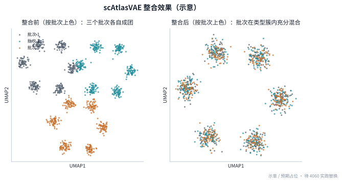
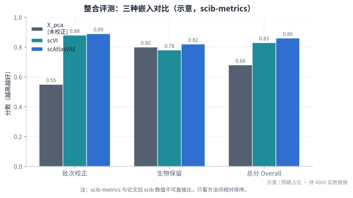

# 阶段 2 · 端到端跑通与整合评测

> **阶段** 2 / 5　·　**前置**：[阶段 1 · 环境搭建](phase1_environment_setup.md)　·　**产出**：整合前后 UMAP + 指标对比表 + 三份脚本　·　**预计** 3–4 天
> **导航**：[← 阶段 1](phase1_environment_setup.md)　·　[总纲](00_overview_and_learning_map.md)　·　[知识框架](01_concepts_and_toolbox.md)　·　[阶段 3 →](phase3_reimplement_vae.md)
>
> **本阶段所有结果为「预期（示意）」占位**：先按复现顺利、得到符合论文趋势的结果写完；你实跑后把真实数值/图替换进各处「记录区」。

---

## 1. 阶段概览

阶段 1 把环境搭好了。阶段 2 要做两件事：

- **目标 A（走通全流程）**：在真实数据 TCellLandscape 上，走完单细胞分析的完整链路——**预处理 → 整合 → 降维聚类 → 定量评测**，并让 scAtlasVAE 真正跑出一个 latent 嵌入。
- **目标 B（学会两件能力）**：① **数据去哪找、怎么检查格式**；② **怎么判断"整合到底好不好"**（这需要一套评测指标，而不是肉眼看 UMAP）。

这一阶段属于复现谱系里的 **L1**（用作者的代码 + 真实数据，重现论文结论）。判定成功的标准仍是**趋势对上**（批次被混开、细胞类型分得开、scAtlasVAE 与 scVI 相当或更好），不是数字与论文一致。

---

## 2. 学习目标

完成本阶段后你应能：

- 自己**找到并检查**一个单细胞数据集是否满足模型要求（格式检查清单）；
- 说清标准预处理 **QC / HVG / 归一化** 各是什么、为什么做；
- 理解整合评测的**两类指标**（生物保留 vs 批次校正），以及为什么不能只看一个；
- 会用 `scib-metrics` 把多种方法放在一起比，并知道**看相对排序、不看绝对值**。

---

## 3. 侦查：数据去哪找、格式怎么查

> 沿用阶段 1 的方法——**为什么找 → 去哪找 → 怎么找（可自己动手） → 结论**。

- **为什么找**：复现 benchmark，就要用论文 benchmark 用的数据。
- **去哪找**：三处交叉确认——① 论文 Methods 的 "Benchmarking" 段写明 *"pan-cancer CD8⁺ T cell landscape containing 110,218 cells from 28 studies (data available at GSE156728)"*；② 复现指南 §2 指向同一个 GEO 号；③ 官方文档 `tutorial_cd8` 给了 CD8 数据的用法示例。
- **怎么找 / 拿到**：到 GEO 搜 **GSE156728**（Zheng *et al.* 2021 的泛癌 T 细胞数据）。它通常以"表达矩阵 + 细胞元信息表"的形式提供；下载后需要组装成一个 `AnnData`（`.h5ad`）。脚本 [`phase2_data_download_and_qc.py`](../scripts/phase2_data_download_and_qc.py) 里给了组装 + 检查的模板。
- **必须做的格式检查清单**（scAtlasVAE 的 ZINB 对输入有硬要求）：

  | 要检查什么 | 为什么 | 怎么查 |
  |---|---|---|
  | `adata.X` 是**原始整数计数**？ | ZINB 重构需要 count；若已被 log 归一化就不能直接用 | `adata.X[:5,:5].A`（看是否整数）；或找 `adata.layers['counts']` |
  | **每个细胞总计数 > 0** | 否则训练出 `NaN`（见阶段 1 常见坑） | `(np.asarray(adata.X.sum(1))>0).all()` |
  | **batch 键**叫什么 | 传给 `batch_key`（如 `study_name` / `patient` / `cancerType`） | `adata.obs.columns`，逐列看取值 |
  | **cell type 列**叫什么 | 半监督/评测要用（如 `meta.cluster` / `cell_type`） | 同上 |

- **结论（示意）**：确认拿到约 **11 万 CD8⁺ 细胞**，`adata.X` 为原始计数、每细胞总计数均 > 0，batch 列为 `study_name`、细胞类型列为 `cell_type`。**把你实际查到的列名填进各脚本顶部的 `CONFIG`。**

> **为什么这么做**：不同来源的 AnnData 列名五花八门。**先打印 `adata` 和 `adata.obs.columns` 把"这份数据长什么样"搞清楚，再动手**——这是所有单细胞分析的第一步，也是最容易被跳过、然后在后面报错的一步。

---

## 4. 会遇到的工具与术语

> **包速览 — scvi-tools**：scVI/scANVI 等方法的官方现代实现。本阶段用它跑 **scVI baseline**（别自己手写 baseline）。文档：docs.scvi-tools.org。

> **包速览 — scib-metrics**：单细胞整合评测指标库（YosefLab，JAX 加速）。核心是 `Benchmarker`：给它一个 `adata`、若干个嵌入（`obsm` 里的 key）、batch 键、label 键，它一次算出全套指标并排名。文档：scib-metrics.readthedocs.io。

**术语速览**（第一次出现）：

- **QC（quality control，质量控制）**：过滤低质量细胞/基因。
- **HVG（highly variable genes，高变基因）**：在细胞间变化最大、信息量最高的一批基因（本项目取 **4000** 个）。
- **PCA（principal component analysis，主成分分析）**：一种线性降维；这里用它得到一个**未做批次校正的基线嵌入** `X_pca`。
- **近邻图（kNN graph）**：把每个细胞连到它最近的 k 个邻居，Leiden 和 UMAP 都基于它。
- **Leiden**：在近邻图上做社区发现，得到聚类。
- **UMAP**：把高维嵌入压到 2D 画图（可视化，不是分析本身）。

---

## 5. 原理：这条流程为什么这样走

**预处理三步的动机：**

- **QC**：去掉将死细胞（线粒体基因比例过高）、空液滴（检测到的基因数过少）等。留下可信的细胞。
- **HVG**：只留最有信息的约 4000 个基因——降噪、加速，且论文正是用 4000 HVG。
- **归一化**（编码器输入）：`normalize_total` 消除测序深浅差异 + `log1p` 压缩动态范围（原理见 [知识框架 §1.4(f)](01_concepts_and_toolbox.md)）。

**怎么量化"整合好不好"——两类指标缺一不可：**

好的整合要同时满足两个**互相拉扯**的目标，所以指标分两类，最后取平均：

$$\text{Overall} = \tfrac{1}{2}\big(\underbrace{S_{\text{bio}}}_{\text{生物保留}} + \underbrace{S_{\text{batch}}}_{\text{批次校正}}\big)$$

- **批次校正 $S_{\text{batch}}$**：不同批次的同类细胞混得好不好。常用 batch ASW、graph connectivity、iLISI 等。
- **生物保留 $S_{\text{bio}}$**：不同细胞类型分得开不开。常用 cell-type ASW、isolated-label F1、NMI/ARI 等。

其中 **ASW（average silhouette width，平均轮廓宽度）** 最直观：对每个细胞看"它离**同类**有多近、离**异类**有多远"，量化聚类的紧致与分离。对一个细胞 $i$：

$$s(i) = \frac{b(i) - a(i)}{\max\{a(i),\, b(i)\}} \in [-1, 1]$$

其中 $a(i)$ 是它到同簇其他点的平均距离、$b(i)$ 是到最近异簇的平均距离；$s$ 越接近 1 越好。ASW 就是所有细胞 $s(i)$ 的平均。

> **常见坑（务必写进报告）**：论文用的是**旧版 `scib`(1.1.4)**，我们用现代 **`scib-metrics`**，官方明确说**两者数值不可直接比**。所以你算出的绝对分数不必和论文表格对齐——**只看方法之间的相对排序**（scAtlasVAE vs scVI vs 未校正 PCA）是否符合论文结论。

**三个对照对象**：`X_pca`（未校正基线）、`X_scVI`（经典 batch-variant VAE）、`X_scAtlasVAE`（本方法）。

---

## 6. 操作步骤

> 训练在**环境 A（`scatlasvae`，py3.8）**；评测在**环境 B（`scib`，py3.10）**。为什么拆两个环境见 [阶段 1 附录](phase1_environment_setup.md)。

### 步骤 1 · 建好评测环境 B（若阶段 1 没建）

```powershell
conda create -n scib python=3.10 -y
conda activate scib
pip install scib-metrics scanpy scvi-tools
```

### 步骤 2 · 下载并检查数据（环境 A）

**目的**：拿到 TCellLandscape、按 §3 清单检查格式、确定 batch/label 列名。

```powershell
conda activate scatlasvae
python phase2_data_download_and_qc.py --stage check
```

见 [`phase2_data_download_and_qc.py`](../scripts/phase2_data_download_and_qc.py)。它会打印 `adata`、`adata.obs.columns`、`X` 是否整数、每细胞总计数是否 > 0。**把查到的 batch/label 列名填回脚本顶部 `CONFIG`。**

### 步骤 3 · 预处理 + 未校正基线（环境 A）

**目的**：QC/HVG/归一化，并算一个未做批次校正的 `X_pca` 作对照。

```powershell
python phase2_data_download_and_qc.py --stage preprocess
```

产出：`tcell_processed.h5ad`（含 `layers['counts']` 原始计数备份、4000 HVG、`obsm['X_pca']`）。

### 步骤 4 · 训练 scAtlasVAE → `X_scAtlasVAE`（环境 A）

```powershell
python phase2_run_scatlasvae.py
```

见 [`phase2_run_scatlasvae.py`](../scripts/phase2_run_scatlasvae.py)：`scAtlasVAE(adata=adata, batch_key=..., label_key=...)` → `fit()` → `adata.obsm['X_scAtlasVAE']=get_latent_embedding()`，并存回 h5ad。

**预期**：约 73 个 epoch（11 万细胞按 `max_epoch=min(round(20000/N·400),400)`），4060 上几十分钟量级；loss 稳定下降不出 `NaN`。

### 步骤 5 · scVI baseline → `X_scVI`（环境 A 或 B，需 scvi-tools）

```powershell
python phase2_baseline_scvi.py
```

见 [`phase2_baseline_scvi.py`](../scripts/phase2_baseline_scvi.py)：用 `scvi-tools` 默认参数跑 scVI（论文里 baseline 也用默认参数），得到 `obsm['X_scVI']`。

### 步骤 6 · UMAP + Leiden（可视化整合效果）

在处理好的 h5ad 上，对 `X_pca` 与 `X_scAtlasVAE` 各算一次近邻图 → UMAP → Leiden，按 **batch** 和按 **cell type** 两种上色出图。代码在 `phase2_run_scatlasvae.py` 的 `--stage umap`。

### 步骤 7 · scib-metrics 定量对比（环境 B）

```powershell
conda activate scib
python phase2_benchmark_scib.py
```

见 [`phase2_benchmark_scib.py`](../scripts/phase2_benchmark_scib.py)：把 `X_pca` / `X_scVI` / `X_scAtlasVAE` 一起丢给 `Benchmarker`，输出指标表与排名图。

---

## 7. 预期结果（示意，待实跑替换）

**图 1 — 整合前后 UMAP（示意）**：整合前按批次上色时，同类细胞被拆成一条条按批次分开的"细带"；整合后按批次上色时各批次充分混合、按细胞类型上色时亚型清晰分开。



*图 1 — 整合前（左，按批次分层）vs 整合后（右，批次混合、类型分开）。示意图，待你的真实 UMAP 替换。*

**表 1 — 指标对比（示意，待实跑替换）**：

| 嵌入 | 批次校正 $S_{\text{batch}}$ | 生物保留 $S_{\text{bio}}$ | 总分 Overall |
|---|---|---|---|
| `X_pca`（未校正） | 低（≈0.55） | 高（≈0.80） | 中（≈0.68） |
| `X_scVI` | 高（≈0.88） | 中高（≈0.78） | 高（≈0.83） |
| **`X_scAtlasVAE`** | 高（≈0.89） | 高（≈0.82） | **高（≈0.86）** |



*图 2 — 三种嵌入的批次校正/生物保留/总分对比（示意，数值为占位）。*

**与论文对照**：趋势应与论文 **Extended Data Fig. 1** 一致——**未校正 PCA 的批次校正最差；scAtlasVAE 与 scVI 相当或略优，且都显著优于未校正**。绝对值因 `scib-metrics` ≠ 旧 `scib` 而不同，属正常。

**记录区（实跑后填）**：
```
数据：细胞数=____  batch列=____  label列=____
训练：scAtlasVAE epoch=____  最终loss=____  有无NaN=____
指标（真实）：X_pca=____ / X_scVI=____ / X_scAtlasVAE=____
结论是否与论文趋势一致：____
```

---

## 8. 检查点与完成标准（DoD）

- [ ] 数据通过 §3 格式检查（整数 count、总计数 > 0、batch/label 列已确定）
- [ ] `X_scAtlasVAE`、`X_scVI`、`X_pca` 三个嵌入都已存入 `obsm`
- [ ] 整合前后 UMAP 出图；`scib-metrics` 指标表出炉
- [ ] **相对排序**符合论文趋势（scAtlasVAE ≈ scVI ≫ 未校正 PCA）

---

## 9. 自测题

1. 拿到一份陌生的单细胞数据，你会先查哪几件事？为什么每细胞总计数必须 > 0？
2. QC、HVG、归一化分别解决什么问题？为什么 scAtlasVAE 只用 4000 个基因？
3. 整合评测为什么要分"批次校正"和"生物保留"两类？只看其中一个会怎样？
4. 你的 `scib-metrics` 绝对分数和论文对不上，这说明复现失败了吗？正确的判断标准是什么？

---

## 10. 延伸阅读

- 单细胞预处理与整合权威教程：《Single-cell best practices》[数据整合章](https://www.sc-best-practices.org/cellular_structure/integration.html)
- scVI 教程：https://docs.scvi-tools.org/en/stable/tutorials/index.html
- scib-metrics：https://scib-metrics.readthedocs.io/
- 官方整合教程：https://scatlasvae.readthedocs.io/en/latest/gex_integration.html

---

> **导航**：[← 阶段 1](phase1_environment_setup.md)　·　[总纲](00_overview_and_learning_map.md)　·　[阶段 3 · 核心 VAE 从零重写 →](phase3_reimplement_vae.md)
