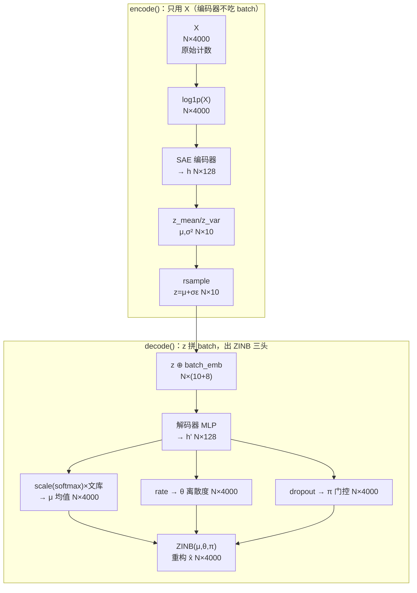
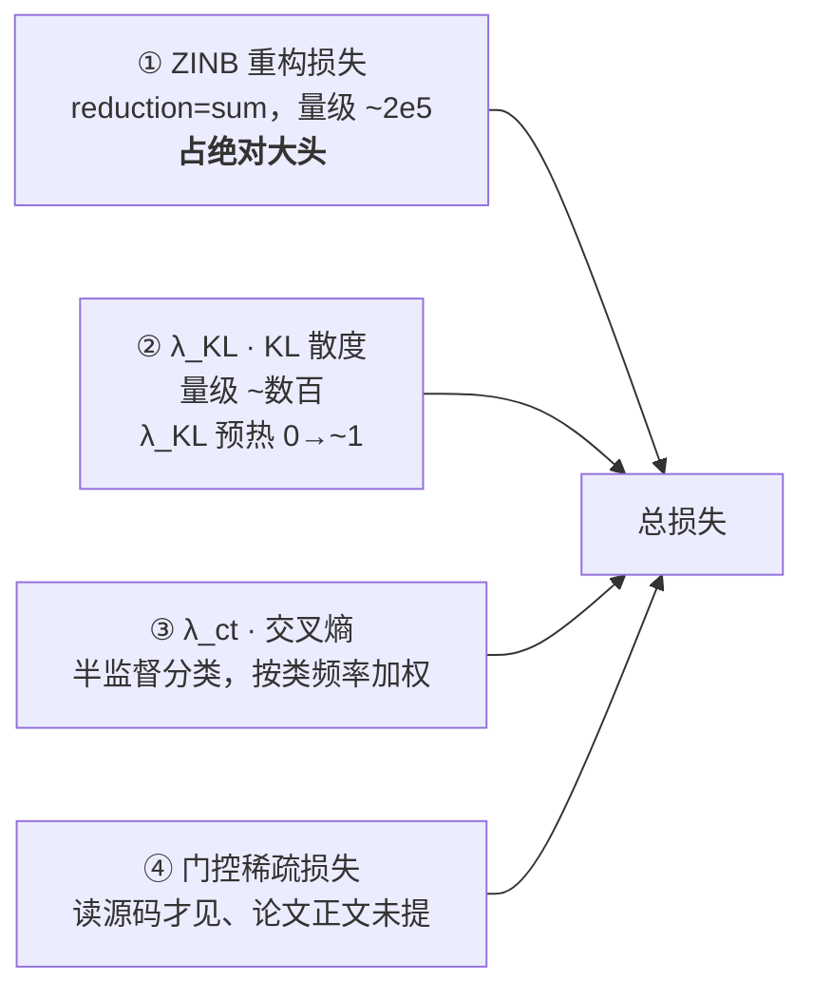
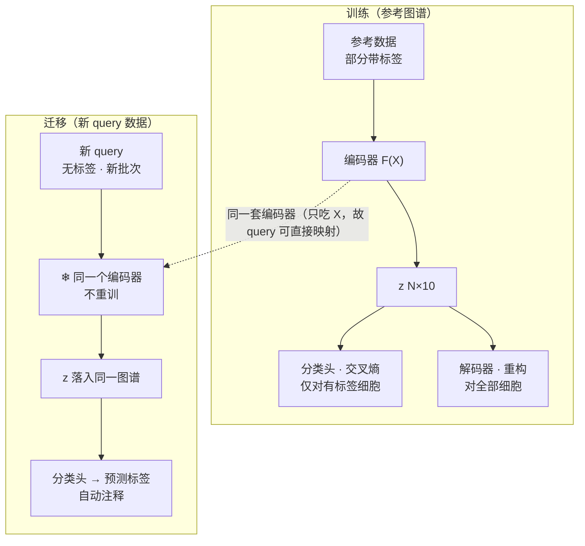
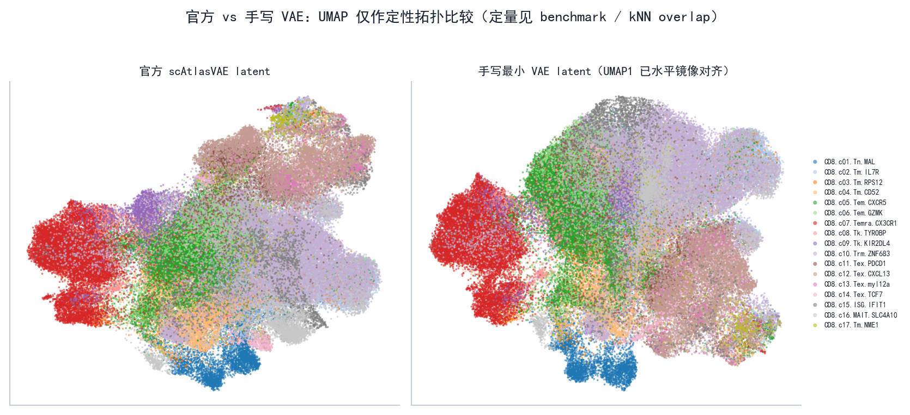

# 阶段 3 · 核心 VAE 从零重写（L2 ★ 全项目重点）

> **阶段** 3 / 6　·　**前置**：[阶段 2 · 整合与评测](phase2_integration_and_benchmark.md)、[知识框架](01_concepts_and_toolbox.md)　·　**产出**：手写模型 `minimal_scatlasvae.py` + 差异清单　·　**预计** 5 天
> **导航**：[← 阶段 2](phase2_integration_and_benchmark.md)　·　[总纲](00_overview_and_learning_map.md)　·　[知识框架](01_concepts_and_toolbox.md)　·　[阶段 4 →](phase4_ablation_studies.md)
>
> **结果已为本机真实实跑**：手写最小 VAE 在 ~10.5 万 CD8 全量数据上训练，与官方实现做了定性(UMAP)+定量(kNN Jaccard)对照，记录区为真实数据。
>
> **关于本篇的源码行号**：下面走读用的行号是 scAtlasVAE **上游 pristine 源码**的行号。**打了 [阶段 1 §4.5](phase1_environment_setup.md) 的 `chunked_anndata` 补丁后**（它在文件头部加了 3 行 `try/except`），你本地工作副本里这些行号**整体 +3**——例如"编码器里被注释掉的 batch 注入行"pristine 是 966–967、你打完补丁后是 **969–970**（[阶段 5](phase5_deeper_validation.md) 用的就是后者）。看到 ±3 的偏差不必惊慌，函数就在附近。

---

## 1. 阶段概览

这是整个复现的**核心**。前两阶段是"用作者的代码"，这一阶段是**自己把核心方法重写一遍**（复现谱系里的 **L2**）——真正长本事的地方。

做法分两步，缺一不可：

1. **先带你逐行读真实源码 `_gex_model.py`**（§4–§8）：不是给你一张"公式↔位置"的对照表让你自己找，而是**手把手打开文件、跳到某一行、把那几行摘出来读给你听、指出门道**。读源码本身就是这一阶段最该学会的硬功夫。
2. **再对着刚读懂的源码，自己手写一个最小可用版**（§9–§11）：`minimal_scatlasvae.py` 是"读者的重写"，每一块都能映射回你刚读过的真实代码；然后逐行对照、列出差异。

> **关于"自己写 vs 我给你写"**：最好的学习方式是**你先自己写一版**、军师只做 review（[总纲 §6](00_overview_and_learning_map.md)）。你要求我直接给出代码，所以我提供一份**参考实现** [`minimal_scatlasvae.py`](../scripts/minimal_scatlasvae.py) 供你**逐行读懂、对照、改写**——请把它当"精读对象"而非"复制粘贴对象"。

---

## 2. 学习目标

- 学会**打开一个大源码文件、快速定位并读懂核心函数**（`grep` → 跳行 → 逐行读）；
- 把 VAE 全套（编码器 / 重参数化 / 解码器 / ZINB / KL 预热 / 分类头）在**真实代码**里一一认出来；
- 把论文 Methods 的**每一条公式**对应到 PyTorch 代码；
- 掌握复现硬功夫：**逐行对照官方实现、找出并解释每一处差异**。

---

## 3. 侦查第一步：顺藤摸瓜，找到并进入核心函数

> 沿用侦查法。[总纲 §2](00_overview_and_learning_map.md) 已经确认"核心就是 `_gex_model.py` 一个文件"，现在要进一步定位到**该读哪几个函数**。

**怎么动手**：一个 2156 行的文件不能从头读到尾。先 `grep` 出所有函数定义，挑核心的读：

```bash
cd scAtlasVAE
grep -nE '^\s*def (encode|decode|forward|fit)\(' scatlasvae/model/_gex_model.py
```

**你会看到什么**：

```
964:    def encode(self, X: torch.Tensor, batch_index: torch.Tensor = None, eps: float = 1e-4):
992:    def decode(self, ...):
1048:    def forward(self, ...):
1243:    def fit(self, ...):
```

**门道**：VAE 的"前向计算"就三步——**编码 → 解码 → 算损失**，正好对应 `encode`/`decode`/`forward`；`fit` 是训练循环。**读懂这四个函数，就读懂了这个模型。** 下面逐个进去读。前向的整条张量流动，先放一张"地图"，读代码时随时回来对：



*图 3-1 — encode（只用 X）与 decode（z 拼 batch，出 ZINB 三头）的张量形状流。下面每读一段代码，都能在这张图上找到位置。*

---

## 4. 读 `encode()`：编码器为什么"看不见批次"

**怎么动手**：`grep` 已告诉我们它在第 964 行。打开 `scatlasvae/model/_gex_model.py`，跳到 964。**你会看到什么**（摘录关键行，行号为真实行号）：

```python
# _gex_model.py:964
def encode(self, X, batch_index=None, eps=1e-4):
    # if batch_index is not None and self.inject_batch:        # 966
    #    X = torch.hstack([X, batch_index])                    # 967  ← 注意这行被注释掉了
    libsize = torch.log(X.sum(1))                              # 968
    if self.reconstruction_method == 'zinb' or ...:            # 969
        if self.total_variational:
            X = self._normalize_data(X, after=1e4, copy=True)  # 971
        if self.log_variational:
            X = torch.log(1+X)                                 # 973
    ...
    q = self.encoder.encode(X)                                 # 975 走 SAE(一个 MLP)
    q_mu  = self.z_mean_fc(q)                                  # 980
    q_var = torch.exp(self.z_var_fc(q)) + eps                  # 981
    z = Normal(q_mu, q_var.sqrt()).rsample()                   # 982
    return dict(q=q, q_mu=q_mu, q_var=q_var, z=z)
```

**门道**（这段是全项目的"题眼"，逐点看）：

1. **第 966–967 行被注释掉了**：`encode` 虽保留 `batch_index` 形参，实际不使用它，所以 scAtlasVAE encoder 不显式接收 batch 元数据。论文把 scVI 概括为 `F(X,B,S)`，但本项目 scvi-tools 默认 `encode_covariates=False` 时同样不接收 batch；scAtlasVAE 的区别是这一接口在结构上固定。无论哪种模型，X 本身仍可能携带批次信号。
2. **第 973 行 `X = torch.log(1+X)`**：编码器**输入**先做 `log1p`（对应构造参数 `log_variational=True`）。但注意——这只改了"喂进编码器的 X"，**重构的目标仍是原始计数**（下面 `forward` 里能看到）。别把这两处搞混（[知识框架 §1.4f 常见坑](01_concepts_and_toolbox.md)）。
3. **第 980–982 行**：`z_mean_fc`、`z_var_fc` 两个线性层把隐藏表示映射成 **μ 和 σ²**；`q_var = exp(...) + eps` 用 `exp` 保证方差为正、`+eps`(1e-4) 防数值问题；`Normal(...).rsample()` 里的 **`rsample`（reparameterized sample）** 做的正是 [知识框架 §1.4d](01_concepts_and_toolbox.md) 的 `z = μ + σ·ε`——让随机采样可导。

> **一个"代码 > 论文"的小发现**：构造函数第 349 行有注释 `# z ~ Logisticnormal(0, I)`，第 352 行还定义了 `self.z_transformation = nn.Softmax(dim=-1)`。但你在 `encode()` 里看到——**实际返回的 `z` 是原始高斯 `rsample`，那个 softmax 变换并没有施加在所用的 `z` 上**。这类"注释/文档说 A、代码实际做 B"的细节，只有读代码才发现，是报告里很好的素材。

> **对照公式**：这段就是论文 Methods 的 $q_\phi(z\mid X)=\mathcal N(\mu,\sigma^2)$ 与近似后验 $z\sim q_\phi(z\mid X)$。注意公式里编码器只依赖 $X$、不依赖 $B$——和代码一致。

---

## 5. 读 `decode()`：批次在这里、而且只在这里注入

**怎么动手**：跳到第 992 行。**你会看到什么**（摘录）：

```python
# _gex_model.py:992
def decode(self, H, lib_size, batch_index=None, label_index=None, ...):
    z = H["z"]
    # 把 batch(和可选的 label) 的 embedding 拼到 z 后面：
    if batch_index is not None and ... self.inject_batch:
        z = torch.hstack([z, batch_index])                    # 1012 前后
    px = self.decoder(z)                                       # 1018 送进解码 MLP
    px_rna_scale = self.px_rna_scale_decoder(px)               # 1021 含 Softmax → 各基因占比
    if self.decode_libsize and self.reconstruction_method != 'mse':
        px_rna_scale_final = px_rna_scale * lib_size.unsqueeze(1)   # 1023 占比 × 文库 = 均值 μ
    ...
    px_rna_rate    = self.px_rna_rate_decoder(px)              # 1030 → 离散度 θ 的 logits
    px_rna_dropout = self.px_rna_dropout_decoder(px)           # 1036 → 零膨胀门控 π 的 logits
    return dict(px_rna_scale=px_rna_scale_final,
                px_rna_rate=px_rna_rate, px_rna_dropout=px_rna_dropout, ...)
```

**门道**：

1. **批次在这里注入**（`torch.hstack([z, batch_index])`）——和 `encode` 里被注释掉的那行形成鲜明对照：**batch 不进编码器、只进解码器**。`batch_index` 事实上先经一个 `nn.Embedding`（构造时 `batch_hidden_dim=8`）变成 8 维向量再拼接（构造函数里建的 `FCLayer` 负责这步）。
2. **ZINB 三头**（对照 [知识框架 §1.4f](01_concepts_and_toolbox.md) 与图 3-1）：
   - `px_rna_scale`：`Softmax` 出的**各基因占比**（和为 1），**× 文库大小 `lib_size`** 得到均值 μ——**文库大小就是在第 1023 行乘进去的**（北极星问题 3 的答案）。
   - `px_rna_rate`：离散度 θ（存的是 logits，用时 `.exp()`）。
   - `px_rna_dropout`：零膨胀门控 π（也是 logits）。

> **对照公式**：论文 Methods 的批条件解码器 $\mathcal F_{\text{decoder}}(z, B)\to(r_{\text{mean}}, r_{\text{var}}, r_{\text{gate}})$，恰好就是这里的三头 `(scale→mean, rate→θ, dropout→π)`。

> **深入（可选）· 又一处只在代码里的细节**：构造函数第 377–378 行有 `# add 1 to the decoder_n_cat_list for dummy variable`，给每个类别数 `+1`。这是给"未知/占位"类别留的哑元位置，服务于迁移时遇到新批次的情形——论文正文不会讲这种工程细节。

---

## 6. 读 `forward()`：三块损失是怎么拼起来的

**怎么动手**：跳到第 1048 行。这是把 encode/decode 串起来、并算出所有损失的地方。**你会看到什么**（摘录）：

```python
# _gex_model.py:1048
def forward(self, X, lib_size, batch_index=None, label_index=None, ...):
    H = self.encode(X, batch_index)                            # 1060
    q_mu, q_var = H["q_mu"], H["q_var"]
    # ① KL：把每团云拉向 N(0, I)
    kldiv_loss = kld(Normal(q_mu, q_var.sqrt()),
                     Normal(torch.zeros_like(q_mu), torch.ones_like(q_var))).sum(dim=1)  # 1065
    R = self.decode(H, lib_size, batch_index, label_index, ...)                          # 1068
    # ② 重构：真实计数在 ZINB 下的负对数似然
    if self.reconstruction_method == 'zinb':                                             # 1070
        reconstruction_loss = LossFunction.zinb_reconstruction_loss(
            X, mu=R['px_rna_scale'], theta=R['px_rna_rate'].exp(),
            gate_logits=R['px_rna_dropout'], reduction=reduction)                        # 1071
    ...
    # ③ 分类（半监督）：只在当前 minibatch 有有效标签时算
    prediction_loss = torch.tensor(0., device=self.device)
    n_active_prediction_heads = 0
    if self.n_label > 0:                                                                 # 1104
        criterion = nn.CrossEntropyLoss(weight=self.label_category_weight)               # 1105
        prediction = self.fc(H['z'])
        valid = (label_index != self.new_adata_code).reshape(-1)
        if valid.any():
            prediction_loss = criterion(prediction[valid],
                                        one_hot(label_index[valid], self.n_label))
            n_active_prediction_heads += 1
    # additional heads 同样 mask undefined；空 head 返回 0，只按 active heads 平均
    ...
    return H, R, {"reconstruction_loss": reconstruction_loss,
                   "prediction_loss": prediction_loss,
                  "n_active_prediction_heads": n_active_prediction_heads,
                   "kldiv_loss": kldiv_loss, ...}                                          # 1172
```

**门道**：

1. **三块损失一一对上** [知识框架 §1.4g](01_concepts_and_toolbox.md) 讲的 `L = 重构 + λ_KL·KL + λ_ct·分类`：`kldiv_loss`（①）、`reconstruction_loss`（②，走 ZINB，注意 `X` 是**原始计数**、`theta` 用了 `.exp()`）、`prediction_loss`（③）。
2. **半监督 mask**：只有有效标签细胞进入交叉熵；若某个 minibatch 对某 head 全是 `undefined`，该 head 返回 0 且不计入 active-head 分母。这样避免空 target 交叉熵产生 NaN。初始化还会强制把 `undefined` 放在类别末尾，保证 code 与输出列对齐。
3. **第 1105 行 `CrossEntropyLoss(weight=self.label_category_weight)`**：交叉熵**按类频率加权**。`label_category_weight` 在构造时（第 697–701 行）算好——**稀有亚型权重更大**，防止模型偷懒只学多数类。这是论文公式里那个 $w_{\hat y}$ 的实现，读代码才看得具体。

几块损失的相对量级、以及"λ_KL 因 min(max_epoch,400) 截断而 0→1 爬满"的预热真相，放一张图：



*图 3-2 — 总损失 = 四块之和。重构（sum 归约，量级 ~2e5）绝对占大头，KL（~数百）与分类相对小；另有一条读源码才见的"门控稀疏"项。KL 权重预热的真相——因 `min(max_epoch,400)` 截断，λ_KL 在 max_epoch 内 0→~1 爬满——由真实训练曲线 [`figures/fig_phase2_loss_curve.png`](figures/fig_phase2_loss_curve.png) 佐证（下面 §8 细讲）。*

---

## 7. 读 ZINB 的负对数似然：把"重构损失"算到底

§6 里 `reconstruction_loss` 调了 `LossFunction.zinb_reconstruction_loss`。**这才是重构损失真正发生的地方，值得跟进去读**（这也是旧版报告一笔带过、这次要讲透的一处）。

**怎么动手**：`grep -n "def zinb_reconstruction_loss" scatlasvae/utils/_loss.py` → 第 113 行。**你会看到**它构造一个 `ZeroInflatedNegativeBinomial` 分布对象，然后 `-znb.log_prob(X).sum(dim=1)`——**"重构好不好" = "真实计数 X 在这个 ZINB 分布下的对数概率有多高"，取负号变成"越小越好"的损失**（[知识框架 §1.4g](01_concepts_and_toolbox.md) 的 NLL）。

分布的 `log_prob` 具体怎么算？跟到 `utils/_distributions.py`。核心是**分 `x=0` 和 `x>0` 两种情形**——这正是"零膨胀"的数学落点。手写版 [`minimal_scatlasvae.py`](../scripts/minimal_scatlasvae.py) 的 `log_zinb()` 把它浓缩成等价、数值稳定的一段（遵循 scVI 的经典写法）：

```python
def log_zinb(x, mu, theta, pi, eps=1e-8):
    softplus_pi = F.softplus(-pi)                              # 数值稳定的 log(1+e^{-pi})
    log_theta_mu_eps = torch.log(theta + mu + eps)
    pi_theta_log = -pi + theta * (torch.log(theta+eps) - log_theta_mu_eps)
    case_zero = F.softplus(pi_theta_log) - softplus_pi         # x==0：门控开 或 NB 恰好给 0
    case_nonzero = (-softplus_pi + pi_theta_log
        + x*(torch.log(mu+eps) - log_theta_mu_eps)
        + torch.lgamma(x+theta) - torch.lgamma(theta) - torch.lgamma(x+1))  # x>0：纯 NB
    return torch.where(x < eps, case_zero, case_nonzero)
```

**门道**（逐点，这段第一次读会晕，慢慢来）：

- **为什么分两种情形**：ZINB = "以概率 π 直接吐 0" ⊕ "以概率 (1−π) 走负二项 NB"。所以 `x=0` 的总概率 = π + (1−π)·NB(0)（**两条路都可能产生 0**）；`x>0` 只可能来自 NB 那条路，概率 = (1−π)·NB(x)。两种情形的对数概率公式自然不同。
- **`softplus` 是干嘛的**：`softplus(t)=log(1+e^t)`。直接算 `log(1+e^{-pi})` 在 `pi` 很大/很小时会溢出；用 `F.softplus` 是数值稳定版。门控 π 以 **logits** 形式参与（回顾 §5：解码器输出的就是 logits），`softplus(-pi)` 恰好等于 `-log(sigmoid(pi))`，避免了先算 sigmoid 再取 log 的精度损失。
- **`lgamma` 是干嘛的**：负二项的概率里有组合数（阶乘），`torch.lgamma` 算的是 log(Γ(·))，即"log 阶乘"的连续版——把连乘变连加，稳定又可导。
- **`torch.where(x<eps, ...)`**：逐元素选分支。`x` 是整数计数，`x<eps`(1e-8) 等价于 `x==0`。

> **对照公式**：这段就是论文 Methods 里 $-\log p_\theta(X\mid z, B)$ 在 ZINB 下的展开。你不需要能默写它，但要能**指着代码说清"哪一块管 x=0、哪一块管 x>0、softplus/lgamma 各自防什么"**——能做到，这段就真读懂了。

---

## 8. 读 `fit()`：训练循环里的三个"读代码才知道"的细节

**怎么动手**：跳到第 1243 行看 `fit` 的签名（默认值往往就是论文超参）。**你会看到**（摘录默认值）：

```python
# _gex_model.py:1243
def fit(self, max_epoch=None, n_per_batch=128, kl_weight=1.,
        lr=5e-5, n_epochs_kl_warmup=400, weight_decay=1e-6,
        random_seed=12, pred_last_n_epoch=10, ...):
```

**门道**（三个细节，都是报告素材）：

1. **默认超参直接抄**：`AdamW` · `lr=5e-5` · `weight_decay=1e-6` · `n_per_batch=128`（批大小）· `random_seed=12`。训练轮数 `max_epoch` 若不指定，按论文公式 $\min(\mathrm{round}(20000/N)\times400,\ 400)$——**本项目 N=104,805 时 76 个 epoch**。
2. **KL 预热的"真相"**（北极星问题 4 的进阶答案，这一版**更正了旧报告的一处硬错**）：`fit` 签名里确实写着 `n_epochs_kl_warmup=400`，但**紧接着有一行**（源码约 1304 行，打补丁后）：`n_epochs_kl_warmup = min(max_epoch, n_epochs_kl_warmup)`。所以当 `max_epoch < 400`（本项目 10.5 万细胞 `max_epoch=76`；细胞越多 epoch 越少），预热长度被**截断成 max_epoch**，权重 `kl_weight = min(1, epoch/max_epoch)`——**λ_KL 恰好在整个训练里从 0 线性爬到 ~1、末轮达到 ~1**。旧报告说"只到 ≈0.18、从没到 1"是**漏读了这行 `min` 截断**（把预热当成固定 400）。含义仍然成立、只是量级要摆对：**早期 λ_KL 很小、重构（ZINB）主导，末期才升到满强度**——这个"先重构、后正则"的爬坡是有意为之。实跑的 λ_KL 曲线（见 phase2 图 2-2）正好实证了它爬到 ~1。**这条纠错本身就是"读源码要读全、别停在函数签名"的最佳教材。**
3. **`pred_last_n_epoch=10`**：分类头**只在最后 10 个 epoch 才重点训练**。为什么？**先让编码器把表示学好（前 60 多个 epoch 专心重构+整合），最后再学分类更稳**——先打地基、再盖楼。

> **深入（可选）**：`fit`/`calculate_metric` 里还用了 `ThreadPoolExecutor` 预取下一个 batch（`_prepare_batch`）——纯工程优化，和方法无关，读到时知道"哦这是为了加速取数"即可，不必深究。

至此，`encode → decode → forward → fit` 四个核心函数读完。**你已经把 scAtlasVAE 的方法内核完整过了一遍真代码。** 下面换你上手。

---

## 9. 换你写：手写最小版，逐块映射回真代码

现在对着刚读懂的源码，看 [`minimal_scatlasvae.py`](../scripts/minimal_scatlasvae.py)——它是"读者的重写"，每一块都对得上 §4–§8 读过的真实函数：

| 手写版（minimal） | 对应真实源码 | 关键点 |
|---|---|---|
| `encode()`：`self.encoder(torch.log1p(x))` | `_gex_model.py:964` `encode` | **只吃 x**，log1p 后进 MLP；`var=exp(...)+1e-4` |
| `reparameterize()`：`mu + var.sqrt()*randn_like` | `:982` `Normal(...).rsample()` | 重参数化 `z=μ+σε` |
| `decode()`：`cat([z, batch_emb(b)])` → 三头 | `:992` `decode` | **batch 只在这拼进来**；`scale*libsize=μ` |
| `log_zinb()` | `utils/_loss.py:113` + `_distributions.py` | ZINB 负对数似然，x=0/x>0 两情形 |
| `elbo()` 里解析 KL | `:1065` `kld(Normal,Normal).sum(1)` | KL 收拢到 N(0,I) |
| `fit()`：`kl_weight=min(1, epoch/max_epoch)` | `:1243` `fit`（`n_epochs_kl_warmup`） | 预热；`AdamW/lr=5e-5/seed=12` |
| 单个 `classifier` | `:1104` `self.fc`（半监督） | 单 atlas 只需一个头（见 §12） |

半监督分类头 + zero-shot 迁移这两件事，是这个分类头的用武之地，配一张图理解"编码器共享"为什么让迁移成立：



*图 3-3 — 训练时分类头只对有标签细胞算交叉熵；迁移时新数据过**同一个不重训的编码器**就落进参考图谱、直接预测标签。根就在"编码器只吃 X"。这条 zero-shot 迁移能力在[阶段 5 · E1](phase5_deeper_validation.md) 被真正跑通并量化。*

> **试一试**：`minimal_scatlasvae.py` 末尾自带一个合成小数据的自测（`python minimal_scatlasvae.py`），512 个假细胞跑 3 个 epoch，验证前向/训练链路能通、不出 NaN。先跑通它，再上真实数据。

---

## 10. 训练手写版并与官方对照

用 [`phase3_train_and_compare.py`](../scripts/phase3_train_and_compare.py) 在从 GSE156728 重建的 104,805-cell Zheng CD8 数据上训练手写模型，得到 `obsm['X_minimal']`，与阶段二的官方 `obsm['X_scAtlasVAE']` 对比。该对象不是论文带 28 个 `study_name` 的成品 TCellLandscape：

- **定性**：两套嵌入各出一张 UMAP（按细胞类型上色），并排看结构是否相似；
- **定量**：算两套嵌入的 **kNN 邻域平均 Jaccard**（随机取细胞，比较它们在两套嵌入里的近邻集合有多重合）。

```powershell
conda activate scatlasvae
python phase3_train_and_compare.py
```

**结果（本机实测）**：



*图 3-4 — **真实对照**（按 17 个 CD8 亚型上色）。**UMAP 朝向是任意的**：两套 latent 各自独立跑 UMAP，实测两图各亚型质心横坐标相关 **r≈-0.929**，即原本互为左右镜像；图中把手写面板 UMAP1 水平镜像，仅为方便观察。主要亚型的宏观拓扑趋势相近，但 UMAP 只能算定性证据。修复后的官方嵌入与手写嵌入 kNN 邻域平均 Jaccard=**0.204**。*

**记录区（本机实测，~10.5 万全量）**：
```
手写版训练 epoch=76（自动=min(round(20000/N·400),400)）  最终loss≈1198（每细胞，.mean 归一）  有无NaN=无  λ_KL 末值=1.00
官方 vs 手写 kNN Jaccard=0.204
UMAP 定性：主要亚型是否都分开=是（Tn/Tem/Temra/Tk/Trm/Tex 各成区，且与官方对应）   patient 批次表现需结合 Phase5 的定量 batch score 判断，不能由结构或单张 UMAP保证
```

> **怎么读 Jaccard=0.204（诚实）**：它远高于随机邻域的期望（约 1.4e-4），说明两套嵌入共享非随机局部结构；但 0.204 也表示它们的精细近邻并不相同。kNN Jaccard 与 UMAP 拓扑只能共同支持"核心结构方向相近"，不能单凭一张 UMAP 宣称数值复刻成功。差异与手写版省去类频率加权 CE、门控稀疏损失、FCLayer 式 batch 嵌入、验证/早停等有关（见 §11）。

> **补一个定量背书（阶段 5 · E4）**：[阶段 5](phase5_deeper_validation.md) 把 `X_minimal` 放上同一把 scib-metrics 标尺：总分 **0.406**，高于 PCA(0.400)，低于无监督 scAtlasVAE(0.411)、scVI(0.416) 与监督 scAtlasVAE(0.444)。这说明最小实现抓住了有效的整合机制，同时也保留了与完整官方实现可量化的差距。

---

## 11. 「我的实现 vs 原实现」差异清单（本阶段最有价值的一节）

复现的价值一半在这张表——**知道自己简化了什么、为什么、有什么影响**。每一行都对得上你在 §4–§8 读到的某处：

| 差异点 | 官方实现 | 我的最小版 | 为什么 / 影响 |
|---|---|---|---|
| 分类头数量 | 多头 `additional_fc`（多套标签） | **单头** | 单 atlas 只需一个头；多头只在跨图谱对齐时用（见 §12） |
| 离散度参数化 | 可选 `gene`/`gene-batch`/`gene-cell`（默认 gene-cell） | 固定 `gene-cell`（每细胞每基因一个 θ） | 最通用；影响拟合灵活度，趋势不变 |
| 编码器类型 | 可选 MLP 或 **TabNet**（`externals/tabnet`） | 仅 MLP | TabNet 是可选特性，非核心 |
| 批次层级 | 支持多层级 `n_additional_batch` | 单一 batch 键 | 单 atlas 够用 |
| batch 嵌入 | `nn.Embedding`(dim 8)，代码里有 `+1 dummy` | `nn.Embedding` | 保留核心机制，省去哑元 |
| MMD / latent constraint | 可选开启（`mmd_key` / `constrain_latent_embedding`） | 未实现 | 可选正则；不影响核心机制（见 §13） |
| 归一化路径 | `log_variational` + 可选 `total_variational` | 仅 `log1p` | 覆盖默认路径 |
| 验证集/早停/lr 调度 | 有 | 简化为固定 epoch | 教学最小化；对结论趋势无碍 |
| **dropout 门控稀疏损失** | `fit()` 里额外加 `gate_weight·sigmoid(π).sum(1).mean()` | **未加** | 把零膨胀门控整体往下压的稀疏正则；核心机制不变，但官方 dropout 更保守（§13 第 7 条） |
| **损失归一方式** | 重构/KL 求和后除以当前实际 batch 大小 `X.shape[0]` | 每细胞先按基因求和，再对细胞求均值 | 修复末短 batch 分母后，两者的核心归一化口径基本等价 |
| 数值稳定细节 | 多处 eps、init 策略 | 保留关键 eps（`1e-4`/`1e-8`） | 防 NaN 的最低要求 |

> 每一行都是知识点、也是报告素材：**你不是"没写完"，而是做了有依据的范围削减**——把这些讲清楚，比硬凑一个全功能版更能体现理解。

---

## 12. 单 atlas 为什么只需一个分类头（北极星问题 5）

**去哪看**：`grep -n "additional_fc\|n_additional_label" scatlasvae/model/_gex_model.py`。**你会看到**官方在 `n_additional_label` 存在时建了一个 `nn.ModuleList`——**多个并列的分类头**，`forward` 里对每个头各算一次加权交叉熵（第 1115–1128 行）。

**门道**：多头的用途是**跨图谱标注对齐**——不同 atlas 各有一套命名，多个头同时预测每个细胞在各套命名下的类型，汇成注释矩阵，再统计重叠对齐（机制见 [知识框架 §1.4h](01_concepts_and_toolbox.md)）。**单个 atlas 只有一套标签，一个头就够**——所以手写版只实现单头是合法简化。

---

## 13. 「代码 > 论文」发现（读代码才看得到，单列）

把 §4–§8 读出来的"论文正文没展开、源码里却有"的东西汇总——发现并理解它们本身就是复现价值（北极星问题 7）：

1. **编码器 batch-invariant = 被注释的 `_gex_model.py:966-967`**——最硬的一处"设计意图"证据。
2. **KL 预热被 `n_epochs_kl_warmup = min(max_epoch, 400)` 截断**：因本项目 max_epoch<400，λ_KL 在整个训练里 0→~1 爬满、末轮≈1（旧报告误作"只到 ≈0.18、从没到 1"，是漏读那行 `min`，已在 §8 更正并用实跑曲线证实）。
3. **`z_transformation=nn.Softmax` 定义了却没施加在所用的 `z` 上**，docstring 却称 "Logisticnormal"（§4）。
4. **层级 batch（`n_additional_batch`）+ 多分类头（`additional_fc`）** 支撑跨图谱；解码器 `+1 dummy`（§5）。
5. **按类频率加权的交叉熵**（`label_category_weight`，§6）治类别不平衡。
6. **`pred_last_n_epoch=10`**：分类头后期才训练（§8）。
7. **dropout 门控稀疏损失**：`fit()` 第 1413 行 `avg_gate_loss = gate_weight * sigmoid(px_rna_dropout).sum(1).mean()` 被**直接加进总损失**——一个把零膨胀门控整体往下压的稀疏正则（鼓励"少用零膨胀、多让 NB 解释计数"）。论文正文只讲 ZINB 三头，不提这条附加正则；手写最小版没实现它（见 §11 差异清单）。
8. **MMD loss / latent constraint / TabNet 编码器** 三个可选特性，正文未提。
9. **末短 minibatch 的真实分母**：原实现固定除以配置的 `n_per_batch`，最后一个不足 128 的 batch 被低估；已改成除以 `X.shape[0]` 并重跑受影响实验。
10. **多头只平均有效 head**：某个 minibatch 对某个 head 没有标签时，空 target 的交叉熵会产生 NaN；现令无有效标签的 head 返回 0，并只按 active heads 平均。原来两个 head 还会因运算符优先级错误被除以 1，这也已修复。
11. **`undefined` 必须是末尾 sentinel**：分类输出默认排除最后一类，故初始化时显式把 `undefined` 重排到 categories 末尾，避免标签 code 与分类器输出错位。

---

## 14. 检查点与完成标准（DoD）

- [ ] 能自己 `grep` 定位 `encode/decode/forward/fit`，并复述每个函数干什么
- [ ] 能指着 `encode` 的第 966–967 行讲清"编码器为何不看 batch"
- [ ] 能指着 `decode` 讲清 ZINB 三头 + 文库大小在哪乘进去
- [ ] 能讲清 `log_zinb` 里 x=0 / x>0 两情形、softplus/lgamma 各防什么
- [ ] 手写版在 GSE156728 重建的 Zheng CD8 对象上训练不出 `NaN`，得到 `X_minimal`
- [ ] 完成与官方的定性 UMAP 对照，并报告定量 Jaccard=0.204 及其有限证据边界；不以 UMAP 外观本身判成功
- [ ] 完成"差异清单"与"代码>论文"两节（用自己的话）

---

## 15. 自测题

1. 你会用什么命令、去哪个文件，定位 scAtlasVAE 的编码器实现？定位到后，哪一行让你断定"编码器不看 batch"？
2. `z = μ + σ·ε` 里为什么要这样写而不是直接采样？代码里哪个函数做这件事？
3. ZINB 的三个输出各是什么？文库大小在 `decode` 的哪一步、以什么形式乘进去？
4. `log_zinb` 为什么要分 x=0 和 x>0 两种情形？`softplus` 和 `lgamma` 分别解决什么问题？
5. 默认超参下，KL 权重训练到结束是多少？为什么不是 1？这说明了什么？
6. 你的手写 UMAP 和官方不一样、Jaccard 不是 1.0——这说明失败了吗？判断成功的标准是什么？
7. 说出三个"论文正文没写、你在代码里发现"的东西。

---

## 16. 延伸阅读

- VAE 原始论文（Kingma & Welling, 2014, *Auto-Encoding Variational Bayes*）
- scVI 方法论文（Lopez et al., 2018, *Nature Methods*）——ZINB + 单细胞 VAE 的经典，`log_zinb` 的写法即源于此
- 官方源码：`scatlasvae/model/_gex_model.py`、`scatlasvae/utils/_loss.py`、`scatlasvae/utils/_distributions.py`

---

> **导航**：[← 阶段 2](phase2_integration_and_benchmark.md)　·　[总纲](00_overview_and_learning_map.md)　·　[阶段 4 · 消融实验 →](phase4_ablation_studies.md)
