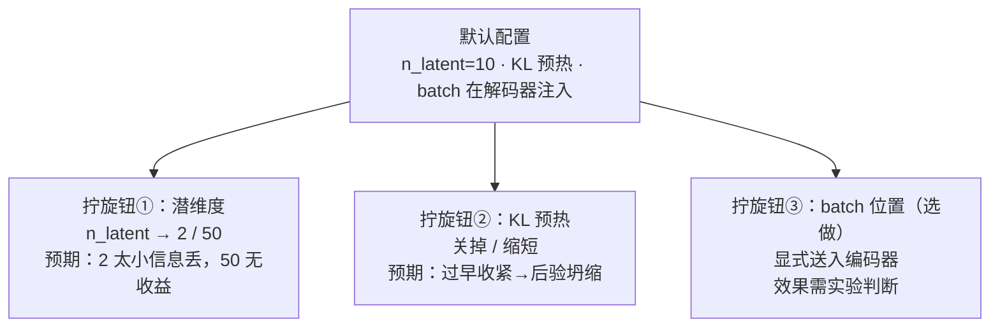
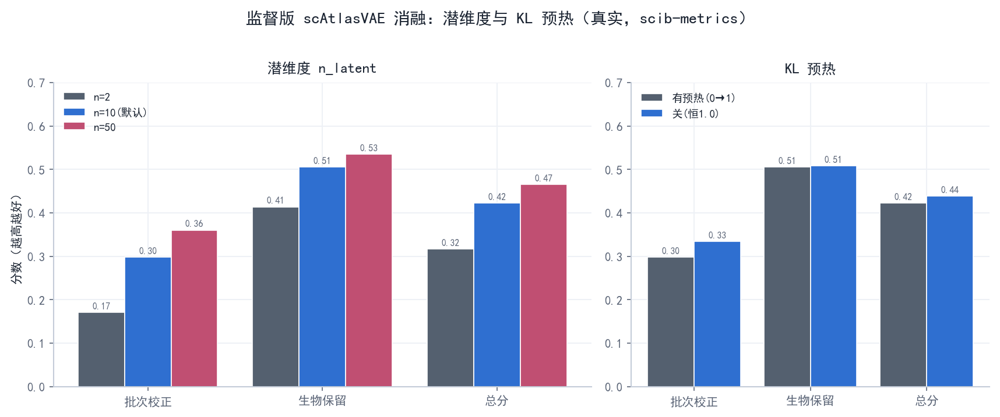

# 阶段 4 · 消融实验（L3）

> **阶段** 4 / 6　·　**前置**：[阶段 3 · 核心 VAE 重写](phase3_reimplement_vae.md)　·　**产出**：消融结果表/图 + 结论　·　**预计** 2 天
> **导航**：[← 阶段 3](phase3_reimplement_vae.md)　·　[总纲](00_overview_and_learning_map.md)　·　[阶段 5 深入验证 →](phase5_deeper_validation.md)
>
> **结果已为本机真实实跑，并于 2026-07-17 用修复后的官方训练循环重训、重评**：两个消融（潜维度、KL 预热）各配置 50 epoch（`phase4_ablations.py` 的 `MAX_EPOCH_ABL=50`，为省时截断），scib-metrics 打分。这里报告的是修复多头损失与末短 batch 归一化后的最终结果。

---

## 1. 阶段概览

前面做到了"我复现了"。这一阶段更进一步——**"我验证了作者的设计选择是否必要"**（复现谱系里的 **L3**，已接近研究）。方法很简单也很硬核：**控制单一变量**——每次只改动模型的一个设计旋钮，其余全按默认，看结论怎么变。



*图 4-1 — 从默认配置出发，每个分支只拧一个旋钮，其余不动。这样结论变化才能归因到这一个改动。*

我们做两个必做消融（**潜维度**、**KL 预热**）+ 一个选做（**batch 注入位置**）。

---

## 2. 学习目标

- 掌握"**控制变量做消融**"这一科学方法；
- 通过消融，从数据上**理解作者为什么这样选**（而不是只接受默认值）；
- 会用 `scib-metrics` 量化每一次消融的效果。

---

## 3. 侦查：作者的默认从哪查、有没有给过理由

> **为什么找**：消融＝"改动作者的默认、看稳不稳"——先得知道默认是什么、作者有没有解释过。

**怎么动手**：默认值不用猜，`grep` 构造函数和 `fit` 签名就有（这也是[阶段 3](phase3_reimplement_vae.md) 练过的手法）：

```bash
grep -nE 'n_latent|n_epochs_kl_warmup|inject_batch' scAtlasVAE/scatlasvae/model/_gex_model.py | head
```

**你会看到 / 结论**：

- `n_latent: int = 10`（构造函数）——潜维度默认 **10**。
- `n_epochs_kl_warmup=400`（`fit` 签名）——但**紧接着** `= min(max_epoch, 400)`（约 1301 行）把它截断到 max_epoch，故 λ_KL 实际在整个训练里 0→~1 爬满（见 §4.1；这也纠正了旧报告"只到 0.18"的说法）。
- `inject_batch: bool = True` + `encode()` 中被注释的 batch 拼接语句——batch **只在解码器**注入（当前工作副本审计时约在 `991–994` 行；以后以语句搜索为准）。
- **论文 Extended Data Fig. 4**：作者做过超参搜索（编码器层数/维度、潜维度、batch 嵌入维度），其中提到**潜维度取 10 或 20 时结果稳定**。

于是我们就改这三个最有代表性的旋钮。

---

## 4. 消融设计（每次只改一个变量）

| 消融 | 怎么改 | 预期观察 | 揭示什么 |
|---|---|---|---|
| **潜维度** | `n_latent` 由 10 改为 2 / 50 | 2 太小、信息被压没；50 未必更好 | 为何论文选 10（"够用且稳"的甜点） |
| **KL 预热** | 见下 §4.1（不是简单"开/关"） | 预热过短/过长各有代价 | 预热（防后验坍缩 vs 别压垮重构）的作用 |
| （可选）**batch 注入位置** | 在 encoder 显式加入 batch covariate | latent 会直接依赖 batch code；迁移指标如何变化未知 | 编码器 covariate 接口的意义（需改架构并独立实测） |

### 4.1 把 KL 预热消融"做对"——借[阶段 3](phase3_reimplement_vae.md) 读到的真相

[阶段 3 §8](phase3_reimplement_vae.md) 我们读**全** `fit` 源码、纠正了旧报告一处硬错：默认参数写着 `n_epochs_kl_warmup=400`，但**紧接着有一行** `n_epochs_kl_warmup = min(max_epoch, 400)`。所以本项目（max_epoch<400；10.5 万细胞→76，消融截到 50）里预热长度被**截断成 max_epoch**，**λ_KL 在整个训练里从 0 线性爬到 ~1、末轮≈1**（不是旧报告说的"只到 0.18、从没到 1"）。看清这点，消融就该对比"预热调度"这个旋钮的两端：

- **默认（有预热）**：λ_KL 从 0 平滑爬到 ~1——**先让编解码器专心学重构、KL 逐渐加力**，这正是防后验坍缩的经典做法。
- **关掉预热**（`n_epochs_kl_warmup=0`，第一轮就给满权重 1.0）：KL 从头就以满力压重构，潜空间可能在学到东西前**坍缩**成 N(0,I)（后验坍缩）——这是"过强、过早"的极端。
- 由此讲清一个完整故事：**预热不是可有可无的开关，而是控制"KL 以多快的节奏加到满"的旋钮**。"0→1 平滑爬坡"与"第一轮就满"两端一对比，就看出这个调度的作用。

> **为什么这样更好**：这版消融**扣着（更正后的）代码事实**——默认是"0→1 爬满"、不是恒定 0.18。你在报告里能写出"我读**全**了 `fit` 源码、纠正了预热量级，于是这样设计消融"，比机械套"关掉就坍缩"的模板更能体现理解。

---

## 5. 操作

用 [`phase4_ablations.py`](../scripts/phase4_ablations.py)：训练阶段（环境 A）产出各配置的嵌入到 `obsm`，评测阶段（环境 B）用 `scib-metrics` 打分。

```powershell
conda activate scatlasvae
python phase4_ablations.py --stage train        # 产出 X_nlat2 / X_nlat10 / X_nlat50 / X_nowarmup
conda activate scib
python phase4_ablations.py --stage benchmark    # scib-metrics 打分
```

> **为什么消融直接用官方模型**：它的构造/`fit` 参数正好能一键改这些旋钮（`n_latent=…`、`n_epochs_kl_warmup=0`），比改手写版更省事、也更可信。消融关心的是"改这个旋钮结论变不变"，用官方或手写版都合法。

---

## 6. 结果（本机实测，~10.5 万细胞，每配置 50 epoch，PCR 基线已修）



*图 4-2 — **监督版 scAtlasVAE 消融**：左为潜维度 2/10/50，右为 KL 预热开（首轮 0，随后升至约 1）/关（恒 1.0）；各画批次校正、生物保留与总分（scib-metrics 实测）。这些配置都保留 `cell_type` 分类头，不是无监督消融。*

| 配置 | 批次校正 | 生物保留 | 总分 Overall | 现象 |
|---|---|---|---|---|
| `n_latent=2` | 0.171 | 0.414 | **0.316** | **明显最差**：维度太小，局部结构与批次校正都受限 |
| `n_latent=10`（默认） | 0.298 | 0.505 | 0.422 | 稳、好 |
| `n_latent=50` | 0.360 | 0.535 | **0.465** | 本数据上**高于 10**（不是"毫无收益"）；代价是更大的表示与潜在过拟合空间 |
| KL 预热 **开**（默认 0→1） | 0.298 | 0.505 | 0.422 | 基准配置 |
| KL 预热 **关**（恒 1.0） | 0.334 | 0.509 | 0.439 | **没有坍缩，反而小幅提高**（主要来自批次校正；见 §7） |

**与"示意"的差别（两个诚实发现）**：

1. **潜维度**：n=2 确实最差（信息被压没）——这条和预期一致。但 **n=50 在本数据反而优于 n=10**（0.465 vs 0.422），并非旧稿假设的"和 10 一样、没有更好"。核心结论（**太小明显变差、10 及以上可用**）成立，与论文 Ext. Data Fig. 4（及 Supp Table 3 网格 n_latent 5 差/10,20 好）的方向相容；但本实验**不能**支持"50 无收益"，也没有多种子证据证明 50 的优势稳定。
2. **KL 预热关掉后没有坍缩，且总分由 0.422 升到 0.439**；生物保留基本相同（0.505→0.509），增益主要来自批次校正（0.298→0.334）。这只说明在当前数据、50 epoch 和单次种子下，预热不是成败开关；不能外推为预热普遍有害。§7 解释可能原因。

**记录区（本机实测，~10.5 万细胞，每配置 50 epoch）**：
```
n_latent=2 / 10 / 50 总分 = 0.316 / 0.422 / 0.465
KL 预热 开 / 关 总分 = 0.422 / 0.439
观察到的现象：n=2 明显较差；n=50 在本次单种子评测最高；关预热未坍缩并小幅升分
```

---

## 7. 结论：作者的设计选择是否必要

- **潜维度**：$n=2$ 明显最差（把细胞状态压进 2 个数、信息不足），**这条成立**。$n=10$ 与 $n=50$ 都可用，本数据上 $n=50$ 更高（0.465 vs 0.422）。因此能下的结论是"太小会损失信息；默认 10 已可用"；不能由这一次单种子实验声称"10 是全局最优"或"50 一定过拟合"。
- **关掉 KL 预热没有后验坍缩，反而从 0.422 小幅升到 0.439**。一个合理解释是损失量级：scAtlasVAE 的 ZINB 重构使用求和归约，每 batch 远大于 KL 项，因此 λ_KL 从第一轮取 1 也未强到压垮表示。这个结果把预热定位为当前设置下的**温和保险**，而不是必要条件；由于这里只跑了一个种子，0.017 的差异应视为观察而非普遍规律。
- （选做，**本轮未运行**）**batch 注入位置**：把 batch 显式送入 encoder 会让 latent 直接依赖 covariate code，但是否降低迁移指标仍需独立消融，当前不能当作实证结论。scvi-tools 的 encoder covariate 输入可配置，且默认 `encode_covariates=False`；因此不能把这个未运行分支简称为“退化成默认 scVI”。

> 这一步让你的复现从"我把它跑出来了"升级到"**我验证了它为什么这么设计**"——尤其是**如实记录了两处与直觉不符的结果并解释了成因**（n=50 略优、关预热不坍缩），这比套用"甜点在 10、关预热就崩"的模板更接近真研究。

---

## 8. 检查点与完成标准（DoD）

- [x] 完成潜维度、KL 预热两个消融，每个都有 `scib-metrics` 分数
- [x] KL 预热消融**扣着（更正后的）代码事实**（λ_KL 因 `min(max_epoch,400)` 0→1 爬满；并解释了"关掉却不坍缩"的量级成因）
- [x] 出对比图/表，且趋势可解释
- [x] 写出"作者的设计选择是否必要"的结论（含两处与直觉不符结果的诚实讨论）

---

## 9. 自测题

1. 什么叫"控制变量"？为什么消融一次只能改一个旋钮？
2. 潜维度太小 / 太大分别有什么问题？为什么 10 是个好选择？
3. 默认 `n_epochs_kl_warmup=400` 遇到 `min(max_epoch, 400)` 会怎样（本项目 max_epoch<400）？λ_KL 到训练结束爬到多少？基于这个事实，你会怎么设计 KL 预热消融？
4. 把 batch 从解码器挪到编码器，会牺牲什么能力？为什么？

---

## 10. 延伸阅读

- 论文 Extended Data Fig. 4（超参搜索）
- 后验坍缩与 KL 预热：Bowman et al., 2016, *Generating Sentences from a Continuous Space*（KL warmup 的经典出处）

---

> **导航**：[← 阶段 3](phase3_reimplement_vae.md)　·　[总纲](00_overview_and_learning_map.md)　·　[阶段 5 · 深入验证 →](phase5_deeper_validation.md)
