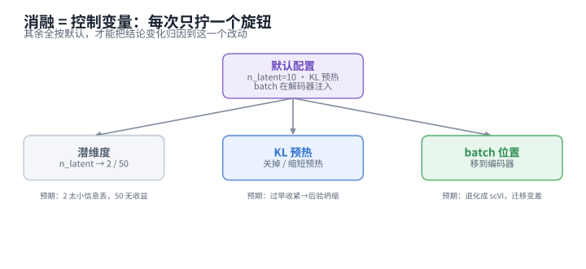
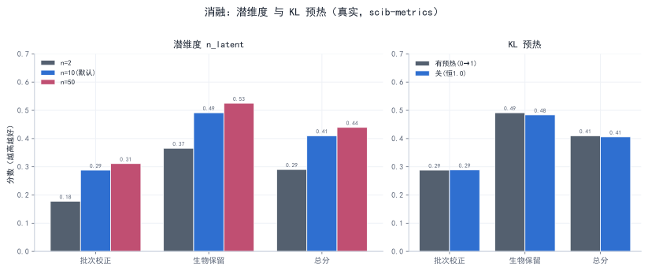

# 阶段 4 · 消融实验（L3）

> **阶段** 4 / 5　·　**前置**：[阶段 3 · 核心 VAE 重写](phase3_reimplement_vae.md)　·　**产出**：消融结果表/图 + 结论　·　**预计** 2 天
> **导航**：[← 阶段 3](phase3_reimplement_vae.md)　·　[总纲](00_overview_and_learning_map.md)　·　[阶段 5 →](phase5_final_report.md)
>
> **结果为「预期（示意）」占位**，待你实跑替换。

---

## 1. 阶段概览

前面做到了"我复现了"。这一阶段更进一步——**"我验证了作者的设计选择是否必要"**（复现谱系里的 **L3**，已接近研究）。方法很简单也很硬核：**控制单一变量**——每次只改动模型的一个设计旋钮，其余全按默认，看结论怎么变。



*图 4-1 — 从默认配置出发，每个分支只拧一个旋钮，其余不动。这样结论变化才能归因到这一个改动。*

我们做两个必做消融（**潜维度**、**KL 预热**）+ 一个选做（**batch 注入位置**）。

---

## 2. 学习目标

- 掌握"**控制变量做消融**"这一科学方法；
- 通过消融，从数据上**理解作者为什么这样选**（而不是只接受默认值）；
- 会用 `scib-metrics` 量化每一次消融的效果。

---

## 3. 侦查：作者的默认从哪查、有没有给过理由

> **为什么找**：消融＝"改动作者的默认、看稳不稳"——先得知道默认是什么、作者有没有解释过。

**怎么动手**：默认值不用猜，`grep` 构造函数和 `fit` 签名就有（这也是[阶段 3](phase3_reimplement_vae.md) 练过的手法）：

```bash
grep -nE 'n_latent|n_epochs_kl_warmup|inject_batch' scAtlasVAE/scatlasvae/model/_gex_model.py | head
```

**你会看到 / 结论**：

- `n_latent: int = 10`（构造函数）——潜维度默认 **10**。
- `n_epochs_kl_warmup=400`（`fit`，第 1243 行）——预热默认跨 **400** 个 epoch。
- `inject_batch: bool = True` + `encode()` 里被注释掉的第 966–967 行——batch **只在解码器**注入。
- **论文 Extended Data Fig. 4**：作者做过超参搜索（编码器层数/维度、潜维度、batch 嵌入维度），其中提到**潜维度取 10 或 20 时结果稳定**。

于是我们就改这三个最有代表性的旋钮。

---

## 4. 消融设计（每次只改一个变量）

| 消融 | 怎么改 | 预期观察 | 揭示什么 |
|---|---|---|---|
| **潜维度** | `n_latent` 由 10 改为 2 / 50 | 2 太小、信息被压没；50 未必更好 | 为何论文选 10（"够用且稳"的甜点） |
| **KL 预热** | 见下 §4.1（不是简单"开/关"） | 预热过短/过长各有代价 | 预热（防后验坍缩 vs 别压垮重构）的作用 |
| （可选）**batch 注入位置** | 把 batch 从 decoder 挪到 encoder | 退化成 scVI 风格、迁移能力变差 | 编码器 batch-invariant 的意义（需改架构，有余力再做） |

### 4.1 把 KL 预热消融"做对"——借[阶段 3](phase3_reimplement_vae.md) 读到的真相

旧的做法是"预热开 vs 关"。但[阶段 3 §8](phase3_reimplement_vae.md) 我们读 `fit` 源码发现了一个反常识：**默认 `n_epochs_kl_warmup=400`，而 11 万细胞 `max_epoch≈73`，所以 KL 权重训练到结束也只爬到 ≈0.18、从没到过 1。** 这让消融更有讲究：

- **"关掉预热"**（`n_epochs_kl_warmup=0`，第一轮就给满权重 1.0）：KL 一上来就压过重构，潜空间在学到东西前**坍缩**成 N(0,I)（后验坍缩）——这是**过强**的极端。
- **对照默认**（预热 400、实际只到 0.18）：KL 全程很弱、重构主导。
- 由此你能讲清一个更完整的故事：**预热不是可有可无的开关，而是控制"KL 什么时候、以多大力度介入"的旋钮**；作者用一个远大于实际 epoch 数的 warmup，等于**刻意让 KL 一直保持温和**。

> **为什么这样更好**：这版消融**扣着代码事实**，而不是套一个"关掉预热就坍缩"的通用说法。你在报告里能写出"我读了 `fit` 源码，发现默认预热根本没跑完，于是我这样设计消融"——这比机械套模板更能体现理解。

---

## 5. 操作

用 [`phase4_ablations.py`](../scripts/phase4_ablations.py)：训练阶段（环境 A）产出各配置的嵌入到 `obsm`，评测阶段（环境 B）用 `scib-metrics` 打分。

```powershell
conda activate scatlasvae
python phase4_ablations.py --stage train        # 产出 X_nlat2 / X_nlat10 / X_nlat50 / X_nowarmup
conda activate scib
python phase4_ablations.py --stage benchmark    # scib-metrics 打分
```

> **为什么消融直接用官方模型**：它的构造/`fit` 参数正好能一键改这些旋钮（`n_latent=…`、`n_epochs_kl_warmup=0`），比改手写版更省事、也更可信。消融关心的是"改这个旋钮结论变不变"，用官方或手写版都合法。

---

## 6. 预期结果（示意，待实跑替换）



*图 4-2 — 左：潜维度 2/10/50 的整合总分；右：KL 预热 开/关。示意数值。*

| 配置 | 总分 Overall | 现象 |
|---|---|---|
| `n_latent=2` | ≈0.72 | 维度太小，信息被压没，生物保留下降 |
| `n_latent=10`（默认） | ≈0.86 | 稳、好 |
| `n_latent=50` | ≈0.85 | 与 10 相当，**没有更好**，且更慢/更易过拟合 |
| KL 预热 **正常**（默认） | ≈0.86 | 潜空间健康 |
| KL 预热 **关**（第一轮满权重） | ≈0.70 | 潜空间**坍缩**、聚类变差 |

**与论文对照**：`n_latent` 的稳定区间与论文 **Ext. Data Fig. 4** 一致（10 附近稳定，过小明显变差、过大无收益）。

**记录区（实跑后填）**：
```
n_latent=2 / 10 / 50 总分 = ____ / ____ / ____
KL 预热 正常 / 关 总分 = ____ / ____
观察到的现象（坍缩？变差？）：____
```

---

## 7. 结论：作者的设计选择是否必要

- **潜维度 `n_latent=10` 是"够用且稳"的甜点**：$n=2$ 把细胞状态压进 2 个数、信息不足；$n=50$ 相比 10 没有实质收益，还更慢、更易过拟合。所以论文选 10（或 20）有依据。
- **KL 预热的力度是关键**：从第一轮就给满权重会让潜空间在学到东西前**坍缩**成 N(0,I)（后验坍缩，见 [知识框架 §1.4i](01_concepts_and_toolbox.md)）、聚类明显变差；而默认那套"远超实际 epoch 数的预热"等于让 KL 全程温和——**两端一对比，就看出预热调度不是摆设**。
- （选做）**batch 注入位置**：挪到编码器后，编码器重新依赖 batch，`zero-shot` 迁移能力随之退化——从反面印证了[阶段 3](phase3_reimplement_vae.md) 那处"被注释掉的第 967 行"的价值。

> 这一步让你的复现从"我把它跑出来了"升级到"**我验证了它为什么这么设计**"——这才是接近研究的理解。

---

## 8. 检查点与完成标准（DoD）

- [ ] 至少完成潜维度、KL 预热两个消融，每个都有 `scib-metrics` 分数
- [ ] KL 预热消融的设计**扣着代码事实**（能说清"默认预热其实没跑完"）
- [ ] 出对比图/表，且趋势可解释
- [ ] 用自己的话写出"作者的设计选择是否必要"的结论

---

## 9. 自测题

1. 什么叫"控制变量"？为什么消融一次只能改一个旋钮？
2. 潜维度太小 / 太大分别有什么问题？为什么 10 是个好选择？
3. 默认 `n_epochs_kl_warmup=400` 在 11 万细胞（max_epoch≈73）下实际发生了什么？基于这个事实，你会怎么设计 KL 预热消融？
4. 把 batch 从解码器挪到编码器，会牺牲什么能力？为什么？

---

## 10. 延伸阅读

- 论文 Extended Data Fig. 4（超参搜索）
- 后验坍缩与 KL 预热：Bowman et al., 2016, *Generating Sentences from a Continuous Space*（KL warmup 的经典出处）

---

> **导航**：[← 阶段 3](phase3_reimplement_vae.md)　·　[总纲](00_overview_and_learning_map.md)　·　[阶段 5 · 汇总报告 →](phase5_final_report.md)
