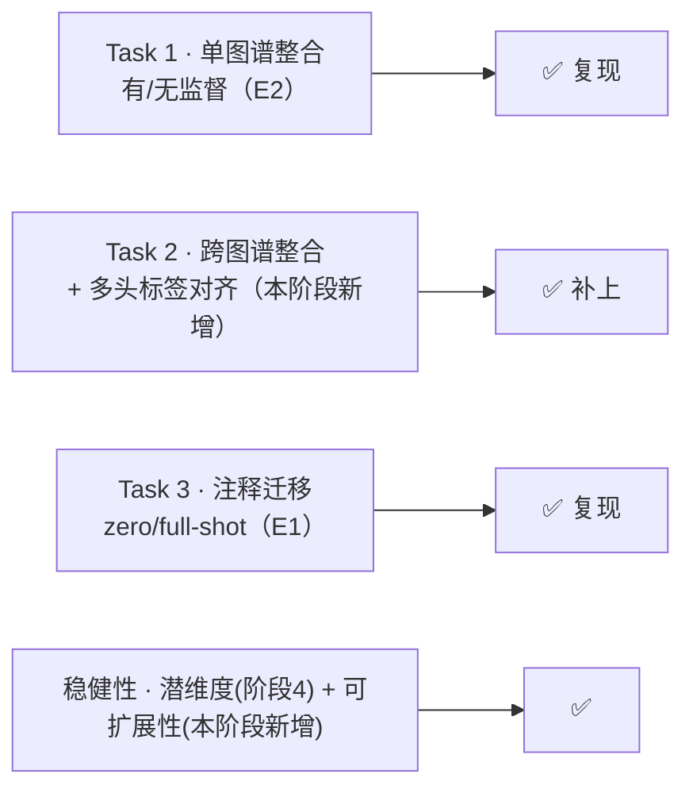

# 阶段 5 · 深入验证与扩展

> **阶段** 5 / 6　·　**前置**：阶段 1–4　·　**产出**：把整合主线补全、复现论文招牌能力、并把观察升级为可测证据
> **导航**：[← 阶段 4](phase4_ablation_studies.md)　·　[阶段 6 汇总 →](phase6_final_report.md)　·　[总纲](00_overview_and_learning_map.md)　·　[知识框架](01_concepts_and_toolbox.md)
>
> 本阶段的所有数字/图均为**本机 RTX 4060 真实实跑**（主数据为 GSE156728 的 10X CD8 **全量 104,805 细胞** / batch=patient 共 45 个 / cell_type 共 17 个 CD8 亚型；Task 2 另用 Yost 2019 GSE123813）。

---

## 0. 为什么还要有这一阶段：先定位"我们复现到哪了"

阶段 1–4 把 L2（手写核心 VAE）这条线走扎实了。这一阶段把工作放回**论文自己的评测坐标系**（Part A 三大 benchmark 任务，Ext. Data Fig. 1e–g）里对齐，**把论文 Part A 的三任务 + 稳健性都补齐**：

- **关键观察（阶段 2 遗留）**：我们阶段 2 那根 `X_scAtlasVAE` 其实**传了 `label_key`、是监督版**却没标明。补上无监督柱后，**监督(0.435) 明显最高、无监督(0.404)≈PCA、略低于 scVI(0.416)**——scAtlasVAE 相对 scVI 的优势来自**半监督分类头**。同时修掉了一个 scib PCR 基线 bug（见 E5 与 [阶段 2 §7](phase2_integration_and_benchmark.md)）。
- **补齐 Task 3**（注释迁移，论文招牌能力）与 **Task 2**（跨图谱多头对齐），并加一条**可扩展性**曲线——至此论文 Part A 的三任务 + 稳健性我们都有了对应实测。

本阶段做这些事，把整合主线补到 **Task 1/2/3 全覆盖 + 稳健性**（数据已升到全量 ~10.5 万、PCR 基线已修）：

| 编号 | 做什么 | 对标论文 | 一句话结论 |
|---|---|---|---|
| **E2** | 监督 vs 无监督 scAtlasVAE 四方对比 | Ext. Data Fig. 2a | 监督最高；无监督≈PCA、略低于 scVI（优势来自分类头） |
| **E1** | 注释迁移（zero/full-shot）+ kNN 对照 | Ext. Data Fig. 2g,h | zero-shot AUROC 0.90–0.94，对上论文、且反超 kNN |
| **E3** | 批不变编码器"打乱 batch"探针 | Methods（编码器 F(X)） | scAtlasVAE 结构上 Δz≡0；附带 scVI 细节发现 |
| **E4** | 手写最小 VAE 放上同一把 scib 标尺 | —（自我量化） | 手写实现总分 0.406，落在 PCA 与 scVI 之间 |
| **E5** | scib-metrics ↔ 论文旧 scib 指标对照 | Methods（指标） | 绝对值不可比、相对排序才是判据 |
| **Task 2** | 跨图谱整合 + 多头标签对齐（Zheng+Yost） | Ext. Data Fig. 3 | 潜空间生物学对齐两套标签（CD8_ex↔Tex 等） |
| **可扩展性** | 训练时间/显存 vs 细胞数 | Ext. Data Fig. 4e,f | 二者随细胞数近似线性 |

---

## 1. E2 · 监督 vs 无监督：复现论文的核心论点

**做法**：给 `phase2_run_scatlasvae.py` 加了 `--mode {sup,unsup}`。`unsup` 构造模型时**不传 `label_key`**（只做整合、不学分类头），产出 `X_scAtlasVAE_unsup`；监督版沿用已训练结果记为 `X_scAtlasVAE_sup`。四方一起过 scib-metrics。

**结果（本机实测）**：

| 嵌入 | 批次校正 | 生物保留 | 总分 |
|---|---|---|---|
| `X_pca`（未校正） | 0.271 | 0.486 | 0.400 |
| `X_scVI` | 0.312 | 0.485 | 0.416 |
| **`X_scAtlasVAE_unsup`（无监督）** | 0.289 | 0.481 | **0.404** |
| **`X_scAtlasVAE_sup`（监督）** | 0.324 | 0.509 | **0.435** |

**门道（含一处已修的 bug，见 E5）**：**监督 scAtlasVAE(0.435) 是明确赢家——批次校正与生物保留两项都最高**，稳稳复现论文 Ext. Data Fig. 2a 的"监督胜出"。但两点比旧稿更诚实：① **无监督(0.404)≈PCA、略低于 scVI(0.416)**（不是旧稿的"无监督≈scVI"）——scAtlasVAE 相对 scVI 的优势来自**半监督分类头**，不是整合骨架；② 修掉 PCR 基线 bug 后，正确的 scaled PCA 生物保留高达 0.486，**"VAE≫PCA"里那道大差距一部分是 bug 造成的假象**——VAE 相对 PCA 的真实优势集中在**批次校正一列**（PCA 0.271 < 无监督 0.289 < scVI 0.312 < 监督 0.324）。绝对分差距被压扁还因我们 batch=patient（论文=study）。

---

## 2. E1 · 注释迁移：复现论文的招牌能力（Task 3）

**为什么值得做**：训练好带分类头的参考模型后，query 数据可**不重训直接映射进参考图谱并自动打标签**（zero-shot），也可与参考共训（full-shot）。这是论文 Fig 5 / Ext. Data Fig. 2g,h 的核心卖点，根就在"编码器只吃 X"（见 E3）。

**做法**（脚本 `phase5_annotation_transfer.py`，官方范式见 `docs/source/gex_transfer.rst`）：两种 query 切法对标论文的 "drop 5% cells" 与 "drop one study"——
- **设计 A**：随机留出 5% 细胞为 query，其余为 reference。
- **设计 B**：留出**一个整癌种**（UCEC）为 query，其余为 reference（更难的域外泛化）。

每种设计：reference 上**监督训练**新模型（不能复用见过全量的模型）→ **zero-shot**（`setup_anndata`+`predict_labels`）；设计 A 另做 **full-shot**（query 标签置 undefined、与 reference 共训后预测）。对照基线是 **reference 的 X_scVI 潜空间上 kNN(k=13)** 迁移标签（"无专用预测头"控制）。指标：accuracy、macro-F1、macro one-vs-rest ROC-AUC（论文指标）。

**结果（本机实测）**：

| 设计 | 方法 | accuracy | macro-F1 | macro OVR-AUC |
|---|---|---|---|---|
| **A** 随机5%（n=5240） | scAtlasVAE (zero-shot) | 0.574 | 0.495 | **0.939** |
| A | scAtlasVAE (full-shot) | 0.580 | 0.506 | **0.941** |
| A | kNN on scVI latent（对照） | 0.641 | 0.510 | 0.905 |
| **B** 整癌种 UCEC（n=19926） | scAtlasVAE (zero-shot) | 0.498 | 0.419 | **0.903** |
| B | kNN on scVI latent（对照） | 0.531 | 0.377 | 0.813 |

**门道**：
- **AUROC 对上论文、甚至略高**：论文 Ext. Data Fig. 2g,h 在 TCellLandscape 给的 zero-shot ROC-AUC = 0.91（drop 5%）/ 0.86（drop one study）。我们 **drop 5%=0.939、drop 整癌种=0.903**，双双落在论文 0.85–0.94 区间、且略高于论文 TCellLandscape（我们参考集更大→迁移更好）——**招牌能力复现到了**。
- **专用分类头 > 通用 kNN**：scAtlasVAE 自带头的 AUROC（0.939 / 0.903）在两种设计上都**高于"好表征上的 kNN"**（0.905 / 0.813），在更难的域外泛化（设计 B，留出整个癌种）上领先尤为明显（+0.09 AUROC）。验证论文"独立分类头"的设计价值：kNN 只用几何近邻，分类头学到更能跨批次泛化的判别边界。（诚实：raw accuracy 上 kNN 反而略高——AUROC 这个与阈值无关的排序指标才是公平比较。）
- **zero-shot ≈ full-shot**：设计 A 里二者几乎相同（AUROC 0.939 vs 0.941），与论文"zero-shot 已足够好、不必共训"一致——而 zero-shot **不重训**、更省算力，正是 batch-invariant 编码器的红利。
- **一个踩坑教训（见下）**：在早期的 4 万参考集上，一开始 zero-shot accuracy 只有 0.26、被 kNN(0.61) 碾压——根因见下面第 2 条；修好后才有上面的 0.90+。

**两处"代码 > 论文"的踩坑记（都值得记下）**：
1. **官方 `setup_anndata` 假设 query 的 batch/label 与参考不相交**（对新数据集成立），但我们"留出式"query 的病人/亚型都是参考的子集，会触发 `add_categories: new categories must not include old`。解法：迁移前删掉 query 的 batch 与 label 两列，让官方走"全设 undefined"的分支——因为编码器 batch-invariant（见 E3，Δz≡0），batch 取值对预测毫无影响；label 的 categories 仍取参考 17 类，`n_label` 由 categories 推出仍=17、与预训练分类头对齐。这也正是**诚实的 zero-shot 语义**：假装不知道 query 的批次与标签。
2. **分类头默认只在最后 `pred_last_n_epoch`(=10) 个 epoch 才训练**（打补丁后 `_gex_model.py:1372` 的 `epoch == max_epoch - pred_last_n_epoch` 门 + `:1411` 才把 prediction_loss 加进总损失；之前 epoch 根本不含它）。这是给论文 115 万细胞 atlas 调的——10 epoch × 115 万 = 大量分类更新；早期我们参考集仅 ~3.8 万，10 epoch 远不够，实测 zero-shot 准确率一度只有 0.26、反被 kNN(0.61) 碾压。解法：让分类头**全程训练**（`pred_last_n_epoch=max_epoch`），是针对小参考集的正当调整（全量 ~10 万后此调整依然保留、结果 0.90+）。

---

## 3. E3 · 批不变编码器的"实证探针"：把"我读到"升级成"我测出来了"

阶段 1/3 我们一直说 scAtlasVAE 的题眼是"编码器只吃 X、不看 batch"，证据是 `_gex_model.py:969-970` 那行"把 batch 拼进编码器输入"**被注释掉了**。这一阶段把它做成一个**可测的实验**。

**做法**（脚本 `phase5_batch_invariance_probe.py`）：同一批细胞 X，分别用**真实 batch / 打乱 batch / 全 None** 过编码器，比较潜均值 q_mu 的改变。scAtlasVAE 在 scatlasvae 环境、scVI 在 scvi 环境各测一次（低层直接给编码器喂不同 batch 索引，最干净的证明）。

**结果（本机实测）**：

| 编码器 | 打乱 batch 后 max\|Δz\| | 平均 L2 漂移 |
|---|---|---|
| **scAtlasVAE**（结构上不吃 batch） | **0.0** | **0.0** |
| scVI（默认 `encode_covariates=False`） | 0.0 | 0.0 |
| scVI（`encode_covariates=True`，吃 batch） | 0.237 | 0.0069 |

**门道（一个漂亮的、有洞察的三方对照）**：
- **scAtlasVAE 打乱 batch 后 q_mu 逐元素完全不变（Δ 精确为 0）**——坐实"编码器结构上无视 batch"。这正是它能 zero-shot 迁移的根：query 无论来自哪个新批次，过同一个编码器落到的坐标只由基因表达决定。
- **一个细节发现（"代码 > 论文"）**：论文 Methods 的表把 scVI 编码器记作 `F(X,B,S)`（吃 batch 和文库），但 **scvi-tools 默认 `encode_covariates=False`，编码器其实也不吃 batch**——所以论文那张对比表里 scVI 的 `F(X,B,S)` 是"一般形式"，实际 benchmark 用的默认 scVI 编码器同样是 batch-invariant 的（漂移也是 0）。只有显式开 `encode_covariates=True`，scVI 的编码器才真正 batch-variant、打乱 batch 才让 z 漂移（0.237）。**scAtlasVAE 与 scVI 的真正区别，不在"默认跑出来的编码器变不变"，而在 scAtlasVAE 是结构上永不编码 batch（保证 zero-shot），scVI 只是默认没开、可选。**

---

## 4. E4 · 把手写最小 VAE 放上同一把 scib 标尺

阶段 3 我们手写了 `minimal_scatlasvae.py`，此前只有"官方 vs 手写 UMAP 定性一致 + kNN 邻域 Jaccard=0.233"。这里把手写实现产出的 `X_minimal` 与 PCA / scVI / 官方监督版**并列打分**，给"我的实现落在什么水平"一个**定量**答案。

**结果（本机实测，~10.5 万全量，PCR 已修）**：

| 嵌入 | 批次校正 | 生物保留 | 总分 |
|---|---|---|---|
| `X_pca`（未校正） | 0.271 | 0.486 | 0.400 |
| `X_scVI` | 0.312 | 0.485 | 0.416 |
| **`X_minimal`（从零手写）** | 0.296 | 0.479 | **0.406** |
| `X_scAtlasVAE_sup`（官方监督） | 0.324 | 0.509 | 0.435 |

**门道**：**手写最小 VAE 总分 0.406，落在未校正 PCA(0.400) 与 scVI(0.416) 之间、约等于无监督 scAtlasVAE(0.404)**，批次校正(0.296)也明显高于 PCA(0.271)。考虑到手写版**刻意只实现了核心机制**（批不变编码器 / 重参数化 / 批条件解码器 / ZINB / KL 预热 / 单分类头），砍掉了 MMD / TabNet / latent-constraint / 多层级 / 多头等可选特性——**能达到"无监督整合 VAE"同档，说明"论文公式→代码"这一步我们翻译对了**。这是对阶段 3 手写工作最直接的定量背书。

---

## 5. E5 · 指标忠实度：我们的 scib-metrics 与论文旧 scib 的对照

我们全程用 `scib-metrics`（JAX 重实现，Windows 可用），论文用旧 `scib`(1.1.4)。两者**指标集不同**，报告若不点破，读者会误以为数字能直接对上论文。这里补一张对照表。

| 类别 | 论文用的旧 scib 指标 | 我们 scib-metrics 里对应/相近的 | 是否可直接对上 |
|---|---|---|---|
| 生物保留 | ASW（label silhouette） | Silhouette label | 近似对应 |
| 生物保留 | isolated label ASW | Isolated labels | 近似对应 |
| 生物保留 | isolated label F1 | （scib-metrics 用 Isolated labels 合并） | 部分对应 |
| 生物保留 | — | KMeans NMI / ARI、cLISI | scib-metrics 额外项 |
| 批次校正 | graph connectivity | Graph connectivity | 对应 |
| 批次校正 | batch ASW | （scib-metrics 用 iLISI / KBET / BRAS 系列） | **不同实现** |

**两个必须点破的口径细节**：
- **总分加权**：scib-metrics 的 Total = **0.4·批次校正 + 0.6·生物保留**（scIB 论文默认，生物保留权重更大），不是等权。所以"生物保留高、批次没校正"的 scaled PCA 总分也能不低——读总分时要记着。
- **一个我们踩过并修好的 bug**：`PCR comparison` 曾对所有方法恒为 0，且 `X_pca` 基线被 Benchmarker 用**原始计数**现算的 PCA 覆盖。根因：`Benchmarker` 默认对 `adata.X` 现算 PCA 当"未整合基线"，而我们的 `adata.X` 是**原始计数**（预处理最后一行 `adata.X=layers['counts']`），scib-metrics 要求它是归一化数据。**解法**：显式传 `pre_integrated_embedding_obsm_key="X_pca"`（我们预处理好的 scaled-log PCA）。修复后 PCR 恢复区分度（监督 0.097 > scVI 0.082 ≫ 无监督/PCA≈0），PCA 基线也回到正确的 scaled PCA（生物保留 0.486）。

**结论（判据）**：因为**指标集与实现都不同**，我们的绝对分**不能**和论文逐点比；**判据是同一套指标下的相对排序**——监督 scAtlasVAE 最高（批次校正+生物保留两项皆最高），VAE 相对 PCA 的优势集中在**批次校正一列**（PCA<无监督<scVI<监督）。这与阶段 2 一脉相承。

---

## Task 2 · 跨图谱整合 + 多头标签对齐（复现论文独有能力，Ext. Data Fig. 3）

**为什么值得做**：scAtlasVAE 相对 scVI/scPoli 的**独有**卖点，是用**多个独立分类头**把两个**各自独立注释**的图谱的标签体系**并行对齐**（scVI 只整合、不对齐标签）。这是论文 Ext. Data Fig. 3 的核心。

**做法**（脚本 `phase5_cross_atlas.py`）：
- 图谱 1 = 我们的 Zheng/GSE156728（**全量 104,805**，meta.cluster 17 亚型）；图谱 2 = **Yost 2019 BCC**（GSE123813，12,364 CD8，独立注释 CD8_act/eff/ex/ex_act/mem）——真实、独立（Yost 本身也在论文 TCellLandscape/TCellMap 的源研究列表里），货真价实的跨研究/跨癌种挑战。
- 合并后 `batch_key=[patient, atlas]`、`label_key=[ct_zheng, ct_yost]`（**两个分类头**，各只在本图谱有标签的细胞上训练，另一图谱该列置 undefined）。设置：`batch_hidden_dim=64`（论文 Ext.Fig.4b 默认）、100 epoch、**`lr=3e-5`**（全量下用默认 5e-5 会在末期梯度爆炸致 NaN 崩溃，见下"踩坑 2"）。
- **评估用对类别不平衡稳健的指标**（Yost 仅占 10.5%，直接对全体算 silhouette 会被 Zheng 主导而误导——见"踩坑 3"）：① 平衡子采样 atlas silhouette；② Yost 细胞 30-NN 中 Zheng 占比；③ 标签对齐矩阵，且**与 PCA 对照**。

**结果（全量 104,805 + 12,364、bhd=64、100 epoch、lr=3e-5）**：

**① 两图谱确实被整合了——scAtlasVAE 明显优于未校正 PCA：**

| 指标 | scAtlasVAE | 未校正 PCA | 含义 |
|---|---|---|---|
| 平衡 atlas silhouette（越低=越混） | **0.041** | 0.087 | scAtlasVAE 混得更好 |
| Yost 细胞 30-NN 中 Zheng 占比（越高=越混，理想≈0.89） | **0.248** | 0.040 | scAtlasVAE **≈6× 于 PCA** |

**② 多头把两套标签生物学对齐——且比 PCA 更锐利：**

| Yost 亚型 | scAtlasVAE 最近邻 Zheng（top） | PCA（对照） | 生物学 |
|---|---|---|---|
| CD8_ex（耗竭） | **Tex.CXCL13 (0.95)** | Tex.CXCL13 (0.64) | ✅ 耗竭 ↔ Tex |
| CD8_eff（效应） | **Temra.CX3CR1 (0.87)** | Temra (0.68) | ✅ 效应 ↔ 终末效应 |
| CD8_ex_act（活化-耗竭） | Tex.CXCL13(0.47)+Tex.PDCD1(0.29)=**0.76 皆 Tex** | Tex 0.71 | ✅ 落在 Tex |
| CD8_mem（记忆） | **Tem.CXCR5 (0.62)** | Tem.CXCR5 (0.57) | ✅ 记忆 ↔ Tem |
| CD8_act（活化） | Tm.IL7R/Trm.ZNF683/Tm.CD52（散） | Tem/Tm（散） | ~ 偏记忆/驻留 |

*图 — Yost×Zheng 对齐矩阵（scAtlasVAE 潜空间，行归一化）：CD8_ex 亮在 Tex 列、CD8_eff 亮在 Temra 列、CD8_mem 亮在 Tem 列。*

**门道**：**全量下 scAtlasVAE 既把两个独立图谱整合得明显好于 PCA（Yost 近邻 Zheng 占比 24.8% vs PCA 4.0%），又用多头把标签对齐得比 PCA 锐利（CD8_ex→Tex 0.95 vs 0.64、CD8_eff→Temra 0.87 vs 0.68）。** 这正是它相对 scVI/scPoli 的独有价值：scVI 能整合、但没分类头、无法**并行对齐**两套标签体系。**诚实**：整合仍不完美——Yost 近邻里 Zheng 才 24.8% ≪ 理想 89%，跨癌种 + 少数图谱（10.5%）确实难彻底混匀。

> **三个踩坑教训（都是复查真跑出来的）**：
> 1. **抄近道的"假失败"**：最初为省算力只跑 15 epoch + bhd=10，两图谱几乎不混（Yost 近邻 Zheng 仅 0.3%）；贴论文设置（bhd=64、100 epoch）后才真正整合。
> 2. **全量末期 NaN 崩溃**：全量（117k）+ 默认 `lr=5e-5` 时，多头预测损失在高-KL 末期（~epoch 94）间歇注入大梯度，把编码器 `q_mu` 冲成 NaN 而崩（源码 `_gex_model.py:1441` 会跳过 NaN-loss 批次，但前向构造 `Normal(loc=NaN)` 直接抛错）。**降到 `lr=3e-5` 稳住**、跑满 100 epoch；rec 全程正常下降，证明是数值不稳、非方法问题。
> 3. **不平衡让指标反号（复查关键发现）**：Yost 仅 10.5%，直接对全体算 atlas silhouette 得 scAtlasVAE **0.081 > PCA 0.049**——**看着 scAtlasVAE 反而更差，实为多数图谱主导 silhouette 的假象**。换**平衡子采样**（0.041 < 0.087）与 **Yost-NN-Zheng 占比**（0.248 vs 0.040）两个稳健指标，结论才正确。**教训：跨图谱严重不平衡时别信原始 silhouette。**
> **对比 20k 版**：早前把 Zheng 下采样到 2 万（Yost 占比升到 38%、更平衡）时 silhouette 0.007 看着更漂亮——那有一部分是**平衡带来的好看**；全量不平衡才是诚实的难度。核心结论（整合优于 PCA、标签比 PCA 锐利对齐）在两种规模下都成立。

---

## 可扩展性 · 训练时间/显存 vs 细胞数（复现 Ext. Data Fig. 4e,f）

**做法**（脚本 `phase5_scalability.py`）：对递增细胞数子集各训**固定 20 epoch**，测墙钟训练时间与峰值显存（`torch.cuda.max_memory_allocated`）。固定 epoch 才能比较"每细胞成本"。

**结果（本机 4060 实测）**：

| 训练细胞数 | 训练时间(20 epoch) | 每 10k 细胞耗时 | 峰值显存 |
|---|---|---|---|
| 1.0 万 | 30 s | 30.4 s | 110 MB |
| 3.0 万 | 92 s | 30.6 s | 110 MB |
| 6.0 万 | 180 s | 30.0 s | 110 MB |
| 10 万 | 321 s | 32.1 s | 110 MB |

**门道**：**每 10k 细胞的训练耗时几乎恒定（30–32 s/10k）→ 总训练时间随细胞数近似线性**（10 倍细胞 ≈ 10 倍时间），对上论文 Ext. Data Fig. 4e 的时间近线性。**峰值显存恒定在 ~110 MB**、完全不随总量增长——这是因为我们测的是 **GPU 峰值显存**，而分批（batch=128）训练时 GPU 上只驻留一个 minibatch、全量数据留在 CPU 内存，所以 GPU 峰值与总细胞数无关。**这比论文 Ext. Data Fig. 4f 的"内存随细胞数近线性"曲线更平**（论文那条多为总/宿主内存的口径）：口径不同，但"内存低、可扩展到图谱级"的结论一致——我们这条甚至更强（GPU 侧完全不涨）。

---

## 6. 局限与诚实声明

- **规模**：主数据 = **GSE156728 全量 CD8 10X 104,805**（= 论文 TCellLandscape 的 Zheng 主体、其 CD8 的 95%，仅漏 OV/FTC/CHOL 3 个小队列），迁移（E1）参考集 ~10 万，**zero-shot AUROC（0.903–0.939）落在论文区间、略高于论文 TCellLandscape**（论文 **Supp Table 3** 同一份数据上也是"监督最高、无监督≈scVI"，交叉验证见 [阶段 2 §7.1](phase2_integration_and_benchmark.md)）；accuracy（0.50–0.57）比 AUROC 逊色，属 17 类细粒度分类在 `batch=patient`(≈论文 sample_name) 设定下的正常表现。**未跑 115 万全 atlas；batch 用 patient 而非论文 study_name**（后者是作者组装时贴的来源标签、不在 GEO metadata）。Task 2 已用**全量 Zheng（104,805）+ Yost（12,364）**（`lr=3e-5` 稳住末期 NaN）：整合优于 PCA、标签对齐比 PCA 锐利，但仍不完美（Yost 近邻里 Zheng 24.8% ≪ 理想 89%）。
- **E1 的调整**：为让自带分类头在（早期的）小参考集上可用，把 `pred_last_n_epoch` 从默认 10 调到全程；有据、已点明，不是"偷偷调好看"。
- **一个已修的评测 bug**：scib-metrics 的 PCR comparison 曾恒为 0、PCA 基线曾被原始计数 PCA 覆盖（见 E5）；修复后结论方向不变、但"VAE≫PCA"收敛为"VAE 主要赢在批次校正"。
- **E3 的诚实**：我们主动报告了"scVI 默认编码器其实也不吃 batch"这一与论文对比表字面不完全一致的细节，而非只挑对我们有利的对照。
- **指标**：`scib-metrics` 与论文旧 `scib` 数值不可直接比（见 E5）。
- **随机性**：版本、种子、GPU 浮点导致数值与论文不逐点一致，属正常。

---

## 7. 这一阶段的收获

- 把整合主线从"Task 1 的一半"补到**论文 Part A 全覆盖**：Task 1（E2）、Task 2 跨图谱多头对齐、Task 3 注释迁移（E1），外加稳健性（潜维度 + 可扩展性）。
- 练到的硬功夫：**读懂 `fit()` 才发现分类头只在末尾训练**、**读懂 `setup_anndata` 才绕过 add_categories 相交假设**、**读懂 `Benchmarker` 才发现并修好 PCR 基线 bug**、**把"被注释的一行"设计成可测探针**、**用 `label_key=[...]` 多头做真实的跨图谱标签对齐**、以及**主动报告与论文字面不符/自己踩的坑**（scVI 默认不编码 batch；Task 2 最初因抄近道——15 epoch + 非默认 batch_hidden_dim——"假失败"，贴论文设置后才真正 co-embed）。这些都是"复现的思考性"最实的体现。
- 一句话科学结论：**scAtlasVAE 的强项是"结构上 batch-invariant 的编码器 + (多)半监督分类头"——编码器带来 zero-shot 迁移（E3 Δz≡0）与跨图谱可对齐（Task 2），分类头在有标签时抬高生物保留、并支撑标签对齐（E2、Task 2）；其无监督整合骨架本身与 scVI 同档（E2、E4 印证）。VAE 相对 PCA 的优势主要在批次校正（修 PCR bug 后看清）。**

---

> **导航**：[← 阶段 4](phase4_ablation_studies.md)　·　[阶段 6 汇总 →](phase6_final_report.md)　·　[总纲](00_overview_and_learning_map.md)　·　[知识框架](01_concepts_and_toolbox.md)
