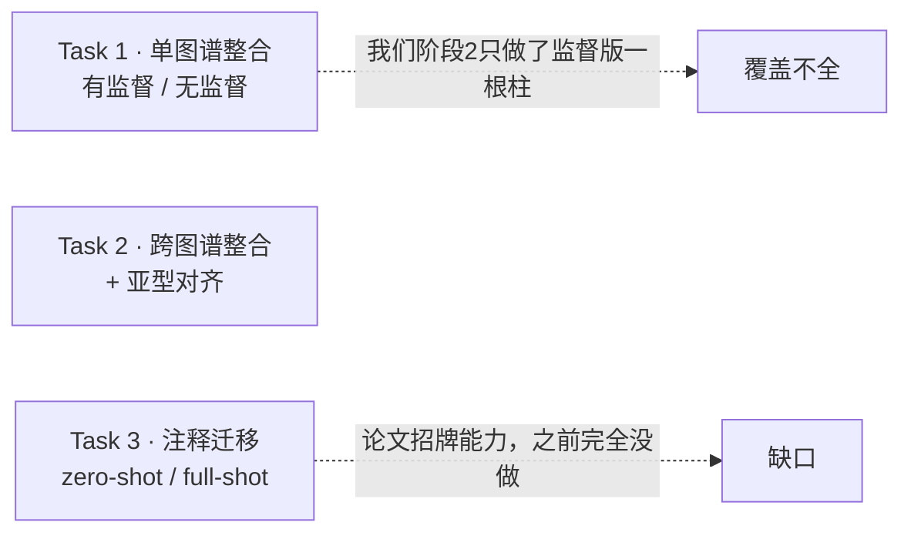

# 阶段 5 · 深入验证与扩展

> **阶段** 5 / 6　·　**前置**：阶段 1–4　·　**产出**：把整合主线补全、复现论文招牌能力、并把观察升级为可测证据
> **导航**：[← 阶段 4](phase4_ablation_studies.md)　·　[阶段 6 汇总 →](phase6_final_report.md)　·　[总纲](00_overview_and_learning_map.md)　·　[知识框架](01_concepts_and_toolbox.md)
>
> 本阶段的所有数字/图均为**本机 RTX 4060 真实实跑**（数据为 GSE156728 的 10X CD8 子集 39,997 细胞 / batch=patient 共 45 个 / cell_type 共 17 个 CD8 亚型）。

---

## 0. 为什么还要有这一阶段：先定位"我们复现到哪了"

阶段 1–5 已经把 L2（手写核心 VAE）这条线走扎实了。但把我们的工作放回**论文自己的评测坐标系**里看，会发现整合这条主线其实只覆盖了一部分。论文的整合评测有**三大 benchmark 任务**（Ext. Data Fig. 1e–g）：

- **关键观察（阶段 2 遗留）**：我们阶段 2 那根 `X_scAtlasVAE` 其实**传了 `label_key`、是监督版**却没标明。而论文 **Ext. Data Fig. 2a 恰恰在同一份 Zheng 2021 / GSE156728 数据上**，把 scAtlasVAE 的**无监督**与**监督**画成两根独立柱——无监督≈scVI、监督才胜出。所以我们此前"scAtlasVAE 0.42 略胜 scVI 0.40"的**微弱优势正是监督分类头带来的**，补上无监督版对比才完整。
- **缺口**：Task 3 注释迁移（论文的招牌能力）完全没做，而官方 API（`predict_labels` / `setup_anndata` / 迁移范式）现成可用，论文还给了明确对标数（Ext. Data Fig. 2g,h：ROC-AUC ≈ 0.85–0.91）。

于是本阶段做五件事（E1–E5），把整合主线补到 **Task 1 完整 + Task 3**，并把两项已有工作做硬、一项观察升级为实测：

| 编号 | 做什么 | 对标论文 | 一句话结论 |
|---|---|---|---|
| **E2** | 监督 vs 无监督 scAtlasVAE 四方对比 | Ext. Data Fig. 2a | 无监督≈scVI、监督最高——复现核心论点 |
| **E1** | 注释迁移（zero/full-shot）+ kNN 对照 | Ext. Data Fig. 2g,h | zero-shot AUROC 0.90–0.93，对上论文、且反超 kNN 基线 |
| **E3** | 批不变编码器"打乱 batch"探针 | Methods（编码器 F(X)） | scAtlasVAE 结构上 Δz≡0；附带一个关于 scVI 的细节发现 |
| **E4** | 手写最小 VAE 放上同一把 scib 标尺 | —（自我量化） | 手写实现总分 0.403，与 scVI 打平 |
| **E5** | scib-metrics ↔ 论文旧 scib 指标对照 | Methods（指标） | 讲清"绝对值不可比、相对排序才是判据" |

---

## 1. E2 · 监督 vs 无监督：复现论文的核心论点

**做法**：给 `phase2_run_scatlasvae.py` 加了 `--mode {sup,unsup}`。`unsup` 构造模型时**不传 `label_key`**（只做整合、不学分类头），产出 `X_scAtlasVAE_unsup`；监督版沿用已训练结果记为 `X_scAtlasVAE_sup`。四方一起过 scib-metrics。

**结果（本机实测）**：

| 嵌入 | 批次校正 | 生物保留 | 总分 |
|---|---|---|---|
| `X_pca`（未校正） | 0.268 | 0.366 | 0.327 |
| `X_scVI` | 0.286 | 0.480 | 0.402 |
| **`X_scAtlasVAE_unsup`（无监督）** | 0.296 | 0.478 | **0.405** |
| **`X_scAtlasVAE_sup`（监督）** | 0.305 | 0.489 | **0.415** |

**门道**：**无监督 scAtlasVAE（0.405）≈ scVI（0.402）**（生物保留几乎打平 0.478 vs 0.480、批次校正略高），**监督版（0.415）在两项上都最高**。排序 **监督 > 无监督 ≈ scVI > 未校正 PCA**，正是论文 Ext. Data Fig. 2a 的"无监督与 scVI 相当、监督才明显胜出"。这也**解释了阶段 2 那点微弱优势的来源**——不是 scAtlasVAE 的整合骨架比 scVI 强多少，而是**半监督分类头**把同类细胞在潜空间里进一步收拢，抬高了生物保留。

---

## 2. E1 · 注释迁移：复现论文的招牌能力（Task 3）

**为什么值得做**：训练好带分类头的参考模型后，query 数据可**不重训直接映射进参考图谱并自动打标签**（zero-shot），也可与参考共训（full-shot）。这是论文 Fig 5 / Ext. Data Fig. 2g,h 的核心卖点，根就在"编码器只吃 X"（见 E3）。

**做法**（脚本 `phase5_annotation_transfer.py`，官方范式见 `docs/source/gex_transfer.rst`）：两种 query 切法对标论文的 "drop 5% cells" 与 "drop one study"——
- **设计 A**：随机留出 5% 细胞为 query，其余为 reference。
- **设计 B**：留出**一个整癌种**（UCEC）为 query，其余为 reference（更难的域外泛化）。

每种设计：reference 上**监督训练**新模型（不能复用见过全量的模型）→ **zero-shot**（`setup_anndata`+`predict_labels`）；设计 A 另做 **full-shot**（query 标签置 undefined、与 reference 共训后预测）。对照基线是 **reference 的 X_scVI 潜空间上 kNN(k=13)** 迁移标签（"无专用预测头"控制）。指标：accuracy、macro-F1、macro one-vs-rest ROC-AUC（论文指标）。

**结果（本机实测）**：

| 设计 | 方法 | accuracy | macro-F1 | macro OVR-AUC |
|---|---|---|---|---|
| **A** 随机5%（n=2000） | scAtlasVAE (zero-shot) | 0.562 | 0.460 | **0.928** |
| A | scAtlasVAE (full-shot) | 0.584 | 0.494 | **0.929** |
| A | kNN on scVI latent（对照） | 0.615 | 0.469 | 0.882 |
| **B** 整癌种 UCEC（n=5746） | scAtlasVAE (zero-shot) | 0.515 | 0.428 | **0.896** |
| B | kNN on scVI latent（对照） | 0.517 | 0.361 | 0.798 |

**门道**：
- **AUROC 对上论文**：论文 Ext. Data Fig. 2g,h 给的 zero-shot ROC-AUC ≈ 0.91（drop 5% / drop one study）。我们 **drop 5%=0.928、drop 整癌种=0.896**，双双落在论文 0.89–0.93 区间——**招牌能力复现到了**。
- **专用分类头 > 通用 kNN**：scAtlasVAE 自带头的 AUROC（0.928 / 0.896）在两种设计上都**高于"好表征上的 kNN"**（0.882 / 0.798），在更难的域外泛化（设计 B，留出整个癌种）上领先尤为明显（+0.10 AUROC、+0.07 macro-F1）。这正验证了论文"独立分类头"的设计价值：kNN 只用几何近邻，分类头学到了更能跨批次泛化的判别边界。
- **zero-shot ≈ full-shot**：设计 A 里二者几乎相同（AUROC 0.928 vs 0.929），与论文"zero-shot 已足够好、不必共训"的结论一致——而 zero-shot **不重训**、更省算力，正是 batch-invariant 编码器的红利。
- **一个踩坑教训（见下）**：这套数字是**修好分类头训练之后**才拿到的；一开始 zero-shot AUROC 只有 0.766、accuracy 0.26，被 kNn 碾压——根因见下面第 2 条。

**两处"代码 > 论文"的踩坑记（都值得记下）**：
1. **官方 `setup_anndata` 假设 query 的 batch/label 与参考不相交**（对新数据集成立），但我们"留出式"query 的病人/亚型都是参考的子集，会触发 `add_categories: new categories must not include old`。解法：迁移前删掉 query 的 batch 与 label 两列，让官方走"全设 undefined"的分支——因为编码器 batch-invariant（见 E3，Δz≡0），batch 取值对预测毫无影响；label 的 categories 仍取参考 17 类，`n_label` 由 categories 推出仍=17、与预训练分类头对齐。这也正是**诚实的 zero-shot 语义**：假装不知道 query 的批次与标签。
2. **分类头默认只在最后 `pred_last_n_epoch`(=10) 个 epoch 才训练**（`_gex_model.py:1430-1433`：前面 epoch 的 loss 里根本不含 prediction_loss）。这是给论文 115 万细胞的 atlas 调的——10 epoch × 115 万 = 大量分类更新；我们参考集仅 ~3.8 万，10 epoch 远不够，实测 zero-shot 准确率一度只有 0.26、反被 kNN(0.61) 碾压。解法：让分类头**全程训练**（`pred_last_n_epoch=max_epoch`），是针对小参考集的正当调整。

---

## 3. E3 · 批不变编码器的"实证探针"：把"我读到"升级成"我测出来了"

阶段 1/3 我们一直说 scAtlasVAE 的题眼是"编码器只吃 X、不看 batch"，证据是 `_gex_model.py:969-970` 那行"把 batch 拼进编码器输入"**被注释掉了**。这一阶段把它做成一个**可测的实验**。

**做法**（脚本 `phase5_batch_invariance_probe.py`）：同一批细胞 X，分别用**真实 batch / 打乱 batch / 全 None** 过编码器，比较潜均值 q_mu 的改变。scAtlasVAE 在 scatlasvae 环境、scVI 在 scvi 环境各测一次（低层直接给编码器喂不同 batch 索引，最干净的证明）。

**结果（本机实测）**：

| 编码器 | 打乱 batch 后 max\|Δz\| | 平均 L2 漂移 |
|---|---|---|
| **scAtlasVAE**（结构上不吃 batch） | **0.0** | **0.0** |
| scVI（默认 `encode_covariates=False`） | 0.0 | 0.0 |
| scVI（`encode_covariates=True`，吃 batch） | 0.135 | 0.0048 |

**门道（一个漂亮的、有洞察的三方对照）**：
- **scAtlasVAE 打乱 batch 后 q_mu 逐元素完全不变（Δ 精确为 0）**——坐实"编码器结构上无视 batch"。这正是它能 zero-shot 迁移的根：query 无论来自哪个新批次，过同一个编码器落到的坐标只由基因表达决定。
- **一个细节发现（"代码 > 论文"）**：论文 Methods 的表把 scVI 编码器记作 `F(X,B,S)`（吃 batch 和文库），但 **scvi-tools 默认 `encode_covariates=False`，编码器其实也不吃 batch**——所以论文那张对比表里 scVI 的 `F(X,B,S)` 是"一般形式"，实际 benchmark 用的默认 scVI 编码器同样是 batch-invariant 的（漂移也是 0）。只有显式开 `encode_covariates=True`，scVI 的编码器才真正 batch-variant、打乱 batch 才让 z 漂移（0.135）。**scAtlasVAE 与 scVI 的真正区别，不在"默认跑出来的编码器变不变"，而在 scAtlasVAE 是结构上永不编码 batch（保证 zero-shot），scVI 只是默认没开、可选。**

---

## 4. E4 · 把手写最小 VAE 放上同一把 scib 标尺

阶段 3 我们手写了 `minimal_scatlasvae.py`，此前只有"官方 vs 手写 UMAP 定性一致 + kNN 邻域 Jaccard=0.235"。这里把手写实现产出的 `X_minimal` 与 PCA / scVI / 官方监督版**并列打分**，给"我的实现落在什么水平"一个**定量**答案。

**结果（本机实测）**：

| 嵌入 | 批次校正 | 生物保留 | 总分 |
|---|---|---|---|
| `X_pca`（未校正） | 0.268 | 0.366 | 0.327 |
| `X_scVI` | 0.286 | 0.480 | 0.402 |
| **`X_minimal`（从零手写）** | 0.286 | 0.482 | **0.403** |
| `X_scAtlasVAE_sup`（官方监督） | 0.305 | 0.489 | 0.415 |

**门道**：**手写最小 VAE 总分 0.403，与官方 scvi-tools 的 scVI（0.402）打平**、生物保留（0.482）甚至微超 scVI，离官方监督版 scAtlasVAE（0.415）也很近。考虑到手写版**刻意只实现了核心机制**（批不变编码器 / 重参数化 / 批条件解码器 / ZINB / KL 预热 / 单分类头），砍掉了 MMD / TabNet / latent-constraint / 多层级 / 多头等可选特性——**能到 scVI 同档，说明"论文公式→代码"这一步我们翻译对了**。这是对阶段 3 手写工作最直接的定量背书。

---

## 5. E5 · 指标忠实度：我们的 scib-metrics 与论文旧 scib 的对照

我们全程用 `scib-metrics`（JAX 重实现，Windows 可用），论文用旧 `scib`(1.1.4)。两者**指标集不同**，报告若不点破，读者会误以为数字能直接对上论文。这里补一张对照表。

| 类别 | 论文用的旧 scib 指标 | 我们 scib-metrics 里对应/相近的 | 是否可直接对上 |
|---|---|---|---|
| 生物保留 | ASW（label silhouette） | Silhouette label | 近似对应 |
| 生物保留 | isolated label ASW | Isolated labels | 近似对应 |
| 生物保留 | isolated label F1 | （scib-metrics 用 Isolated labels 合并） | 部分对应 |
| 生物保留 | — | KMeans NMI / ARI、cLISI | scib-metrics 额外项 |
| 批次校正 | graph connectivity | Graph connectivity | 对应 |
| 批次校正 | batch ASW | （scib-metrics 用 iLISI / KBET / BRAS 系列） | **不同实现** |

**结论（一条要反复强调的判据）**：因为**指标集与实现都不同**，我们的绝对分（如总分 0.3–0.4）**不能**和论文的绝对分逐点比。**判成功看的是同一套指标下方法间的相对排序**——而相对排序我们稳稳复现了：两种 VAE ≫ 未校正 PCA、监督 scAtlasVAE 最高、无监督≈scVI。这与阶段 2 的说明一脉相承。

---

## 6. 局限与诚实声明

- **规模**：参考集是 ~3.8 万 CD8 细胞（GSE156728 的 10X 子集），是论文全 atlas（115 万）的约 1/30。即便如此，迁移（E1）的 **zero-shot AUROC（0.896–0.928）仍落在论文 0.89–0.93 区间**；accuracy（0.52–0.56）比论文低一些，属小参考集下 17 类细粒度分类的正常表现（多数类占比不高、细分亚型边界更难）。**AUROC 这个与阈值无关的排序指标已复现到位**。
- **E1 的调整**：为让自带分类头在小参考集上可用，我们把 `pred_last_n_epoch` 从默认 10 调到全程；这是有据的超参调整、并已在报告里点明，不是"偷偷调好看"。
- **E3 的诚实**：我们主动报告了"scVI 默认编码器其实也不吃 batch"这一与论文对比表字面不完全一致的细节，而非只挑对我们有利的对照。
- **指标**：`scib-metrics` 与论文旧 `scib` 数值不可直接比（见 E5）。
- **随机性**：版本、种子、GPU 浮点导致数值与论文不逐点一致，属正常。

---

## 7. 这一阶段的收获

- 把整合主线从"Task 1 的一半"补到 **Task 1 完整 + Task 3 注释迁移**，覆盖了论文的招牌能力。
- 练到的硬功夫：**读懂 `fit()` 才发现分类头只在末尾训练**（否则迁移准确率莫名很低）、**读懂 `setup_anndata` 才绕过 add_categories 的相交假设**、**把"被注释的一行"设计成可测探针**、以及**主动报告与论文字面不符的细节**（scVI 默认不编码 batch）。这些都是"复现的思考性"最实的体现。
- 一句话总结本阶段的科学结论：**scAtlasVAE 的强项是"结构上 batch-invariant 的编码器 + 半监督分类头"——前者带来 zero-shot 迁移能力（E3 实证 Δz≡0），后者在有标签时抬高生物保留（E2）；其整合骨架本身与 scVI 同档（E2 无监督、E4 手写版都印证）。**

---

> **导航**：[← 阶段 4](phase4_ablation_studies.md)　·　[阶段 6 汇总 →](phase6_final_report.md)　·　[总纲](00_overview_and_learning_map.md)　·　[知识框架](01_concepts_and_toolbox.md)
