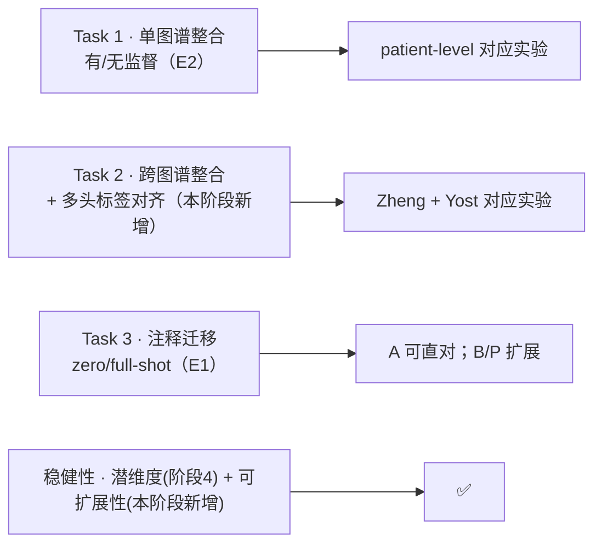
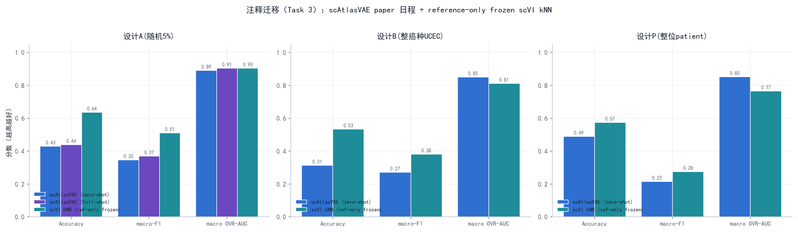
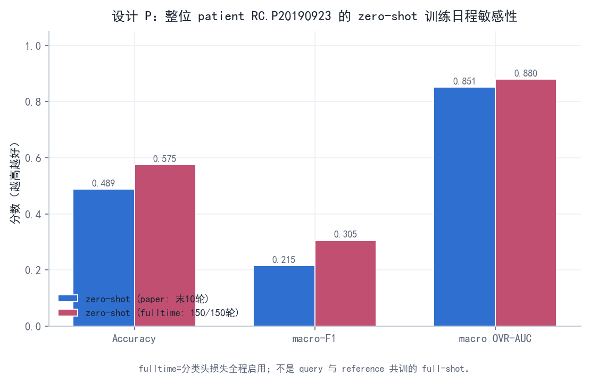
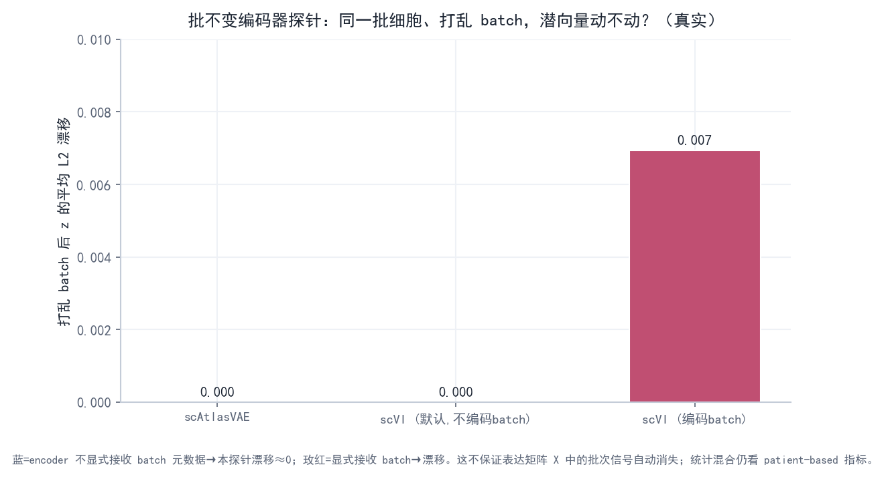
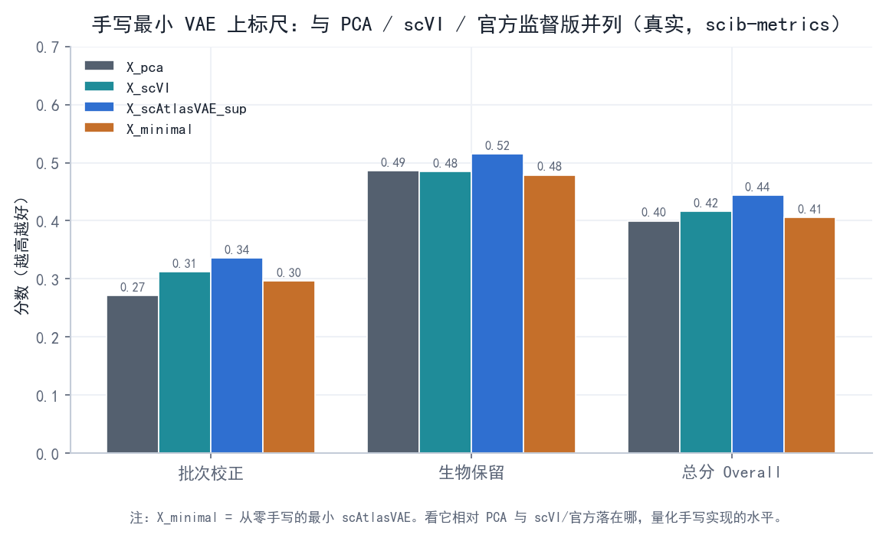
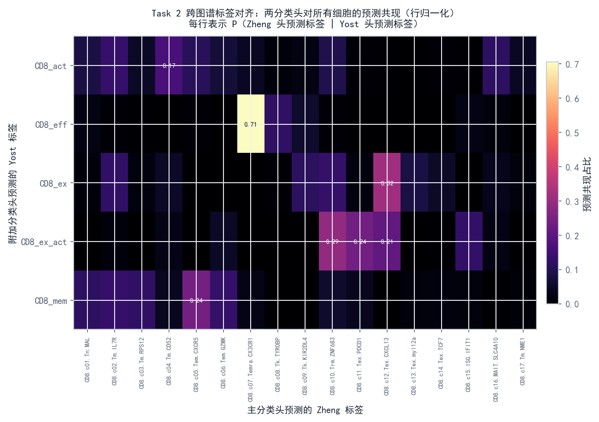
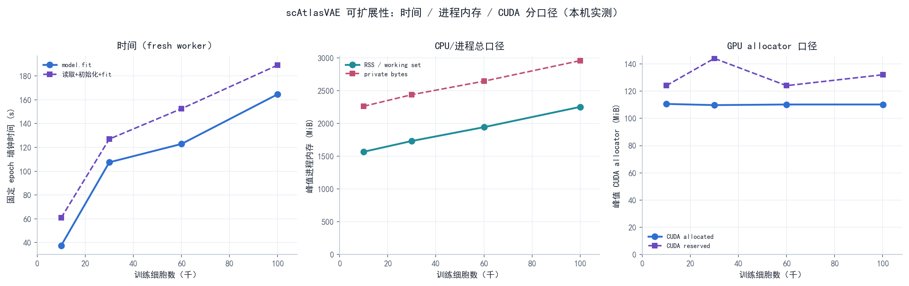

# 阶段 5 · 深入验证与扩展

> **阶段** 5 / 6　·　**前置**：阶段 1–4　·　**产出**：把整合主线补全、复现论文招牌能力、并把观察升级为可测证据
> **导航**：[← 阶段 4](phase4_ablation_studies.md)　·　[阶段 6 汇总 →](phase6_final_report.md)　·　[总纲](00_overview_and_learning_map.md)　·　[知识框架](01_concepts_and_toolbox.md)
>
> 本阶段的所有数字/图均为**本机真实实跑**（主数据为 GSE156728 的 10X CD8 **全量 104,805 细胞** / batch=patient 共 45 个 / cell_type 共 17 个 CD8 亚型；Task 2 另用 Yost 2019 GSE123813）。scAtlasVAE 训练使用 RTX 4060；scVI reference-only 公平 kNN 与 scib-metrics 在各自现有环境中使用 CPU，报告中不再笼统声称“所有步骤都走 GPU”。

---

## 0. 为什么还要有这一阶段：先定位"我们复现到哪了"

阶段 1–4 把 L2（手写核心 VAE）这条线走扎实了。这一阶段为论文 Part A 的三个任务分别建立**对应实验**，但不是三项都能与论文精确对齐：Task 1 用 patient 代替 study；Task 3 只有随机 5% 的 A 可直接对应，B/P 是扩展压力测试。

- **关键观察（阶段 2 遗留）**：我们阶段 2 那根 `X_scAtlasVAE` 其实**传了 `label_key`、是监督版**却没标明。补上无监督柱、修复官方训练损失并重训后，**监督(0.444) 明显最高、无监督(0.411)≈scVI(0.416)、略高于 PCA(0.400)**——scAtlasVAE 相对 scVI 的主要优势来自**半监督分类头**。同时修掉了一个 scib PCR 基线 bug（见 E5 与 [阶段 2 §7](phase2_integration_and_benchmark.md)）。
- 补上 Task 3 注释迁移、Task 2 跨图谱多头对齐与可扩展性曲线；至此三个任务都有对应实测，但 exact-study 边界仍保留。

本阶段做这些事，为 **Task 1/2/3 建立对应实验 + 稳健性检查**（数据已升到全量 ~10.5 万、PCR 基线已修）：

| 编号 | 做什么 | 对标论文 | 一句话结论 |
|---|---|---|---|
| **E2** | 监督 vs 无监督 scAtlasVAE 四方对比 | Ext. Data Fig. 2a | 监督最高；无监督≈scVI、略高于 PCA（主要优势来自分类头） |
| **E1** | 注释迁移（zero/full-shot）+ kNN 对照 | Ext. Data Fig. 2g,h | A 的 AUROC 0.891 可与论文 drop-5% 对照；B/P 只作域外压力测试 |
| **E3** | 批不变编码器"打乱 batch"探针 | Methods（编码器 F(X)） | scAtlasVAE 结构上 Δz≡0；附带 scVI 细节发现 |
| **E4** | 手写最小 VAE 放上同一把 scib 标尺 | —（自我量化） | 手写实现总分 0.406，落在 PCA 与 scVI 之间；与修复后的官方嵌入 kNN Jaccard=0.204 |
| **E5** | scib-metrics ↔ 论文旧 scib 指标对照 | Methods（指标） | 绝对值不可比、相对排序才是判据 |
| **Task 2** | 跨图谱整合 + 多头标签对齐（Zheng+Yost） | Ext. Data Fig. 3 | 潜空间生物学对齐两套标签（CD8_ex↔Tex 等） |
| **可扩展性** | 训练时间 + 进程/CUDA 多口径内存 vs 细胞数 | Ext. Data Fig. 4e,f | 时间与总进程内存分别测量；固定 minibatch 的 CUDA allocated 不冒充进程总内存 |

---

## 1. E2 · 监督 vs 无监督：复现论文的核心论点

**做法**：给 `phase2_run_scatlasvae.py` 加了 `--mode {sup,unsup}`。`unsup` 构造模型时**不传 `label_key`**（只做整合、不学分类头），产出 `X_scAtlasVAE_unsup`；监督版沿用已训练结果记为 `X_scAtlasVAE_sup`。四方一起过 scib-metrics。

**结果（本机实测）**：

| 嵌入 | 批次校正 | 生物保留 | 总分 |
|---|---|---|---|
| `X_pca`（未校正） | 0.271 | 0.486 | 0.400 |
| `X_scVI` | 0.312 | 0.485 | 0.416 |
| **`X_scAtlasVAE_unsup`（无监督）** | 0.309 | 0.478 | **0.411** |
| **`X_scAtlasVAE_sup`（监督）** | 0.336 | 0.515 | **0.444** |

**门道（含已修的评测与训练 bug，见 E5）**：监督 scAtlasVAE(0.444) 的批次校正与生物保留均最高，复现了论文 Ext. Data Fig. 2a 中"监督胜出"的**方向**。但无监督(0.411)≈scVI(0.416)、只略高于 PCA(0.400)，且正确 scaled PCA 的生物保留为 0.486；VAE 相对 PCA 的优势主要在患者批次校正（0.271 < 0.309≈0.312 < 0.336）。由于这里 batch=patient 而非 study、指标实现也不同，绝对分不能与论文逐点对齐。

---

## 2. E1 · 注释迁移：复现论文的招牌能力（Task 3）

**为什么值得做**：训练好带分类头的参考模型后，query 数据可**不重训直接映射进参考图谱并自动打标签**（zero-shot），也可与参考共训（full-shot）。这是论文 Fig 5 / Ext. Data Fig. 2g,h 的核心卖点，根就在"编码器只吃 X"（见 E3）。

**做法**（脚本 `phase5_annotation_transfer.py`，官方范式见 `docs/source/gex_transfer.rst`）：当前数据没有 `study_name`，所以把三种 query 设计明确分开，绝不把它们混称为同一个实验——
- **设计 A**：随机留出 5% 细胞为 query，其余为 reference。
- **设计 B**：留出**一个整癌种**（UCEC）为 query，其余为 reference；这是癌种生物域外泛化，**不是 batch/study 留出**。
- **设计 P**：完整留出患者 `RC.P20190923`（5,809 个细胞、覆盖全部 17 类）；这是现有字段下最接近批次/样本域留出的类比，但仍**不是论文的 leave-one-study**。

每种设计：reference 上**监督训练**新模型（不能复用见过全量的模型）→ **zero-shot**；设计 A 另做 **full-shot**（query 标签置 undefined、与 reference 共训后预测）。主表保留的 `kNN on scVI latent` 是早期**全数据 scVI 的 transductive 诊断**，不能叫 reference-only 基线；公平结论以随后重跑的 `fair-inductive(reference-encoder-direct)` 为准：scVI 只在 reference 训练，query counts 直接经过冻结 encoder，完全不训练 query。指标：accuracy、macro-F1、macro one-vs-rest ROC-AUC（论文指标）。

**结果（本机实测）**：

*图中 scVI kNN 为公平的 `reference-only frozen encoder` 结果；下表另外保留旧的 full-data transductive kNN，仅用于诊断和追溯，二者不能混为同一基线。*

| 设计 | 方法 | accuracy | macro-F1 | macro OVR-AUC |
|---|---|---|---|---|
| **A** 随机5%（n=5240） | scAtlasVAE (zero-shot) | 0.430 | 0.345 | **0.891** |
| A | scAtlasVAE (full-shot) | 0.439 | 0.369 | **0.905** |
| A | kNN on scVI latent（transductive 诊断） | 0.641 | 0.510 | 0.905 |
| **B** 整癌种 UCEC（n=19926） | scAtlasVAE (zero-shot) | 0.313 | 0.272 | **0.851** |
| B | kNN on scVI latent（transductive 诊断） | 0.531 | 0.377 | 0.813 |
| **P** 整位患者 RC.P20190923（n=5809） | scAtlasVAE (zero-shot) | 0.489 | 0.215 | **0.851** |
| P | kNN on scVI latent（transductive 诊断） | 0.587 | 0.289 | 0.784 |

> **上表为论文训练协议**（`pred_last_n_epoch=10`；不同 reference 规模自动得到约 76–94 个 epoch，P 为 81），分类头只训末 10 轮。作日程敏感性对照，A/B 的分类头全程训练版本 AUROC 为 0.941/0.907；P 另以固定 150 epoch、`pred_last_n_epoch=150` 完成全程训练，accuracy/F1/AUROC 为 **0.575/0.305/0.880**（paper 日程为 **0.489/0.215/0.851**）。这些都超出 Task 3 默认日程，不能写成“超越论文”。这里 `fulltime` 只表示 reference 分类损失全程启用，**不是** query 与 reference 共训的 `full-shot`；B/P 的留出单位也仍不等同于论文 study。

*图 5-E1b — 同一个整 patient 留出下，比较 zero-shot 的 paper 末 10 轮日程与 full-time 150/150 轮日程；两者均不训练 query，因而都不是 full-shot。*

**门道**：
- **论文数字只能和相同留出单位比较**：论文 zero-shot ROC-AUC = 0.905（drop 5%）/ 0.859（drop one study）。我们随机 5% 的 **0.891** 可与前者对照，低约 0.014；B 的整癌种 **0.851** 与 P 的整 patient 都是额外压力测试，**不能拿来与论文 0.859 做误差对齐**。
- **⚠️ 一处方法学自我更正（本轮复查）**：此前本节把“分类头全程训练”误称为论文协议。论文 benchmark 用默认 `pred_last_n_epoch=10`，即分类头只训最后 10 轮。改回同协议并完成训练循环修复后，A/B/P 的 AUROC 为 **0.891/0.851/0.851**；全程训练对照为 **0.941/0.907/0.880**，其中 P 是明确固定的 150/150 轮。后者只用于日程敏感性，不算“超越论文”，也不改变 A/B/P 留出单位的证据边界。
- **专用分类头 vs kNN——要分场景看**：A 的 transductive kNN AUROC 0.905 略胜 head 0.891；B/P 则是 head **0.851/0.851** 高于 transductive kNN **0.813/0.784**。但三种设计里 head 的 accuracy 与 macro-F1 都低于 kNN，所以只能说它在 B/P 的概率排序（AUROC）更好，不能概括为全面胜出。B 是癌种 OOD，P 是患者域；两者都不等价于 leave-study。
- **kNN 对照的公平性——真正的 reference-only encoder（`phase5_fair_knn.py`）**：scVI 只在 reference 上训练；query counts 直接送入这个**冻结的 reference encoder**，不调用 `prepare_query_anndata`、`load_query_data` 或 `qm.train()`，也不看 query 标签。fair-inductive 与旧 transductive 仍接近：A acc/AUROC **0.637/0.904**（旧 0.641/0.905），B **0.534/0.812**（旧 0.531/0.813），P **0.574/0.765**。所以旧 kNN 没因见过 query 而获得实质性优势。该 scVI 环境本轮是 CPU 训练，科学协议不受影响，但硬件口径已单列。
- **zero-shot ≈ full-shot**：设计 A 里二者接近（AUROC 0.891 vs 0.905），与论文"zero-shot 已足够好、不必共训"一致——而 zero-shot **不重训**、更省算力，正是 batch-invariant 编码器的红利。

**三处“代码/评测 > 论文”的踩坑记（都已修复）**：
1. **官方 `setup_anndata` 假设 query 的 batch/label 与参考不相交**（对新数据集成立），但我们"留出式"query 的病人/亚型都是参考的子集，会触发 `add_categories: new categories must not include old`。解法：迁移前删掉 query 的 batch 与 label 两列，让官方走"全设 undefined"的分支——因为编码器 batch-invariant（见 E3，Δz≡0），batch 取值对预测毫无影响；label 的 categories 仍取参考 17 类，`n_label` 由 categories 推出仍=17、与预训练分类头对齐。这也正是**诚实的 zero-shot 语义**：假装不知道 query 的批次与标签。
2. **分类头默认只在最后 `pred_last_n_epoch`(=10) 个 epoch 才训练**。这个“末 10 轮”会随自动 epoch 总数改变相对占比：论文 11 万 benchmark 约 73 轮，而 147 万多图谱 benchmark 只有约 5 轮、分类头因而等同全程训练。当前全量数据按论文协议重跑后 A/B/P AUROC 为 0.891/0.851/0.851；全程训练仅作为 A/B/P 日程敏感性对照，P 的 150/150 轮实测 AUROC 为 0.880。`fulltime` 与只对设计 A 做过的 `full-shot` 是两个不同概念。
3. **标签与概率必须来自同一次随机前向**：旧脚本为标签和 AUROC 分别调用 `predict_labels()`，VAE 的随机 latent 可能使两次结果不一致。现只调用一次取得 logits，再同时派生类别、softmax 概率与全部指标；A/B/P 均已按此逻辑重跑。

---

## 3. E3 · 批不变编码器的"实证探针"：把"我读到"升级成"我测出来了"

阶段 1/3 我们一直说 scAtlasVAE 的题眼是"编码器只吃 X、不看 batch"，证据是 `_gex_model.py:969-970` 那行"把 batch 拼进编码器输入"**被注释掉了**。这一阶段把它做成一个**可测的实验**。

**做法**（脚本 `phase5_batch_invariance_probe.py`）：同一批细胞 X，分别用**真实 batch / 打乱 batch / 全 None** 过编码器，比较潜均值 q_mu 的改变。scAtlasVAE 在 scatlasvae 环境、scVI 在 scvi 环境各测一次（低层直接给编码器喂不同 batch 索引，最干净的证明）。

**结果（本机实测）**：

| 编码器 | 打乱 batch 后 max\|Δz\| | 平均 L2 漂移 |
|---|---|---|
| **scAtlasVAE**（结构上不吃 batch） | **0.0** | **0.0** |
| scVI（默认 `encode_covariates=False`） | 0.0 | 0.0 |
| scVI（`encode_covariates=True`，吃 batch） | 0.237 | 0.0069 |

**门道（一个漂亮的、有洞察的三方对照）**：
- **scAtlasVAE 打乱 batch 后 q_mu 逐元素完全不变（Δ 精确为 0）**——坐实"编码器结构上无视 batch"。这正是它能 zero-shot 迁移的根：query 无论来自哪个新批次，过同一个编码器落到的坐标只由基因表达决定。
- **一个细节发现（"代码 > 论文"）**：论文 Methods 把 scVI encoder 概括为 `F(X,B,S)`，但 scvi-tools 默认 `encode_covariates=False`，本项目实际 scVI encoder 也不显式接收 batch；只有设为 `True` 时打乱 batch 才让 z 漂移。scAtlasVAE 的区别是这一接口在结构上固定为只接收 X，而 scVI 可配置。这里的 Δz=0 只证明“batch 元数据没有直接进入 encoder”，不证明 X 中的批次信号已统计消失；后者看 patient-based mixing 指标。

---

## 4. E4 · 把手写最小 VAE 放上同一把 scib 标尺

阶段 3 我们手写了 `minimal_scatlasvae.py`；用修复后官方嵌入重算，官方 vs 手写的 kNN 邻域 Jaccard 为 **0.204**。这里再把 `X_minimal` 与 PCA / scVI / 官方监督版并列打分，给"我的实现落在什么水平"一个定量答案。

**结果（本机实测，~10.5 万全量，PCR 已修）**：

| 嵌入 | 批次校正 | 生物保留 | 总分 |
|---|---|---|---|
| `X_pca`（未校正） | 0.271 | 0.486 | 0.400 |
| `X_scVI` | 0.312 | 0.485 | 0.416 |
| **`X_minimal`（从零手写）** | 0.296 | 0.479 | **0.406** |
| `X_scAtlasVAE_sup`（官方监督） | 0.336 | 0.515 | 0.444 |

**门道**：手写最小 VAE 总分 **0.406**，高于未校正 PCA(0.400)，低于无监督 scAtlasVAE(0.411)、scVI(0.416) 与官方监督版(0.444)；批次校正 0.296 也高于 PCA 0.271。它证明最小实现抓住了有效机制，但不能再写成"约等于官方无监督版"。

---

## 5. E5 · 指标忠实度：我们的 scib-metrics 与论文旧 scib 的对照

我们全程用 `scib-metrics`（JAX 重实现，Windows 可用），论文用旧 `scib`(1.1.4)。两者**指标集不同**，报告若不点破，读者会误以为数字能直接对上论文。这里补一张对照表。

| 类别 | 论文用的旧 scib 指标 | 我们 scib-metrics 里对应/相近的 | 是否可直接对上 |
|---|---|---|---|
| 生物保留 | ASW（label silhouette） | Silhouette label | 近似对应 |
| 生物保留 | isolated label ASW | Isolated labels | 近似对应 |
| 生物保留 | isolated label F1 | （scib-metrics 用 Isolated labels 合并） | 部分对应 |
| 生物保留 | — | KMeans NMI / ARI、cLISI | scib-metrics 额外项 |
| 批次校正 | graph connectivity | Graph connectivity | 对应 |
| 批次校正 | batch ASW | （scib-metrics 用 iLISI / KBET / BRAS 系列） | **不同实现** |

**三个必须点破的口径细节**：
- **总分加权**：scib-metrics 的 Total = **0.4·批次校正 + 0.6·生物保留**（scIB 论文默认，生物保留权重更大），不是等权。所以"生物保留高、批次没校正"的 scaled PCA 总分也能不低——读总分时要记着。
- **一个我们踩过并修好的 bug**：`PCR comparison` 曾对所有方法恒为 0，且 `X_pca` 基线被 Benchmarker 用原始计数现算的 PCA 覆盖。显式传入预处理好的 scaled-log `X_pca` 后，PCR 恢复区分度（监督 **0.130** > scVI **0.082** > 无监督 **0.059** > PCA 0），PCA 生物保留回到 0.486。
- **iLISI/KBET 绝对值低，是"批次多"的必然、不是"没整合好"**：本项目 `batch=patient` 有 **45 个批次**（还有小到 5 个细胞的）。iLISI/KBET 衡量"每个细胞邻域里批次混得多匀"——批次越多、单个 ~90 细胞邻域越不可能塞下全部 45 个批次，绝对值就天然越低（实测 iLISI 全在 0.01–0.06、KBET 0.08–0.14）。**只看相对排序**：PCA 0.011 < 三个 VAE 0.047–0.058，metric 正确反映了"整合后批次更混"；别把低绝对值误读成"没整合"。批次校正的其他分项（graph connectivity 0.64–0.72、BRAS 0.60–0.62）也印证整合有效。

**结论（判据）**：因为**指标集与实现都不同**，我们的绝对分**不能**和论文逐点比；**判据是同一套指标下的相对排序**——监督 scAtlasVAE 最高（批次校正+生物保留两项皆最高），VAE 相对 PCA 的优势集中在**批次校正一列**（PCA<无监督<scVI<监督）。这与阶段 2 一脉相承。

---

## Task 2 · 跨图谱整合 + 多头标签对齐（复现论文独有能力，Ext. Data Fig. 3）

**为什么值得做**：scAtlasVAE 相对 scVI/scPoli 的**独有**卖点，是用**多个独立分类头**把两个**各自独立注释**的图谱的标签体系**并行对齐**（scVI 只整合、不对齐标签）。这是论文 Ext. Data Fig. 3 的核心。

**做法**（脚本 `phase5_cross_atlas.py`）：
- 图谱 1 = 我们的 Zheng/GSE156728（**全量 104,805**，meta.cluster 17 亚型）；图谱 2 = **Yost 2019 BCC**（GSE123813，12,364 CD8，独立注释 CD8_act/eff/ex/ex_act/mem）——真实、独立（Yost 本身也在论文 TCellLandscape/TCellMap 的源研究列表里），货真价实的跨研究/跨癌种挑战。
- 合并后 `batch_key=[patient, atlas]`、`label_key=[ct_zheng, ct_yost]`，建立两个分类头；每个 head 只用自己图谱的有效标签训练。设置为 `batch_hidden_dim=64`、100 epoch、`lr=3e-5`，主分析显式令分类头全程训练；另跑 `pred_last_n_epoch=10` 敏感性版本。
- **整合强度**用平衡子采样 atlas silhouette 与 Yost 细胞 30-NN 中 Zheng 占比，并与未校正 PCA 比较。
- **论文式标签对齐**只用两个真实分类头在同一次 forward 中的预测共现矩阵。PCA 没有分类头，因此不存在可直接比较的 "PCA head alignment"。另把基于真标签的 latent-kNN 对齐作为独立诊断，才可在 `X_cross` 与 PCA 之间比较。

**结果（全量 104,805 + 12,364、bhd=64、100 epoch、lr=3e-5）**：

**① 两图谱确实被整合了——scAtlasVAE 明显优于未校正 PCA：**

| 指标 | scAtlasVAE | 未校正 PCA | 含义 |
|---|---|---|---|
| 平衡 atlas silhouette（越低=越混） | **0.0325** | 0.0874 | scAtlasVAE 更混合 |
| Yost 细胞 30-NN 中 Zheng 占比（越高=越混，理想≈0.89） | **0.2462** | 0.0405 | scAtlasVAE 约为 PCA 的 6 倍 |

**② 两个真实分类头产生了可解释但并不完美的标签共现：**

| Yost-head 预测 | Zheng-head 预测共现（full-head，行归一化） | 解读 |
|---|---|---|
| CD8_eff | **Temra.CX3CR1 0.706** | 强的效应 ↔ 终末效应对应 |
| CD8_ex | **Tex.CXCL13 0.317**；全部 Tex 家族合计 0.477 | 耗竭方向正确，但不如旧 kNN 数字那么尖锐 |
| CD8_ex_act | top 为 **Trm.ZNF683 0.294**；Tex 家族合计 0.451 | 活化/耗竭信号分散，不能说单一落入 Tex |
| CD8_mem | **Tem.CXCR5 0.241** | 记忆方向可解释，但分布较散 |
| CD8_act | **Tm.CD52 0.167**（其次 Tm.IL7R 0.133） | 活化头没有形成很尖锐的一对一映射 |

*图 — 同一次前向中，Yost 与 Zheng 两个分类头对所有细胞的预测共现矩阵（行归一化）。它是论文式多头标签对齐；latent-kNN 另存为附加诊断，不再冒充该结果。*

**门道**：主模型在两个混合指标上均优于 PCA，并且真实多头给出了生物学上部分可解释的标签共现；这证明"并行预测两套命名体系"的机制确实运行了。它**不能**证明多头全面优于 PCA，因为 PCA 根本没有 head。可比较的 latent-kNN 诊断结果是混合的：full 模型在 CD8_eff→Temra（0.911 vs 0.677）和 CD8_ex_act→Tex.CXCL13（0.549 vs 0.463）更集中，但 CD8_ex（0.579 vs 0.642）与 CD8_mem（0.488 vs 0.570）反而低于 PCA。正确结论是：两种嵌入都恢复了主要生物对应，各自在不同亚型更尖锐。

> **训练协议敏感性**：末 10 轮版本的 mixing 为 silhouette **0.0912**、Yost-NN-Zheng **0.1404**；前者略差于 PCA 0.0874，后者仍高于 PCA 0.0405。真实 head 共现也明显改变，例如 CD8_eff→Temra 从 0.706 降到 0.236。因此只能说广义生物方向仍可解释，不能再声称 head 对齐强度对训练日程稳健。主分析用 full-head 的依据是论文 147 万多图谱任务自动 epoch 约 5、默认 `pred_last=10` 在那里等价于全程训练；但本项目规模与论文仍不同。
>
> **三个踩坑教训（都是复查真跑出来的）**：
> 1. **抄近道的"假失败"**：最初为省算力只跑 15 epoch + bhd=10，两图谱几乎不混（Yost 近邻 Zheng 仅 0.3%）；贴论文设置（bhd=64、100 epoch）后才真正整合。
> 2. **NaN 的已确认根因是空标签 head**：某个 minibatch 对某 head 没有任何有效标签时，空 target 的 `CrossEntropyLoss` 产生 NaN；原多头平均还存在分母优先级错误，且 `undefined` 若不在类别末尾会导致 code/输出错位。三处均已修复：空 head 返回 0、只按 active heads 平均、强制 sentinel 置末。guarded full/pl10 重跑日志对 `nan loss detected`、`pred=nan`、non-finite 均为 0。当前仍保守使用 `lr=3e-5`；修复后没有单独重跑 5e-5，故不能再把默认 lr 写成已证实的唯一根因。
> 3. **类别不平衡会扭曲原始 silhouette**：Yost 只占 10.5%，所以改用平衡子采样与定向近邻占比。最终 full 结果是 0.0325 < 0.0874、0.2462 > 0.0405；这是当前可以引用的稳健比较。

---

## 可扩展性 · 训练时间/进程内存/CUDA 内存 vs 细胞数（对应 Ext. Data Fig. 4e,f）

**做法**（脚本 `phase5_scalability.py`）：每个规模启动一个**全新 worker 进程**，用 backed H5AD 只 materialize 所选细胞的 X/obs/var，再固定训练 20 epoch。50 ms 采样 Windows 进程 working-set/RSS 与 private memory，同时记录 PyTorch CUDA allocated/reserved。这样不再让全量 AnnData 或前一次 PyTorch allocator 污染下一规模。

**结果（本机 4060 实测）**：

| 细胞数 | `fit()` | worker 核心总时长 | 峰值 RSS | 峰值 private | CUDA allocated / reserved |
|---:|---:|---:|---:|---:|---:|
| 10,002 | 37.5 s | 60.8 s | 1,569 MiB | 2,264 MiB | 110.6 / 124 MiB |
| 29,999 | 107.5 s | 127.0 s | 1,734 MiB | 2,440 MiB | 109.7 / 144 MiB |
| 60,005 | 122.9 s | 152.5 s | 1,945 MiB | 2,646 MiB | 110.2 / 124 MiB |
| 100,006 | 164.7 s | 189.2 s | 2,254 MiB | 2,960 MiB | 110.2 / 132 MiB |

**门道**：训练时间随规模总体增加；四点线性拟合的 `fit()` R²≈0.874、worker 核心总时长 R²≈0.895，可称**粗略近线性趋势**，但每 10k 细胞耗时并不恒定（约 37.5→16.5 s），且每个规模只跑一次，所以证据不足以声称严格线性。反而 fresh-worker 峰值 RSS/private 与细胞数几乎线性（R²≈0.999，约每增加 10k 细胞增 75–76 MiB），这是目前最接近论文“进程总内存曲线”的口径。CUDA allocated/reserved 基本平坦，是固定 minibatch=128 的预期结果，只反映 GPU 上当前 batch/模型，不代表全流程总内存。论文具体采用的进程与内存定义未完全公开，因此可以比较趋势，不能把我们的 MiB 数值与论文逐点对齐，也不能把平坦 CUDA 曲线当成论文总内存曲线。

---

## 6. 局限与诚实声明

- **规模与留出边界**：主数据 = **GSE156728 8 癌种 10X CD8 104,805**，与论文 110,218-cell benchmark 同量级，但缺少其 28-study 成品对象与 `study_name`。Task 1 用 `patient` 做 batch；Task 3 中 A=随机细胞、B=整癌种生物 OOD、P=整患者批次域类比。**B/P 都不能冒充 leave-one-study**。未跑 115 万全 atlas。
- **UMAP 证据边界**：整合 UMAP 已改为按 `patient`（实际 batch）与 `cell_type` 分别上色。`cancerType` 是生物变量，癌种着色不能证明 patient batch 被移除；定量结论来自 patient-based 指标而不是单张图。
- **E1 训练协议**：主结果使用论文默认的分类头末 10 轮；全程训练仅作为日程敏感性对照。P 在 150/150 轮下由 0.489/0.215/0.851 提升到 0.575/0.305/0.880，但这不是 full-shot，也不把 patient 留出变成 study 留出。留出单位是否可与论文比较，和训练协议是否相同是两件独立的事。
- **一个已修的评测 bug**：scib-metrics 的 PCR comparison 曾恒为 0、PCA 基线曾被原始计数 PCA 覆盖（见 E5）；修复后结论方向不变、但"VAE≫PCA"收敛为"VAE 主要赢在批次校正"。
- **E3 的诚实**：我们主动报告了"scVI 默认编码器其实也不吃 batch"这一与论文对比表字面不完全一致的细节，而非只挑对我们有利的对照。
- **指标**：`scib-metrics` 与论文旧 `scib` 数值不可直接比（见 E5）。
- **随机性**：版本、种子、GPU 浮点导致数值与论文不逐点一致，属正常。

---

## 7. 这一阶段的收获

- 为论文 Part A 的 Task 1/2/3 都建立了对应实验，并补充潜维度与可扩展性；其中只有 Task 3 的随机 5% 设计可直接按相同留出单位对照论文，其他结论遵守 patient≠study 的边界。
- 练到的硬功夫：**读懂 `fit()` 才发现分类头只在末尾训练**、**读懂 `setup_anndata` 才绕过 add_categories 相交假设**、**读懂 `Benchmarker` 才发现并修好 PCR 基线 bug**、**把"被注释的一行"设计成可测探针**、**用 `label_key=[...]` 多头做真实的跨图谱标签对齐**、以及**主动报告与论文字面不符/自己踩的坑**（scVI 默认不编码 batch；Task 2 最初因抄近道——15 epoch + 非默认 batch_hidden_dim——"假失败"，贴论文设置后才真正 co-embed）。这些都是"复现的思考性"最实的体现。
- 一句话科学结论：**scAtlasVAE 的强项是“不显式接收 batch 元数据的 encoder +（多）半监督分类头”——该结构支持 zero-shot 接口，多头支撑标签共现；是否真正移除 patient batch 仍由定量指标判断。其无监督整合骨架与 scVI 同档，VAE 相对 PCA 的优势主要在批次校正。**

---

> **导航**：[← 阶段 4](phase4_ablation_studies.md)　·　[阶段 6 汇总 →](phase6_final_report.md)　·　[总纲](00_overview_and_learning_map.md)　·　[知识框架](01_concepts_and_toolbox.md)
