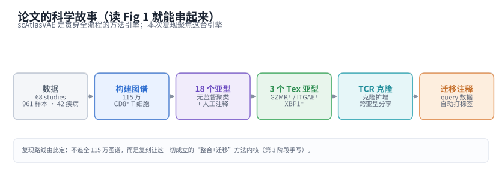
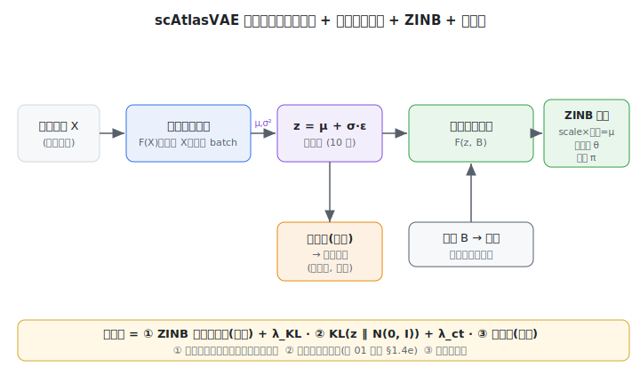
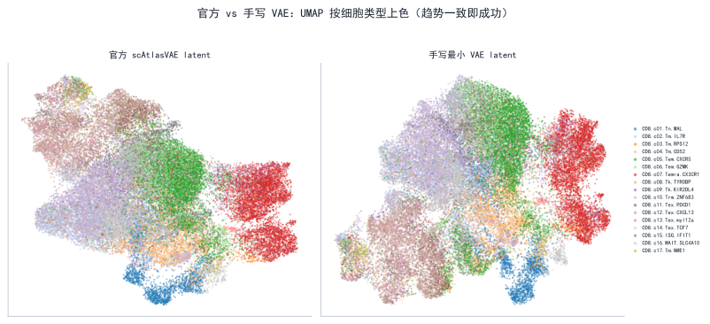

# 阶段 5 · 复现汇总报告（组会汇报稿）

> **阶段** 5 / 5　·　**前置**：阶段 1–4　·　**产出**：可直接汇报的复现总结　·　**预计** 2–3 天
> **导航**：[← 阶段 4](phase4_ablation_studies.md)　·　[总纲](00_overview_and_learning_map.md)　·　[知识框架](01_concepts_and_toolbox.md)
>
> 本稿综合前四阶段。凡涉及需实跑的数字/图，均为**预期（示意）占位**，请以你的真实结果替换后再汇报。

*图 5-1 — 复现全流程：环境 → 整合评测 → 手写 VAE（核心）→ 消融 → 汇总。*

---

## 1. 背景与目标

CD8⁺ T 细胞在炎症与肿瘤中呈现高度异质的状态。**scAtlasVAE**（Xue et al., *Nature Methods* 2024）是一个基于 VAE 的深度学习模型，用于**大规模 scRNA-seq 数据的图谱级整合与查询数据迁移**，作者据此构建了 115 万细胞的人 CD8⁺ T 细胞图谱、划分 18 个亚型（含 3 个耗竭 Tex 亚型），并结合配对 TCR 做克隆分析。这条科学故事，我们在[总纲](00_overview_and_learning_map.md)通过读论文 Fig 1 一起推导过：

*图 5-2 — scAtlasVAE 是贯穿全故事的"方法引擎"，本次复现聚焦它。*

**本次复现的范围与约束**：单人、RTX 4060（8GB）、约两周。因此**不复现全 atlas**（引用论文数字），而以**泛癌 T 细胞 landscape（GEO GSE156728，约 11 万 CD8⁺ 细胞）** 为主力数据。复现定位在 **L2**——**从零手写核心 VAE**为必达底线，配 1–2 个消融。判定成功的标准是**结论与趋势一致**（批次被校正、亚型分得开、指标量级接近、方法相对排序符合论文），而非数字/像素与论文重合。

---

## 2. 方法拆解

*图 5-3 — 架构：批不变编码器 → 潜向量 → 批条件解码器（ZINB 三头）→ 分类头。*

- **批不变编码器（题眼）**：编码器 $F(X)\to(\mu,\sigma^2)$ **只吃基因表达 X、不看 batch**。这一点有代码铁证——`_gex_model.py:966-967` 把 batch 拼进输入的那行**被注释掉了**。正因编码器不依赖 batch，查询数据可**不重训直接映射**进参考图谱（zero-shot 迁移）。这是它与 scVI（编码器 $F(X,B,S)$）的**本质区别**。
- **批条件解码器**：batch 只在**解码端**注入（经嵌入层与 $z$ 拼接），输出 ZINB 三参数（$\mathrm{scale}\times\text{文库}=\mu$、离散度 $\theta$、门控 $\pi$）重构原始计数。
- **损失**：$\mathcal L=-\mathbb E_{q}[\log p_\theta(X\mid z,B)]+\lambda_{KL}D_{KL}(q\|\mathcal N(0,I))+\lambda_{ct}\mathcal L_{\text{ct}}$；KL 权重**预热**——但读 `fit` 源码发现默认设置下它训练到结束只到 ≈0.18、从没到 1。
- **半监督分类头**：潜空间上的线性头，用加权交叉熵学细胞类型，使模型**能自动注释 query 数据**；多头版本还能做**跨图谱标注对齐**。

（架构与代码走读详见 [知识框架 §1.4–1.5](01_concepts_and_toolbox.md) 与 [阶段 3](phase3_reimplement_vae.md)。）

---

## 3. 复现设置

| 项 | 取值 |
|---|---|
| 数据 | TCellLandscape（GSE156728，约 110,218 细胞 / 28 studies / 17 亚型 / 4000 HVG） |
| 训练环境 | `scatlasvae`：Python 3.8、**torch 2.0.1 + cu118**（4060/sm_89 必须换，见 [阶段 1](phase1_environment_setup.md)） |
| 评测环境 | `scib`：Python 3.10、`scib-metrics`、`scvi-tools` |
| 超参（默认，读源码得来） | `n_latent=10`、`hidden=[128]`、`batch_hidden_dim=8`、`lr=5e-5`、AdamW、`batch_size=128`、`seed=12`、`n_epochs_kl_warmup=400`、`pred_last_n_epoch=10` |
| baseline | 未校正 `X_pca`；`scVI`（scvi-tools 默认） |
| 评测 | `scib-metrics` 的批次校正 + 生物保留（**与旧 scib 数值不可直接比，只看相对排序**） |

---

## 4. 结果与对照（预期示意）

**整合效果**（图 5-4）：整合前按批次上色时同类细胞被拆成按批次分开的团；整合后各批次在类型簇内充分混合。

*图 5-4 — 整合前 vs 整合后（示意）。*

**定量对比**（图 5-5，示意）：

| 嵌入 | 批次校正 | 生物保留 | 总分 |
|---|---|---|---|
| `X_pca`（未校正） | 低 | 高 | 中 |
| `scVI` | 高 | 中高 | 高 |
| **`scAtlasVAE`** | 高 | 高 | **高** |

**结论**：趋势与论文 **Ext. Data Fig. 1** 一致——scAtlasVAE 与 scVI 相当或略优，且都显著优于未校正 PCA。

---

## 5. 核心重写与发现（本次最有价值的部分）

**手写最小 VAE**（[`minimal_scatlasvae.py`](../scripts/minimal_scatlasvae.py)）复刻了：批不变编码器、重参数化、批条件解码器、ZINB 负对数似然、解析 KL + 预热、单分类头。做法是**先逐行读官方 `_gex_model.py`（encode/decode/forward/fit）再对着重写**（见 [阶段 3](phase3_reimplement_vae.md)）。在 TCellLandscape 上训练，与官方 latent 对比：

*图 5-6 — UMAP 趋势一致，kNN 邻域 Jaccard ≈ 0.4–0.6（结构相似即成功）。*

**「我的实现 vs 原实现」差异清单**（节选，详见 [阶段 3 §11](phase3_reimplement_vae.md)）：单分类头 vs 多头、固定 `gene-cell` 离散度、仅 MLP 编码器、未实现 MMD/latent-constraint/多层级——每条都是有依据的范围削减。

**「代码 > 论文」发现**（读源码才看到，详见 [阶段 3 §13](phase3_reimplement_vae.md)）：
1. 编码器 batch-invariant = 被注释的 `_gex_model.py:966-967`；
2. KL 预热默认 400、而 max_epoch≈73 → λ_KL 全程 ≤~0.18、**从没到 1**；
3. `z_transformation` 定义了 Softmax 却没施于所用 `z`（docstring 称 Logisticnormal）；
4. 层级 batch + 多分类头做跨图谱对齐；按类频率加权交叉熵；`pred_last_n_epoch=10`；MMD/latent-constraint/TabNet 三个可选特性。

---

## 6. 消融结论

（详见 [阶段 4](phase4_ablation_studies.md)。）

*图 5-7 — 消融（示意）。*

- **潜维度 `n_latent=10` 是"够用且稳"的甜点**：$n=2$ 信息不足、$n=50$ 无实质收益。与论文 Ext. Data Fig. 4 一致。
- **KL 预热力度是关键**：从第一轮给满权重会导致潜空间**坍缩**、聚类变差；默认那套"远超实际 epoch 数的预热"让 KL 全程温和——本次消融特意扣着"预热其实没跑完"这个代码事实来设计。

---

## 7. 局限与诚实声明

- **规模**：只复现约 11 万细胞的 benchmark，**未跑全 115 万 atlas**（算力约束，正当理由）；相关数字引用论文。
- **结果状态**：本报告若干数字/图为**预期示意占位**，需以真实实跑结果替换后方可作结论。
- **评测**：`scib-metrics` 与论文旧 `scib`(1.1.4) **数值不可直接比**，本文只看方法间相对排序。
- **手写版**：为**最小忠实实现**，未含 MMD/TabNet/latent-constraint/多层级等可选特性；部分结论为定性验证。
- **随机性**：版本、随机种子、GPU 浮点导致 UMAP/数值与论文不逐点一致，属正常。

---

## 8. 收获与后续

- 建立了对 **VAE-based 单细胞整合方法**的完整理解：从神经网络训练地基，到 VAE 的编码器/解码器/ZINB/KL，再到 scAtlasVAE 的 batch-invariant 设计与迁移能力。
- 练成了**复现硬功夫**：如何读论文 Fig 1 抓科学故事、如何摸清一个陌生库、**如何打开大源码文件逐行读懂核心函数**、如何把公式翻译成代码、如何用消融验证设计选择。
- **后续可做**：跨图谱整合（多 label 对齐）、迁移到新数据集（zero-shot）、或挑战某个生物学结论（如 Tex 三亚型）。

---

## 附 A · 「北极星 7 问」作答（复现自测）

1. **编码器为何不接收 batch？带来什么能力？** 让 $z$ 不依赖 batch，从而查询数据可不重训直接映射进来（zero-shot 迁移）。铁证：`_gex_model.py:966-967` 把 batch 拼进编码器输入的那行被注释掉了。
2. **batch 在哪注入？** 在**解码器** `decode()`（`:992`）：batch 经嵌入层后与 $z$ 拼接送入解码 MLP。
3. **ZINB 三输出？文库大小在哪一步乘进去？** scale（softmax 占比）、离散度 $\theta$、门控 $\pi$；$\mu=\text{scale}\times\text{文库大小}$，在 `decode` 第 1023 行乘进去。
4. **关掉 KL 预热会怎样？默认下预热到了 1 吗？** 从第一轮给满权重会使潜空间坍缩成 $\mathcal N(0,I)$（后验坍缩）。而默认 warmup=400、max_epoch≈73，λ_KL 全程只到 ≈0.18、**从没到 1**——读 `fit` 源码才发现。
5. **多分类头解决什么？单 atlas 为何用不到？** 跨图谱标注对齐；单 atlas 只有一套标签，一个头即可。
6. **UMAP 与论文不一样能说明失败吗？** 不能；判成功看趋势/结论（批次校正、亚型分离、相对排序），不看像素/数字一致。
7. **"代码>论文"的发现？** 见 §5 那四条（被注释的 batch 行、warmup 从没到 1、Softmax 未施于 z、层级 batch/多头 等）。

---

## 附 B · 汇报 slides 大纲（约 10 页）

1. 题目 + 一句话：复现 scAtlasVAE（Nature Methods 2024）
2. 问题背景：CD8⁺ T 细胞图谱 + 批次效应（用图 5-2 科学故事）
3. 方法一图：架构图（编码器 batch-invariant 是题眼，图 5-3）
4. 与 scVI 的关键区别（编码器 batch 位置对比图）
5. 复现设置：数据/环境（4060 换 cu118 的坑）/超参
6. 结果 1：整合前后 UMAP（图 5-4）
7. 结果 2：scib-metrics 指标对比（图 5-5）
8. 核心：手写 VAE + 逐行读源码 + 差异清单 + "代码>论文"发现
9. 消融：潜维度 / KL 预热 → 设计是否必要（图 5-7）
10. 局限与收获（诚实声明）

---

> **导航**：[← 阶段 4](phase4_ablation_studies.md)　·　[总纲](00_overview_and_learning_map.md)　·　[知识框架](01_concepts_and_toolbox.md)
