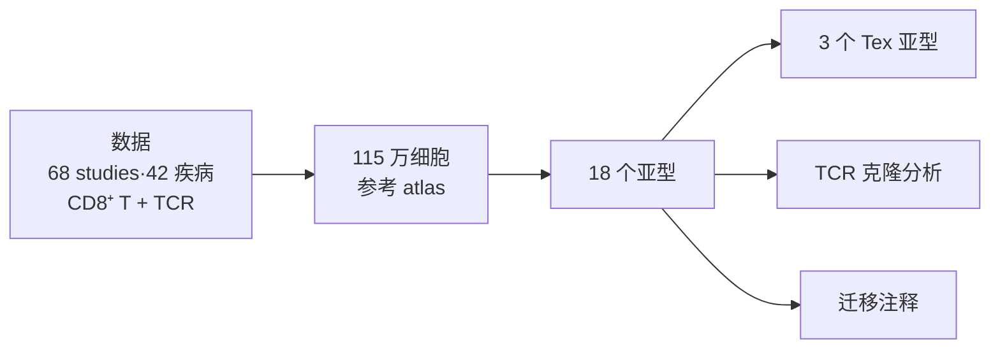
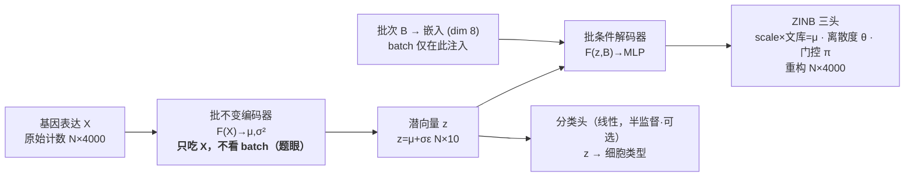

# 阶段 6 · 复现汇总报告（组会汇报稿）

> **阶段** 6 / 6　·　**前置**：阶段 1–5　·　**产出**：可直接汇报的复现总结（含深入验证与扩展）
> **导航**：[← 阶段 5](phase5_deeper_validation.md)　·　[总纲](00_overview_and_learning_map.md)　·　[知识框架](01_concepts_and_toolbox.md)
>
> 本稿综合前五阶段（含阶段 5 的深入验证与扩展）。数字/图均为**本机 RTX 4060 真实实跑**：数据为 GSE156728 的 10X CD8 子集（~4 万细胞），baseline 用 **scVI**（scvi-tools；Windows 需先开长路径才能装）。含若干与直觉/旧稿不符的诚实结果与成因讨论。

*图 6-1 — 复现全流程：环境 → 整合评测 → 手写 VAE（核心）→ 消融 → 深入验证与扩展 → 汇总（本篇）。*

---

## 1. 背景与目标

CD8⁺ T 细胞在炎症与肿瘤中呈现高度异质的状态。**scAtlasVAE**（Xue et al., *Nature Methods* 2024）是一个基于 VAE 的深度学习模型，用于**大规模 scRNA-seq 数据的图谱级整合与查询数据迁移**，作者据此构建了 115 万细胞的人 CD8⁺ T 细胞图谱、划分 18 个亚型（含 3 个耗竭 Tex 亚型），并结合配对 TCR 做克隆分析。这条科学故事，我们在[总纲](00_overview_and_learning_map.md)通过读论文 Fig 1 一起推导过：

*图 6-2 — scAtlasVAE 是贯穿全故事的"方法引擎"，本次复现聚焦它。*

**本次复现的范围与约束**：单人、RTX 4060（8GB）、约两周。因此**不复现全 atlas**（引用论文数字），而以**泛癌 T 细胞 landscape（GEO GSE156728，约 11 万 CD8⁺ 细胞）** 为主力数据。复现定位在 **L2**——**从零手写核心 VAE**为必达底线，配 1–2 个消融。判定成功的标准是**结论与趋势一致**（批次被校正、亚型分得开、指标量级接近、方法相对排序符合论文），而非数字/像素与论文重合。

---

## 2. 方法拆解

*图 6-3 — 架构：批不变编码器 → 潜向量 → 批条件解码器（ZINB 三头）→ 分类头。总损失 = ZINB 重构 + λ_KL·KL + λ_ct·交叉熵。*

- **批不变编码器（题眼）**：编码器 $F(X)\to(\mu,\sigma^2)$ **只吃基因表达 X、不看 batch**。这一点有代码铁证——`_gex_model.py:966-967` 把 batch 拼进输入的那行**被注释掉了**。正因编码器不依赖 batch，查询数据可**不重训直接映射**进参考图谱（zero-shot 迁移）。这是它与 scVI（编码器 $F(X,B,S)$）的**本质区别**。
- **批条件解码器**：batch 只在**解码端**注入（经嵌入层与 $z$ 拼接），输出 ZINB 三参数（$\mathrm{scale}\times\text{文库}=\mu$、离散度 $\theta$、门控 $\pi$）重构原始计数。
- **损失**：$\mathcal L=-\mathbb E_{q}[\log p_\theta(X\mid z,B)]+\lambda_{KL}D_{KL}(q\|\mathcal N(0,I))+\lambda_{ct}\mathcal L_{\text{ct}}$；KL 权重**预热**——读**全** `fit` 源码可知 `n_epochs_kl_warmup=min(max_epoch,400)`，本项目 max_epoch<400 故 λ_KL 在整个训练里 0→~1 爬满（这纠正了旧稿"只到 0.18、从没到 1"的错，详见 [阶段 3 §8](phase3_reimplement_vae.md)）。此外 `fit` 还给总损失加了一条 **dropout 门控稀疏损失**（论文正文未提）。
- **半监督分类头**：潜空间上的线性头，用加权交叉熵学细胞类型，使模型**能自动注释 query 数据**；多头版本还能做**跨图谱标注对齐**。

（架构与代码走读详见 [知识框架 §1.4–1.5](01_concepts_and_toolbox.md) 与 [阶段 3](phase3_reimplement_vae.md)。）

---

## 3. 复现设置

| 项 | 取值 |
|---|---|
| 数据 | TCellLandscape（GSE156728）的 10X CD8 子集，**下采样到 39,997 细胞**（8 癌种 / **batch=patient 共 45 个** / **cell_type=meta.cluster 共 17 个 CD8 亚型** / 4000 HVG）。组装脚本 `phase2_data_fetch_gse156728.py`。全 11 万/28 studies 与 115 万 atlas 引用论文数字、不自跑。 |
| 训练环境 | `scatlasvae`：Python 3.8、**torch 2.0.1 + cu118**（4060/sm_89 必须换，见 [阶段 1](phase1_environment_setup.md)） |
| 评测环境 | `scib`：Python 3.10、`scib-metrics`（JAX 后端，Windows 可用）；scVI 另在独立 `scvi`(py3.10, scvi-tools) 环境跑 |
| 超参（默认，读源码得来） | `n_latent=10`、`hidden=[128]`、`batch_hidden_dim=8`、`lr=5e-5`、AdamW、`batch_size=128`、`seed=12`、`n_epochs_kl_warmup=400`（实际被 `min(max_epoch,400)` 截断）、`pred_last_n_epoch=10`；4 万细胞 → `max_epoch=min(round(20000/N·400),400)=200` |
| baseline | 未校正 `X_pca`；**scVI**（`X_scVI`，scvi-tools 默认参数、`max_epochs=10`）——scAtlasVAE"编码器 batch-invariant"的正牌对照。scvi-tools 在 Windows 需先开长路径(`LongPathsEnabled`)才能装。另附 Harmony 作可选第二基线。 |
| 评测 | `scib-metrics` 的批次校正 + 生物保留（**与旧 scib 数值不可直接比，只看相对排序**） |

---

## 4. 结果与对照（本机实测）

**整合效果**（图 6-4）：未校正时细胞按癌种/患者(batch)分裂；scAtlasVAE 整合后各 batch 在类型簇内更混合，而 17 个 CD8 亚型仍分得开。

*图 6-4 — 上排未校正 X_pca、下排 scAtlasVAE；左列按癌种(batch)、右列按亚型（真实）。*

**定量对比**（图 6-5，scib-metrics 实测）：

| 嵌入 | 批次校正 | 生物保留 | 总分 |
|---|---|---|---|
| `X_pca`（未校正） | 0.27 | 0.37 | 0.33 |
| `X_scVI` | 0.29 | 0.48 | 0.40 |
| `X_scAtlasVAE_unsup`（无监督） | 0.30 | 0.48 | 0.41 |
| **`X_scAtlasVAE_sup`（监督）** | **0.31** | **0.49** | **0.42** |

**结论**：**相对排序与论文趋势一致**——**监督 scAtlasVAE > 无监督 scAtlasVAE ≈ scVI ≫ 未校正 PCA**（总分 0.42 / 0.41 / 0.40 / 0.33）。**无监督 scAtlasVAE 与 scVI 基本打平、监督版才明显胜出**，正对上论文 **Ext. Data Fig. 2a**；这也说明 scAtlasVAE 相对 scVI 的优势来自**半监督分类头**、而非整合骨架本身（[阶段 5 · E2](phase5_deeper_validation.md) 专门补了这根无监督柱、纠正了原稿只画监督版一根柱的坑）。绝对分因 scib-metrics ≠ 旧 scib、子集小、默认超参而偏低，属正常；**判成功看相对排序**，这次稳稳复现了。（另跑了 Harmony 作可选第二基线，数据在仓库可查。）

> 这根无监督柱来自阶段 5 的**深入验证**；阶段 5 还把注释迁移、批不变探针、手写 VAE 上标尺一并做了——摘要见下面 [§7](#7-深入验证与扩展阶段-5-摘要)。

---

## 5. 核心重写与发现（本次最有价值的部分）

**手写最小 VAE**（[`minimal_scatlasvae.py`](../scripts/minimal_scatlasvae.py)）复刻了：批不变编码器、重参数化、批条件解码器、ZINB 负对数似然、解析 KL + 预热、单分类头。做法是**先逐行读官方 `_gex_model.py`（encode/decode/forward/fit）再对着重写**（见 [阶段 3](phase3_reimplement_vae.md)）。在 TCellLandscape 上训练，与官方 latent 对比：

*图 6-6 — 官方 vs 手写：UMAP 把同一批主要亚型放到相似区域（红 Temra 在右、绿 Tem 居中、蓝 Tn 在底），**结构趋势高度一致**；kNN 邻域 Jaccard=0.235（远高于随机 ~7e-4；严格局部指标偏低，定性一致才是成功的直接证据，详见 [阶段 3 §10](phase3_reimplement_vae.md)）。*

**「我的实现 vs 原实现」差异清单**（节选，详见 [阶段 3 §11](phase3_reimplement_vae.md)）：单分类头 vs 多头、固定 `gene-cell` 离散度、仅 MLP 编码器、未实现 MMD/latent-constraint/多层级——每条都是有依据的范围削减。

**「代码 > 论文」发现**（读源码才看到，详见 [阶段 3 §13](phase3_reimplement_vae.md)）：
1. 编码器 batch-invariant = 被注释的 `_gex_model.py:966-967`；
2. KL 预热被 `min(max_epoch,400)` 截断 → 本项目 λ_KL 在整个训练里 **0→~1 爬满、末轮≈1**（纠正旧稿"只到 0.18、从没到 1"——那是漏读了那行 `min`，实跑曲线证实）；
3. `z_transformation` 定义了 Softmax 却没施于所用 `z`（docstring 称 Logisticnormal）；
4. `fit()` 给总损失加了一条 **dropout 门控稀疏损失**（`sigmoid(π).sum(1).mean()`），论文正文未提；
5. 层级 batch + 多分类头做跨图谱对齐；按类频率加权交叉熵；`pred_last_n_epoch=10`；MMD/latent-constraint/TabNet 三个可选特性。

---

## 6. 消融结论

（详见 [阶段 4](phase4_ablation_studies.md)。）

*图 6-7 — 消融（真实）：左潜维度 2/10/50、右 KL 预热 开/关。*

- **潜维度**：$n=2$ 总分 0.29 **明显最差**（信息被压没、graph-connectivity 塌到 0.14）；$n=10$(0.41) 与 $n=50$(0.44) 都稳，本 4 万子集上 $n=50$ 还略高。核心结论"**太小明显变差、10 及以上稳定**"复现到、与论文 Ext. Data Fig. 4 一致；"更大无收益"要在图谱级才显现（诚实：不是"50 一定更差"）。
- **KL 预热开/关几乎无差别（0.41 vs 0.41），未见坍缩**——反直觉但可解释：scAtlasVAE 重构用 `reduction='sum'`（每 batch 几十万量级），KL 即使 λ_KL=1 也只几百量级，**重构始终碾压 KL**，故关掉预热也压不垮潜空间。这与 §5 那条"λ_KL 爬到 ~1 但量级弱"的更正互相印证——**预热在这套损失标度下是温和保险、非成败关键**。

---

## 7. 深入验证与扩展（阶段 5 摘要）

阶段 5 把整合主线补到"Task 1 完整 + Task 3"，并把关键观察升级为可测证据（完整见 [阶段 5 报告](phase5_deeper_validation.md)）：

**① 注释迁移（Task 3，论文招牌能力）**：参考集监督训练后，query 数据 zero-shot 自动打标签。两种切法的 zero-shot ROC-AUC——随机留 5%=**0.928**、留整个癌种(UCEC)=**0.896**，双双落在论文 Ext. Data Fig. 2g,h 的 0.89–0.93 区间，且两种设计都**高于 kNN 基线**（0.882 / 0.798），域外泛化领先尤为明显。zero-shot ≈ full-shot，印证"不必共训"。

*图 6-8 — 注释迁移：zero/full-shot 与 kNN 对照的 accuracy/macro-F1/AUROC（真实）。*

**② 监督 vs 无监督（复现 Ext. Data Fig. 2a 核心论点）**：补上无监督柱后——无监督 scAtlasVAE(0.41) ≈ scVI(0.40)、监督版(0.42)才胜出，说明优势来自半监督分类头（已并入 §4 那张四方表；纠正了原稿只画监督版一根柱的坑）。

**③ 批不变编码器实证探针**：给编码器喂打乱的 batch，scAtlasVAE 潜向量 **Δz≡0**（逐元素精确为 0，坐实"结构上不吃 batch"）。附带发现：scVI 默认 `encode_covariates=False`，编码器其实也不吃 batch，仅开 `=True` 才 batch-variant（漂移 0.135）——主动报告了这个与论文对比表字面不完全一致的细节。

*图 6-9 — 打乱 batch 后潜向量的平均 L2 漂移：scAtlasVAE 与 scVI 默认均≈0，仅 scVI(encode_covariates=True) 明显漂移（真实）。*

**④ 手写最小 VAE 上标尺**：把手写实现产出的 latent 与官方并列打分，总分 **0.403、与 scVI(0.402) 打平**——给阶段 3 的手写工作一个硬的定量背书。

**一个方法论亮点**：注释迁移一开始 zero-shot 只有 0.26 准确率、被 kNN 碾压，是**读源码 `_gex_model.py:1430-1433` 才发现分类头默认只在最后 10 个 epoch 训练**（为论文 115 万 atlas 调的），小参考集下远不够；改成全程训练后 AUROC 从 0.766 跃到 0.928。"读懂 fit 才跑对"正是复现思考性的直接体现。

---

## 8. 局限与诚实声明

- **规模**：只复现约 **4 万 CD8 细胞**的子集 benchmark（GSE156728 的 10X CD8 下采样），**未跑全 11 万/28 studies，更未跑 115 万 atlas**（算力约束，正当理由）；全量数字引用论文。子集规模会低估 scAtlasVAE 的图谱级红利。
- **结果状态**：阶段 1–5 均为**本机 4060 真实实跑**；阶段 4 消融、阶段 5 深入验证（迁移/探针/上标尺）数值均以实跑为准填入本稿 §6–§7。
- **baseline**：用 **scVI**（scvi-tools 默认参数）作 batch-variant VAE 对照；scvi-tools 在 Windows 需先开长路径(`LongPathsEnabled`)才能装（本机单独建 `scvi` 环境、CPU 跑 10 epoch）。另附 Harmony 作可选第二基线。
- **评测**：`scib-metrics` 与论文旧 `scib`(1.1.4) **数值不可直接比**，本文只看方法间相对排序。
- **手写版**：为**最小忠实实现**，未含 MMD/TabNet/latent-constraint/多层级等可选特性；部分结论为定性验证。
- **随机性**：版本、随机种子、GPU 浮点导致 UMAP/数值与论文不逐点一致，属正常。

---

## 9. 收获与后续

- 建立了对 **VAE-based 单细胞整合方法**的完整理解：从神经网络训练地基，到 VAE 的编码器/解码器/ZINB/KL，再到 scAtlasVAE 的 batch-invariant 设计与迁移能力。
- 练成了**复现硬功夫**：如何读论文 Fig 1 抓科学故事、如何摸清一个陌生库、**如何打开大源码文件逐行读懂核心函数**、如何把公式翻译成代码、如何用消融验证设计选择。
- **后续可做**：跨图谱整合（多 label 对齐）、迁移到新数据集（zero-shot）、或挑战某个生物学结论（如 Tex 三亚型）。

---

## 附 A · 「北极星 7 问」作答（复现自测）

1. **编码器为何不接收 batch？带来什么能力？** 让 $z$ 不依赖 batch，从而查询数据可不重训直接映射进来（zero-shot 迁移）。铁证：`_gex_model.py:966-967` 把 batch 拼进编码器输入的那行被注释掉了。
2. **batch 在哪注入？** 在**解码器** `decode()`（`:992`）：batch 经嵌入层后与 $z$ 拼接送入解码 MLP。
3. **ZINB 三输出？文库大小在哪一步乘进去？** scale（softmax 占比）、离散度 $\theta$、门控 $\pi$；$\mu=\text{scale}\times\text{文库大小}$，在 `decode` 第 1023 行乘进去。
4. **关掉 KL 预热会怎样？默认下预热到了 1 吗？** 从第一轮给满权重会使潜空间坍缩成 $\mathcal N(0,I)$（后验坍缩）。默认**会**爬到 ~1：`n_epochs_kl_warmup=min(max_epoch,400)`，本项目 max_epoch<400 → λ_KL 在整个训练里 0→~1 爬满、末轮≈1（旧稿"只到 0.18、从没到 1"是漏读了那行 `min`，读**全** `fit` 源码才发现）。
5. **多分类头解决什么？单 atlas 为何用不到？** 跨图谱标注对齐；单 atlas 只有一套标签，一个头即可。
6. **UMAP 与论文不一样能说明失败吗？** 不能；判成功看趋势/结论（批次校正、亚型分离、相对排序），不看像素/数字一致。
7. **"代码>论文"的发现？** 见 §5（被注释的 batch 行；warmup 因 `min(max_epoch,400)` 截断而 0→~1 爬满、非"只到 0.18"；Softmax 未施于 z；dropout 门控稀疏损失；层级 batch/多头 等）。

---

## 附 B · 汇报 slides 大纲（约 12 页）

1. 题目 + 一句话：复现 scAtlasVAE（Nature Methods 2024）
2. 问题背景：CD8⁺ T 细胞图谱 + 批次效应（用图 6-2 科学故事）
3. 方法一图：架构图（编码器 batch-invariant 是题眼，图 6-3）
4. 与 scVI 的关键区别（编码器 batch 位置对比）
5. 复现设置：数据/环境（4060 换 cu118 的坑）/超参
6. 结果 1：整合前后 UMAP（图 6-4）
7. 结果 2：scib-metrics 四方对比——**监督 > 无监督 ≈ scVI ≫ PCA**（图 6-5，复现 Ext.Data Fig.2a）
8. 核心：手写 VAE + 逐行读源码 + 差异清单 + "代码>论文"发现（手写版上标尺 = scVI 同档）
9. 消融：潜维度 / KL 预热 → 设计是否必要（图 6-7）
10. **扩展 1 · 注释迁移**（Task 3）：zero/full-shot 自动打标签 + kNN 对照（阶段 5 · E1）
11. **扩展 2 · 批不变探针**：打乱 batch，scAtlasVAE Δz≡0 vs scVI(编码batch)漂移（阶段 5 · E3）
12. 局限与收获（诚实声明：小参考集、指标口径、主动报告与论文不符的细节）

---

> **导航**：[← 阶段 5](phase5_deeper_validation.md)　·　[总纲](00_overview_and_learning_map.md)　·　[知识框架](01_concepts_and_toolbox.md)
