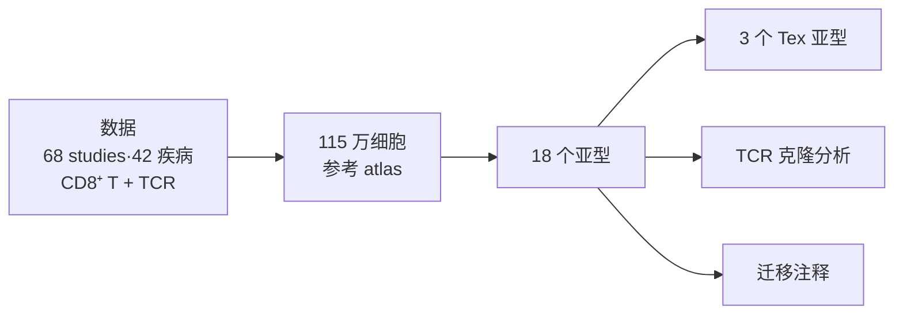
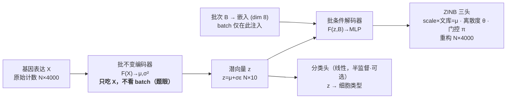

# 阶段 6 · 复现汇总报告（组会汇报稿）

> **阶段** 6 / 6　·　**前置**：阶段 1–5　·　**产出**：可直接汇报的复现总结（含深入验证与扩展）
> **导航**：[← 阶段 5](phase5_deeper_validation.md)　·　[总纲](00_overview_and_learning_map.md)　·　[知识框架](01_concepts_and_toolbox.md)
>
> 本稿综合前五阶段（含阶段 5 的深入验证与扩展）。数字/图均为本机真实实跑：**scAtlasVAE 训练使用 RTX 4060**；reference-only scVI 与 scib-metrics 在对应环境中使用 CPU。主数据为 GSE156728 的 104,805-cell Zheng CD8 对象（与论文 110,218-cell benchmark 同量级，但不是带 28 个 `study_name` 的成品 TCellLandscape）；Task 2 另用 Yost 2019（GSE123813）。

*图 6-1 — 复现全流程：环境 → 整合评测 → 手写 VAE（核心）→ 消融 → 深入验证与扩展 → 汇总（本篇）。*

---

## 1. 背景与目标

CD8⁺ T 细胞在炎症与肿瘤中呈现高度异质的状态。**scAtlasVAE**（Xue et al., *Nature Methods* 2024）是一个基于 VAE 的深度学习模型，用于**大规模 scRNA-seq 数据的图谱级整合与查询数据迁移**，作者据此构建了 115 万细胞的人 CD8⁺ T 细胞图谱、划分 18 个亚型（含 3 个耗竭 Tex 亚型），并结合配对 TCR 做克隆分析。这条科学故事，我们在[总纲](00_overview_and_learning_map.md)通过读论文 Fig 1 一起推导过：

*图 6-2 — scAtlasVAE 是贯穿全故事的"方法引擎"，本次复现聚焦它。*

**本次复现的范围与约束**：单人、RTX 4060（8GB）、约两周。因此**不复现全 atlas**（引用论文数字），而以从 **GEO GSE156728 重建的 104,805-cell Zheng CD8 对象**为主力数据；它不是带 28 个 `study_name` 的论文成品 TCellLandscape。复现定位在 **L2**——**从零手写核心 VAE**为必达底线，配合消融、迁移与跨图谱实验。证据标准是预先定义的定量指标、同口径基线与明确边界；不要求数字/像素完全重合，但也不以 UMAP 外观、笼统趋势或“指标量级接近”单独判成功。

---

## 2. 方法拆解

*图 6-3 — 架构：批不变编码器 → 潜向量 → 批条件解码器（ZINB 三头）→ 分类头。总损失 = ZINB 重构 + λ_KL·KL + λ_ct·交叉熵。*

- **不显式接收 batch 的编码器（题眼）**：编码器 $F(X)\to(\mu,\sigma^2)$ 只接收表达矩阵 X；源码中把 batch 拼进输入的行被注释掉。这为 query 直接通过同一 encoder 的 zero-shot 接口提供了结构基础，但不保证 X 中携带的批次信号会自动消失。scVI 的 encoder 是否接收 covariate 可配置；本项目默认 `encode_covariates=False` 时也不显式接收 batch，区别不能简化成 `F(X)` 对 `F(X,B,S)`。
- **批条件解码器**：batch 只在**解码端**注入（经嵌入层与 $z$ 拼接），输出 ZINB 三参数（$\mathrm{scale}\times\text{文库}=\mu$、离散度 $\theta$、门控 $\pi$）重构原始计数。
- **损失**：$\mathcal L=-\mathbb E_{q}[\log p_\theta(X\mid z,B)]+\lambda_{KL}D_{KL}(q\|\mathcal N(0,I))+\lambda_{ct}\mathcal L_{\text{ct}}$；KL 权重**预热**——读**全** `fit` 源码可知 `n_epochs_kl_warmup=min(max_epoch,400)`，本项目 max_epoch<400 故 λ_KL 在整个训练里 0→~1 爬满（这纠正了旧稿"只到 0.18、从没到 1"的错，详见 [阶段 3 §8](phase3_reimplement_vae.md)）。此外 `fit` 还给总损失加了一条 **dropout 门控稀疏损失**（论文正文未提）。
- **半监督分类头**：潜空间上的线性头，用加权交叉熵学细胞类型，使模型**能自动注释 query 数据**；多头版本还能做**跨图谱标注对齐**。

（架构与代码走读详见 [知识框架 §1.4–1.5](01_concepts_and_toolbox.md) 与 [阶段 3](phase3_reimplement_vae.md)。）

---

## 3. 复现设置

| 项 | 取值 |
|---|---|
| 数据 | 从 GSE156728 重建的 Zheng 2021 **8 癌种 10X CD8 主体**，共 **104,805 细胞**（**batch=patient 共 45 个** / **cell_type=meta.cluster 共 17 个 CD8 亚型** / 4000 HVG）。它与论文 110,218-cell benchmark 同量级、也是其绝对多数主体，但**不是带 28 个 `study_name` 的论文成品 TCellLandscape 对象**。公开基础 metadata 没有 `study_name`，所以 Task 1 评估的是 patient 批次，而不是 study 批次；`cancerType` 是生物变量，不能改名顶替 batch。组装脚本 `phase2_data_fetch_gse156728.py` 采用分块流式读取。未自跑 115 万全 atlas；Task 2 另用 Yost 2019（GSE123813）作第二图谱。详见[阶段 2 §7](phase2_integration_and_benchmark.md)。 |
| 训练环境 | `scatlasvae`：Python 3.8、**torch 2.0.1 + cu118**（4060/sm_89 必须换，见 [阶段 1](phase1_environment_setup.md)） |
| 评测环境 | `scib`：Python 3.10、`scib-metrics`（JAX 后端，Windows 可用）；scVI 另在独立 `scvi`(py3.10, scvi-tools) 环境跑 |
| 超参（默认，读源码得来） | `n_latent=10`、`hidden=[128]`、`batch_hidden_dim=8`（**本项目主流程显式用 10**；消融/可扩展性用默认 8，论文 Ext.Fig.4b 证此维度稳健）、`lr=5e-5`、AdamW、`batch_size=128`、`seed=12`、`n_epochs_kl_warmup=400`（实际被 `min(max_epoch,400)` 截断）、`pred_last_n_epoch=10`；**本项目 10.5 万细胞 → `max_epoch=min(round(20000/N·400),400)=76`**（Task 2 跨图谱那趟另用 `batch_hidden_dim=64`+100 epoch，见 §7⑤） |
| baseline | 未校正 `X_pca`；**scVI**（`X_scVI`，scvi-tools 默认参数、`max_epochs=10`）——scAtlasVAE"编码器 batch-invariant"的正牌对照。scvi-tools 在 Windows 需先开长路径(`LongPathsEnabled`)才能装。另附 Harmony 作可选第二基线。 |
| 评测 | `scib-metrics` 的批次校正 + 生物保留（**与旧 scib 数值不可直接比，只看相对排序**） |

---

## 4. 结果与对照（本机实测）

**整合效果**（图 6-4）：未校正时细胞按患者(batch)分裂；scAtlasVAE 整合后各患者 batch 在类型簇内更混合，而 17 个 CD8 亚型仍分得开。

*图 6-4 — 上排未校正 X_pca、下排 scAtlasVAE；左列按模型与指标实际使用的患者(batch)、右列按亚型（真实）。*

**定量对比**（图 6-5，scib-metrics 实测）：

| 嵌入 | 批次校正 | 生物保留 | 总分 |
|---|---|---|---|
| `X_pca`（未校正） | 0.271 | 0.486 | 0.400 |
| `X_scVI` | 0.312 | 0.485 | 0.416 |
| `X_scAtlasVAE_unsup`（无监督） | 0.309 | 0.478 | 0.411 |
| **`X_scAtlasVAE_sup`（监督）** | **0.336** | **0.515** | **0.444** |

**结论（评测与训练损失均修复后）**：监督 scAtlasVAE 的批次校正(0.336)与生物保留(0.515)均最高，**复现了 Ext. Data Fig. 2a 中“监督模式胜出”的方向**。无监督(0.411)≈scVI(0.416)、略高于 PCA(0.400)。这里比较的是 patient 而非论文 study，且指标实现不同，因此只能比较本实验内部相对排序，不能声称逐点复现论文分数。

> 这根无监督柱来自阶段 5 的**深入验证**；阶段 5 还把注释迁移、批不变探针、手写 VAE 上标尺一并做了——摘要见下面 [§7](#7-深入验证与扩展阶段-5-摘要)。

---

## 5. 核心重写与发现（本次最有价值的部分）

**手写最小 VAE**（[`minimal_scatlasvae.py`](../scripts/minimal_scatlasvae.py)）复刻了：批不变编码器、重参数化、批条件解码器、ZINB 负对数似然、解析 KL + 预热、单分类头。做法是先逐行读官方 `_gex_model.py` 再对着重写（见 [阶段 3](phase3_reimplement_vae.md)），并在 GSE156728 重建对象上与官方 latent 对比：

*图 6-6 — 官方 vs 手写：UMAP 的宏观亚型拓扑相近；两套 UMAP 原本互为左右镜像（亚型质心横坐标 r≈-0.929），图中只为观察方便作水平镜像。修复后官方嵌入与手写嵌入的 kNN 邻域 Jaccard=0.204，远高于随机但也表明精细邻域并不相同；UMAP 是定性佐证，不是单独的成功判据。*

**「我的实现 vs 原实现」差异清单**（节选，详见 [阶段 3 §11](phase3_reimplement_vae.md)）：单分类头 vs 多头、固定 `gene-cell` 离散度、仅 MLP 编码器、未实现 MMD/latent-constraint/多层级——每条都是有依据的范围削减。

**「代码 > 论文」发现**（读源码才看到，详见 [阶段 3 §13](phase3_reimplement_vae.md)）：
1. 编码器 batch-invariant = 被注释的 `_gex_model.py:969-970`；
2. KL 预热被 `min(max_epoch,400)` 截断 → 本项目 λ_KL 在整个训练里 **0→~1 爬满、末轮≈1**（纠正旧稿"只到 0.18、从没到 1"——那是漏读了那行 `min`，实跑曲线证实）；
3. `z_transformation` 定义了 Softmax 却没施于所用 `z`（docstring 称 Logisticnormal）；
4. `fit()` 给总损失加了一条 **dropout 门控稀疏损失**（`sigmoid(π).sum(1).mean()`），论文正文未提；
5. 层级 batch + 多分类头做跨图谱对齐；按类频率加权交叉熵；`pred_last_n_epoch=10`；MMD/latent-constraint/TabNet 三个可选特性。
6. 本轮代码审计还修复了四个会改变结果的问题：末短 batch 用实际大小归一化；多头只平均 active heads、空 head 不再产生 NaN；`undefined` sentinel 固定放在类别末尾；迁移的标签与概率从同一次 logits 前向派生，避免两次随机采样不一致。

---

## 6. 消融结论

（详见 [阶段 4](phase4_ablation_studies.md)。）

*图 6-7 — 消融（真实）：左潜维度 2/10/50、右 KL 预热 开/关。*

- **潜维度**：$n=2/10/50$ 总分为 **0.316/0.422/0.465**。太小明显较差；本数据单次种子下 50 最高，因此不能声称默认 10 是全局最优或 50 无收益。
- **KL 预热**：默认开为 0.422，关掉为 **0.439**；没有坍缩，且有约 0.017 的温和提升（主要来自批次校正）。这只支持"当前设置下预热不是成败开关"，不应外推为普遍规律。

---

## 7. 深入验证与扩展（阶段 5 摘要）

阶段 5 把整合主线补到 Task 1/2/3，并把关键观察升级为可测证据（完整见 [阶段 5 报告](phase5_deeper_validation.md)）：

**① 注释迁移（Task 3，论文招牌能力）**：主结果使用分类头末 10 轮。A=随机 5%，head accuracy/F1/AUROC 为 **0.430/0.345/0.891**，可与论文 drop-5% AUROC 0.905 对照；B=整癌种 UCEC 生物 OOD，为 **0.313/0.272/0.851**；P=整位患者 `RC.P20190923`（5,809 细胞、17 类），为 **0.489/0.215/0.851**。B/P 都不能冒充 leave-one-study。公平 kNN 已是真正 reference-only frozen encoder，完全不调用 `qm.train()`；A/B/P 的 accuracy/AUROC 为 **0.637/0.904、0.534/0.812、0.574/0.765**。主表旧 kNN 是 full-data scVI 的 transductive 诊断，不再冒充公平基线。另做 P 日程敏感性：固定 150 epoch 并令分类损失 150/150 轮全程启用后，zero-shot 为 **0.575/0.305/0.880**；这里的 `fulltime` 不是 query/reference 共训的 `full-shot`。

*图 6-8 — 注释迁移：zero/full-shot 与公平的 reference-only frozen scVI kNN 对照（accuracy/macro-F1/AUROC，真实）；阶段 5 表中的旧 full-data kNN 只保留为 transductive 诊断。*

*图 6-8b — 设计 P 的 zero-shot paper 末 10 轮与 full-time 150/150 轮对照；full-time 只改变 reference 分类损失日程，不训练 query。*

**② 监督 vs 无监督（复现 Ext. Data Fig. 2a 核心论点）**：修复并重训后，监督版(0.444) 明显最高（批次校正+生物保留两项皆最高）；无监督(0.411) ≈ scVI(0.416)、略高于 PCA(0.400)，说明 scAtlasVAE 相对 scVI 的主要优势来自半监督分类头。

**③ 批不变编码器实证探针**：给编码器喂打乱的 batch，scAtlasVAE 潜向量 **Δz≡0**（逐元素精确为 0，坐实"结构上不吃 batch"）。附带发现：scVI 默认 `encode_covariates=False`，编码器其实也不吃 batch，仅开 `=True` 才 batch-variant（平均 L2 漂移 0.007、max|Δz|=0.237）——主动报告了这个与论文对比表字面不完全一致的细节。

*图 6-9 — 打乱 batch 后潜向量的平均 L2 漂移：scAtlasVAE 与 scVI 默认均≈0，仅 scVI(encode_covariates=True) 明显漂移（真实）。*

**④ 手写最小 VAE 上标尺**：总分 **0.406**，高于 PCA(0.400)，低于无监督 scAtlasVAE(0.411)、scVI(0.416) 与监督 scAtlasVAE(0.444)。这证明最小实现有效，但也量化了它与完整官方实现的差距。

**⑤ 跨图谱整合 + 标签对齐（Task 2）**：全量 Zheng（104,805）+ Yost（12,364）的 full-head 模型在 mixing 上优于 PCA：平衡 silhouette **0.0325 < 0.0874**，Yost-NN-Zheng **0.2462 > 0.0405**。真正的多头证据是同一次 forward 的两个 head 预测共现：CD8_eff→Temra 0.706，CD8_ex 的 Tex 家族合计 0.477，CD8_ex_act 的 Tex 家族合计 0.451 但最大单项是 Trm 0.294。PCA 没有分类头，不能再写"多头比 PCA 锐利"；可比较的 latent-kNN 诊断在不同亚型各有胜负。末 10 轮版本 mixing 为 0.0912/0.1404，head 共现强度也明显变化，说明训练日程敏感。已修复空标签 head 导致 NaN、多头分母和 sentinel 顺序错误；guarded full/pl10 日志均无 NaN。

**⑥ 可扩展性**：每个规模用 fresh worker + backed H5AD，记录进程与 CUDA 两种口径。10k→100k 时 `fit()` 为 **37.5→164.7 s**（线性拟合 R²≈0.874，只能称粗略趋势）；峰值 RSS **1,569→2,254 MiB**、private **2,264→2,960 MiB**，随规模近线性（R²≈0.999）；CUDA allocated 约 **110 MiB**、reserved 124–144 MiB，因固定 minibatch 基本平坦。进程曲线最接近论文总内存概念，但统计定义仍不同，不能逐点对齐。

**一个方法论亮点（含自我更正）**：本轮把主结果恢复为默认末 10 轮，并用 A/B/P 全程分类日程作独立敏感性对照；P 的 150/150 轮把 AUROC 从 0.851 提到 0.880。由此进一步分清三件事：`fulltime` 不等于 `full-shot`，**训练日程相同也不代表留出单位相同**。A 可与论文 drop-5% 对照；B/P 只能作为本项目新增压力测试，不能借训练日程变化就声称复现 leave-study。

---

## 8. 局限与诚实声明

- **规模与 batch 定义**：本次用 **GSE156728 全量 CD8 10X（~10.5 万细胞）**，与论文 TCellLandscape 的 11 万**同量级**（不再是早期的 4 万下采样）。但两点要诚实：① 论文 TCellLandscape 聚合了 **28 个研究**，我们只有 Zheng 自己那份 deposit（GSE156728，8 癌种），且**未跑 115 万全 atlas**；② 论文 Task 1 的 batch 键用 **study_name**（跨研究、批次效应大），我们用 **patient**（一个研究内、批次效应小、更同质）——这使我们各方法**绝对分差距被压扁、不能与论文绝对值对齐**，判据只能是相对排序。
- **UMAP 证据边界**：整合图左侧现按实际 batch=`patient` 上色，右侧按 `cell_type`；`cancerType` 是生物变量，不能用癌种着色图证明 patient batch 已移除。UMAP 仍只是可视化，批次结论以 patient-based 指标为主。
- **一个已修的评测 bug**：早先 scib-metrics 的 `PCR comparison` 对所有方法恒为 0、且 `X_pca` 基线被原始计数 PCA 覆盖（没传 `pre_integrated_embedding_obsm_key`、而 `adata.X` 是原始计数）。修复后 PCR 恢复区分度、PCA 基线用正确的 scaled PCA——**结论方向不变，但"VAE≫PCA"收敛为"VAE 主要赢在批次校正一列"**（见 §4）。
- **硬件口径**：所有结果均为本机真实实跑；scAtlasVAE 训练走 RTX 4060，scVI reference-only 公平 kNN 与 scib-metrics 在各自现有环境中走 CPU。不能把“核心模型用 GPU”写成“所有步骤都用 GPU”。
- **baseline**：用 **scVI**（scvi-tools 默认参数）作 batch-conditioned VAE 对照；默认 `encode_covariates=False` 时其 encoder 也不吃 batch，batch 主要进入生成端。scvi-tools 在 Windows 需先开长路径，本机单独环境以 CPU 运行。另附 Harmony 作可选第二基线。
- **评测**：`scib-metrics` 与论文旧 `scib`(1.1.4) **数值不可直接比**，本文只看方法间相对排序。
- **手写版**：为**最小忠实实现**，未含 MMD/TabNet/latent-constraint/多层级等可选特性；部分结论为定性验证。
- **随机性**：版本、随机种子、GPU 浮点导致 UMAP/数值与论文不逐点一致，属正常。

---

## 9. 收获与后续

- 建立了对 **VAE-based 单细胞整合方法**的完整理解：从神经网络训练地基，到 VAE 的编码器/解码器/ZINB/KL，再到 scAtlasVAE 的 batch-invariant 设计与迁移能力。
- 练成了**复现硬功夫**：如何读论文 Fig 1 抓科学故事、如何摸清一个陌生库、**如何打开大源码文件逐行读懂核心函数**、如何把公式翻译成代码、如何用消融验证设计选择。
- **后续可做**：跨图谱整合（多 label 对齐）、迁移到新数据集（zero-shot）、或挑战某个生物学结论（如 Tex 三亚型）。

---

## 附 A · 「北极星 7 问」作答（复现自测）

1. **编码器为何不接收 batch？带来什么能力？** 它保证 encoder 不直接使用 batch 元数据，使新 query 可走同一映射而不为新 batch 改 encoder；但 batch 信号仍可能经 X 间接进入 z，所以是否充分混合必须靠 patient-based 指标验证。
2. **batch 在哪注入？** 在**解码器** `decode()`（`:995`）：batch 经嵌入层后与 $z$ 拼接送入解码 MLP。
3. **ZINB 三输出？文库大小在哪一步乘进去？** scale（softmax 占比）、离散度 $\theta$、门控 $\pi$；$\mu=\text{scale}\times\text{文库大小}$，在 `decode` 第 1026 行乘进去。
4. **关掉 KL 预热会怎样？默认下预热到了 1 吗？** 理论上从第一轮给满 KL 会提高后验坍缩风险，但本实验没有发生：无预热总分 0.439，反而略高于默认 0.422。默认预热会因 `min(max_epoch,400)` 在整个训练中从 0 爬到约 1。
5. **多分类头解决什么？单 atlas 为何用不到？** 跨图谱标注对齐；单 atlas 只有一套标签，一个头即可。
6. **UMAP 与论文不一样能说明失败吗？** 不能；但 UMAP 相似也不能证明成功。应结合预先定义的定量指标、同口径基线、数值重合度和实验范围来判断，UMAP 只作定性辅助。
7. **"代码>论文"的发现？** 见 §5（被注释的 batch 行；warmup 因 `min(max_epoch,400)` 截断而 0→~1 爬满、非"只到 0.18"；Softmax 未施于 z；dropout 门控稀疏损失；层级 batch/多头 等）。

---

## 附 B · 汇报 slides 大纲（约 12 页）

1. 题目 + 一句话：复现 scAtlasVAE（Nature Methods 2024）
2. 问题背景：CD8⁺ T 细胞图谱 + 批次效应（用图 6-2 科学故事）
3. 方法一图：架构图（编码器 batch-invariant 是题眼，图 6-3）
4. encoder covariate 接口：scAtlasVAE 结构固定只接收 X；scVI 可配置且本项目默认也不显式接收 batch
5. 复现设置：数据/环境（4060 换 cu118 的坑）/超参
6. 结果 1：整合前后 UMAP（图 6-4）
7. 结果 2：scib-metrics 四方对比——监督最高、方向与论文一致；batch/指标口径不同（附 PCR 基线修复）
8. 核心：手写 VAE + 逐行读源码 + 差异清单（手写总分 0.406，介于 PCA 与 scVI 之间）
9. 消融：潜维度 / KL 预热 → 设计是否必要（图 6-7）
10. **扩展 1 · 注释迁移**（Task 3）：zero/full-shot、fair kNN 与 P 的 paper-vs-fulltime 日程敏感性（阶段 5 · E1）
11. **扩展 2 · 批不变探针**：打乱 batch，scAtlasVAE Δz≡0 vs scVI(`encode_covariates=True`)漂移（阶段 5 · E3）
12. 局限与收获（缺少 28-study 成品对象、patient≠study、指标/内存口径、主动报告反例）

---

> **导航**：[← 阶段 5](phase5_deeper_validation.md)　·　[总纲](00_overview_and_learning_map.md)　·　[知识框架](01_concepts_and_toolbox.md)
